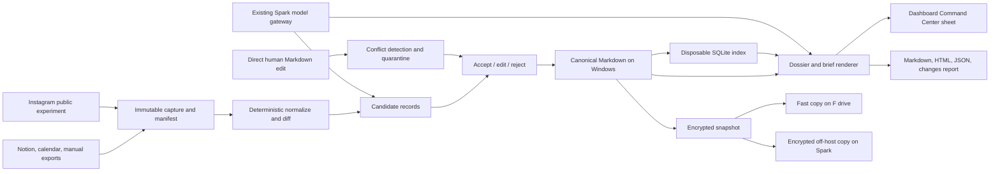

# Dunbar Dossier

> A completely private, local personal biographic archive that stays current in the background and provides an evidence-backed rundown when the owner deliberately opens a person file or prepares for a meeting.

`PERSONAL // PRIVATE // LOCAL-ONLY`

## Product Outcome

Dunbar Dossier is for one owner. Its primary job is to maintain a comprehensive, source-aware archive about people the owner has intentionally chosen to remember. It is operational rather than habitual: the owner should not need to monitor people daily or remember every update. When a dossier is opened, the product supplies a current rundown; before a meeting, it condenses the same archive into a brief reviewable in under two minutes.

The archive covers identity, photographs, education, career, residences and travel, interests and fandom, public views and affiliations, family and partner context, typed associations, public activity, the owner's interaction history, important dates, open promises, contradictions, information gaps, and clearly labelled analysis. The product automates collection, normalization, provenance, freshness, comparison, and draft synthesis. The owner remains authoritative for identity, sensitive meaning, relationship status, corrections, deletion, and every outbound action.

The home screen answers:

- Which person do I want a complete current rundown on now?
- What has changed since I last opened this dossier or met this person?
- What does the evidence support, contradict, or leave unknown?
- What should I remember before an upcoming meeting?
- Which proposed changes still require accept, edit, or reject?

Treat 150 as a chosen attention budget, not a scientific law. People may be archived without losing their history, and the active roster does not need to be full.

## Resolved Product Decisions

The decision interview was submitted and confirmed on 2026-08-30.

| Decision | Settled contract |
|---|---|
| Primary job | Maintain a comprehensive personal biographic archive; provide on-demand rundowns and meeting preparation. |
| V0 outcome | Account for all 43 current Notion people by import, explicit merge, explicit skip, or quarantine; deeply curate five afterward. |
| Scale | Five curated, then 43 reconciled, at most 150 active, unlimited archive. |
| Canonical truth | Reviewed Obsidian Markdown plus immutable evidence files on Windows. SQLite is disposable. |
| Canonical root | `F:\Vaults\LLMWiki\Agent Inbox\Dunbar Dossier\`; live import is blocked until privacy and Sync exclusion are proven. |
| Manual editing | Markdown may be edited directly; human edits are detected, versioned, and reconciled without silent overwrite. |
| Inputs | Manual/first-party first; Instagram public profiles are the first later connector experiment. |
| Interface | Responsive private web app registered as a Dashboard Command Center sheet. |
| Mobile | Responsive brief and quick field note only; no native app. |
| Automation | Evidence and deterministic work may run automatically; sensitive meaning and consequential actions require review. |
| Outputs | Markdown dossier, HTML brief, JSON manifest, and changes report; PDF later. |
| Latency | Cached reads under 500 ms, mutations under 1 second, cached brief under 10 seconds; enrichment asynchronous. |
| Models | Deterministic authority; local Spark model roles; schema-bound, replaceable, and fail-closed. |
| Privacy | Person data never goes to hosted models. Public-source retrieval is allowed; private context stays on Windows/Spark. |
| Review | Accept, edit-and-accept, or reject; no silent preference learning. |
| WhatsApp | One user-exported one-to-one chat experiment after core proof. |
| Host authority | Windows is canonical; Spark runs existing models and stores encrypted backup copies only. |
| Hermes | Restricted read and proposal-only MCP after core proof. |
| First slice | Synthetic person-to-brief loop with restart, read-back, encrypted backup, and clean restore; no live data. |

Consistency corrections required by these choices:

1. `F:\Vaults\Dossiers` is on the same Windows storage as the canonical folder, so it is a fast-recovery copy, not an off-host disaster backup.
2. Windows creates authoritative backups and publishes encrypted ciphertext to Spark; Spark cannot originate canonical rotations.

### Primary surfaces

1. **Today:** upcoming meetings, important dates, open promises, a deliberately small check-in queue, and new observations awaiting review.
2. **The 150:** concentric 5/15/50/150, list, and filtered views with manual ring placement and neutral cadence states.
3. **Person File / BIBP:** identity and images; biographical/career/location/travel timelines; interests, opinions, affiliations, family/partner context; typed social graph; digital footprint; analytical hypotheses; relationship history; contradictions, gaps, sources, and private manual notes.
4. **Meeting Brief:** last meaningful interaction, changes since then, two or three conversation threads, promises, possible support, sensitive/stale topics, and source freshness.
5. **Change Inbox:** proposed person matches and fact changes with evidence, date, confidence, and accept/edit/reject controls.
6. **Relationship Review:** time and attention allocation, intentionally paused ties, unresolved commitments, and relationships the user wants to deepen—without red decay scores or streak shame.

### Visual language

Use a readable monospaced/typewriter face, manila-folder tabs, paper texture, stamped states, evidence footnotes, source thumbnails, association maps, chronology strips, and optional redactions. The aesthetic must communicate epistemic state: `CONFIRMED`, `CORROBORATED`, `OBSERVED`, `ANALYTICAL HYPOTHESIS`, `CONTRADICTED`, `STALE`, and `REVIEW NEEDED`. Internally call people `Person`, not `target` or `asset`.

## Personal V0

Personal V0 is complete when all 43 Notion rows are reconciled and the owner can open a trustworthy dossier without maintaining a daily habit. Slice 1 proves the entire workflow with synthetic data before any live import; the five deep person files follow the 43-person reconciliation pass.

- Prove the file, index, direct-edit, brief, restart, encrypted-backup, and restore loop with synthetic data.
- Import all 43 Notion rows from a hashed CSV; optionally use a read-only API after authentication.
- Preserve every raw row and show an import reconciliation screen rather than guessing field mappings.
- Create stable person IDs, aliases, verified handles, manual Dunbar rings, desired cadence, and archive state.
- For five people, generate the full BIBP skeleton: identity/photos, education/career episodes, residence/travel episodes, interests/fandom, views/affiliations, family/partner and association graph, recent signals, analytical hypotheses, relationship history, contradictions, gaps, and source annex.
- Manually enter how the relationship began, last meaningful interactions, shared interests/activities, important dates, open conversational threads, and promises; these analyst overrides outrank later agent guesses.
- Record a meeting involving multiple participants and generate a one-screen pre-meeting briefing.
- Make reviewed Markdown and immutable evidence canonical; generate a disposable SQLite index and a narrowly filtered `Dunbar Dossier.base`.
- Add one calendar adapter that triggers a briefing for matched attendees.
- Import one WhatsApp chat export, normalize it, and create an expiring communication-style card with evidence and sample count.
- Add a Change Inbox and one public-source adapter only after the manual/core workflow is useful.
- Produce an on-demand rundown, one meeting brief, and one changes-since-last-check view; V0 has no daily-notification requirement.
- Create an encrypted consistent backup and complete a clean restore test.

The first proof is not “scrape three platforms.” It is: **can all 43 rows be accounted for, do manual edits survive regeneration, and does an opened dossier provide a trustworthy current rundown with claim-level provenance?**

### Current Notion migration

The live page verified through the Notion connector on 2026-08-25 contains 43 people in **Intentional Relationship Aid**. All 43 have `LastContacted`, `Contact Freq`, `Location`, and at least one `Relationship` tag; 34 have `Organization`; 31 have `Industry`; nine link to the companion chat database. Cadence is 17 bi-monthly, 16 monthly, four bi-weekly, three quarterly, two semesterly, and one weekly. The linked **Chats with people example** database contains three dated, person-linked chat records. Do not copy personal names into this build spec or migration logs. The importer should:

1. import through the Notion connector/API when available, with CSV as a repeatable fallback, and store source page URL, export time, row identity, and raw JSON/CSV payload;
2. map obvious identity fields into a proposed person;
3. retain unknown columns in `import_payload` until mapped;
4. detect possible duplicates using confirmed email, phone, LinkedIn URL, and user-approved handles—not name alone;
5. let the user choose ring/category and confirm merges;
6. preserve the existing `Relationship` and `Industry` tags without destructive remapping, and preserve the “Contact Every?” and “Chat?” formulas as migration documentation rather than durable facts;
7. produce an import report: accepted, merged, skipped, and unresolved rows, accounting for every one of the 43 source pages.

## Build Boundary

**MVP:** one owner; Windows-canonical Markdown/evidence; rebuildable SQLite; 43-person Notion reconciliation; five curated dossiers; interaction/meeting memory; Change Inbox; exact/FTS search; on-demand rundown; one-screen meeting brief; calendar trigger; deterministic HTML/Markdown/JSON outputs; one Instagram experiment; one WhatsApp export experiment; local Spark model adapter; restricted Tailscale access; encrypted backup and restore.

**One connector after core validation:** Instagram public profiles for five owner-confirmed URLs behind a replaceable adapter. The connector remains optional to product value.

**Later:** more first-party adapters, additional public-source adapters, optional local OCR/ASR/VLM enrichment, reviewed association maps, CardDAV/vCard, and printable PDF.

**Out for V0:** automatic outbound messages; covert face identification; biometric watchlists; clinical diagnosis; sensitive-trait scoring; live-location tracking; native mobile apps; multi-user/public SaaS; direct agent SQL; synced live SQLite; multi-writer replication; graph/vector databases; continuous browser monitoring; automatic ring changes, merges, or deletion; hosted-model processing of person data.

The product can draft birthdays, anniversaries, check-ins, introductions, and follow-ups, but it must not mark a copied draft as sent or send it automatically. User-confirmed sends become interactions.

## Existing Products, Building Blocks, and Shortcuts

- [Monica](https://github.com/monicahq/monica) is the closest open-source PRM reference. It already models contacts, relationships, reminders, birthdays, notes, activities, tasks, and personal history. Borrow its humane information architecture before inventing a larger CRM.
- [Bonds](https://github.com/naiba/bonds) is a Monica-inspired Go/React PRM with full-text search, reminder delivery, CardDAV/CalDAV, personal access tokens, verification flags, and an MCP endpoint. Its agent boundary is especially relevant.
- [Dex](https://getdex.com/) demonstrates LinkedIn/email/calendar/contact aggregation, keep-in-touch reminders, and meeting context. Its strength is reducing manual data entry; its enrichment should not become unreviewed truth.
- [Clay Reconnect](https://library.clay.earth/hc/en-us/articles/6817306147355-Reconnect) shows how a reminder can move after a detected interaction. Reuse the interaction-aware cadence idea, not an opaque relationship score.
- [Covve](https://covve.com/personal-crm) is a useful reference for post-call capture, contact news, and pre-call context.
- [SQLite](https://www.sqlite.org/about.html), [FTS5](https://www.sqlite.org/fts5.html), and JSON functions provide a disposable relational/full-text index. As of 2026-08-30 the current release is [3.53.4](https://sqlite.org/news.html); fail startup below 3.51.3 or an officially fixed backport because of the WAL-reset bug.
- [Obsidian](https://obsidian.md/help/Files%2Band%2Bfolders/How%2BObsidian%2Bstores%2Bdata) provides the reviewed canonical Markdown; [Bases](https://obsidian.md/help/bases) provides filtered views but not integrity enforcement.
- [n8n Schedule Trigger](https://docs.n8n.io/integrations/builtin/core-nodes/n8n-nodes-base.scheduletrigger/) orchestrates scheduled work. Use HTTP calls to the Dunbar service and run n8n's [security audit](https://docs.n8n.io/hosting/securing/security-audit/) after adding integrations.
- The Notion importer pins API version [`2026-03-11`](https://developers.notion.com/guides/get-started/upgrade-guide-2026-03-11), discovers `data_source_id`, paginates property values, and respects the documented average [three requests per second plus `Retry-After`](https://developers.notion.com/reference/request-limits). CSV is a fallback snapshot, not a relation-preserving backup.
- [Tailscale Serve](https://tailscale.com/docs/features/tailscale-serve) exposes a localhost-only Windows service to the tailnet. Funnel remains disabled and grants remain explicit.
- [MCP 2025-11-25](https://modelcontextprotocol.io/specification/2025-11-25) is the later Hermes target; consent and data minimization support a read/proposal-only boundary.
- [Google People](https://developers.google.com/people/v1/contacts), [Google Calendar incremental sync](https://developers.google.com/workspace/calendar/api/guides/sync), and Microsoft Graph contact/calendar delta APIs provide useful official inputs.
- A LinkedIn first-party [connections export](https://www.linkedin.com/help/linkedin/answer/a566336/export-connections-from-linkedin) is a better seed than assuming open API access to every connection. LinkedIn states that most permissions require approval and open consumer access is narrow ([official access guide](https://learn.microsoft.com/en-us/linkedin/shared/authentication/getting-access)).
- Meta's official Instagram collection documents that the Facebook Login API cannot access consumer accounts, so it is not a universal friend-monitoring interface ([official collection](https://www.postman.com/meta/instagram/documentation/6yqw8pt/instagram-api)).
- The [X API](https://docs.x.com/x-api/overview) exposes public posts and user timelines but currently uses pay-per-use billing; a private X List and aggressive caching can reduce reads ([billing](https://docs.x.com/x-api/fundamentals/post-cap)).
- [ScrapeCreators](https://docs.scrapecreators.com/) offers one public-data API across Instagram, LinkedIn, X, and other platforms plus n8n support and caching. Put it behind a replaceable adapter and retain raw responses.
- [Playwright](https://playwright.dev/docs/auth) can support a narrowly scoped Windows capture worker with a dedicated browser profile. Never upload browser authentication state to Spark or store it in the vault.
- [JSContact RFC 9553](https://datatracker.ietf.org/doc/html/rfc9553) is a strong JSON interchange export; [vCard 4.0](https://datatracker.ietf.org/doc/html/rfc6350) is the practical address-book projection. Neither replaces the evidence/fact model.
- Declassified CIA records use **Biographic Intelligence** and **Biographic Profile** for person-centric research ([CIA memorandum](https://www.cia.gov/readingroom/document/cia-rdp78-05597a000300080059-2), [Biographic Profile](https://www.cia.gov/readingroom/document/cia-rdp80-01826r000800030025-8)). Army guidance for a HUMINT support package explicitly includes associations, family, residence, travel, and employment history ([ATP 2-22.82](https://irp.fas.org/doddir/army/atp2-22-82.pdf)).
- A military [Target Intelligence Package](https://irp.fas.org/doddir/army/fm34-36/ch2.htm) is technically a mission package about a target and operational area, not simply a person biography. The project's person-centric export is therefore named **Biographic Intelligence Briefing Packet**.
- [ODNI ICD 203](https://www.dni.gov/files/documents/ICD/ICD-203.pdf) supplies the right analytical discipline for opinions, affiliations, and psychological/behavioral patterns: distinguish information, assumptions, and judgments; explain uncertainty; show alternatives; and state what would change the assessment.

**Fastest product test:** one synthetic Markdown person/evidence set, a narrowly filtered Base, a field-note template, and deterministic briefs. Prove ownership, edit reconciliation, rebuild, and restore before the 43-row migration or five-person curation.

## Recommended Free-First Stack

### Chosen V0

- **Canonical host:** Windows workstation.
- **Service:** one Python process using FastAPI, Uvicorn, Pydantic, and one domain service layer. REST, UI, jobs, and later MCP share it.
- **Canonical data:** round-trip-safe Markdown plus immutable content-addressed evidence at `F:\Vaults\LLMWiki\Agent Inbox\Dunbar Dossier\`.
- **Index:** current stable SQLite with foreign keys, `STRICT` tables where practical, `synchronous=FULL`, busy timeout, FTS5, JSON, and a runtime/compile-option gate. It is safe to delete and rebuild.
- **Dashboard:** server-rendered semantic HTML and small native JavaScript modules, registered as a [[Dashboard Command Center]] sheet only after standalone verification.
- **Jobs:** one durable job table and dispatcher. Add n8n only after a measured workflow justifies another owner.
- **Models:** the existing Spark gateway for schema-bound extraction, contradiction analysis, and rundown/brief drafts. Preserve its model ownership and production default.
- **Public source:** one replaceable Instagram public-profile adapter for five owner-confirmed URLs after core proof.
- **Backups:** Windows creates manifest-verified [age](https://github.com/FiloSottile/age) encrypted archives; same-host copies go to `F:\Vaults\Dossiers\Dunbar Dossier\`, off-host ciphertext to Spark.
- **Testing:** pytest, golden Markdown/HTML, focused parser/idempotency properties, Playwright for critical UI flows, and synthetic data only.

### Why Markdown plus SQLite rather than a database as truth

The submitted decision keeps the reviewed archive directly readable and editable in Obsidian. SQLite supplies fast deterministic queries and job state but never becomes a second authority. One service reconciles files, expected hashes, review decisions, and derived indexes. PostgreSQL, a graph database, and a vector database are unjustified at this scale.

## Architecture and Data Model

### Trust and lifecycle architecture



SQLite may be deleted and rebuilt without losing accepted facts, interactions, evidence links, overrides, or review decisions. Generated artifacts may be regenerated. Pausing a source stops new captures but preserves its recorded evidence subject to retention. Archiving removes a person from the active 150 without deleting history.

### Storage locations

```text
F:\Vaults\LLMWiki\Agent Inbox\Dunbar Dossier\
  People\                 # human-readable person entrypoints
  Records\                # facts, episodes, assessments, contradictions
  Interactions\           # meetings, calls, messages, field notes
  Evidence\               # Markdown metadata and exact evidence spans
  Captures\sha256\        # immutable raw files
  Overrides\              # locks, redactions, merge/split decisions
  Briefs\                 # reproducible generated artifacts
  Changes\                # candidates and quarantined external edits
  Imports\Notion\         # hashed source files and reconciliation reports
  Config\                 # non-secret schemas, policies, templates
  Manifests\              # packet, backup, and restore manifests
  Dunbar Dossier.base
  .dunbar\state\index.sqlite       # derived and disposable
  .dunbar\logs\                    # redacted operational logs
```

`F:\Vaults\Dossiers\Dunbar Dossier\` holds same-host encrypted recovery copies. Spark holds ciphertext only at `/home/snknitin/Backups/dunbar-dossier/`; it receives no plaintext canonical directory, live database, vault credentials, or write authority.

Before live import, a mandatory gate proves the canonical folder is excluded from unintended Obsidian Sync remotes, Git, cloud-drive replication, and public shares. If the selected LLMWiki location cannot meet that requirement, implementation stops and reports the exact boundary rather than moving data silently.

### Stable IDs and canonical file identity

- Manual records use UUIDv4. Imported records use deterministic UUIDv5 over `source_namespace + stable_source_id` so re-import converges.
- Type prefixes are `P-`, `R-`, `I-`, `E-`, `O-`, `B-`, `C-`, and `RUN-`.
- Filenames may include display slugs, but references use stable IDs. Renaming a person never changes identity.
- Every canonical file contains `schema_version`, `record_id`, `record_type`, `person_ids`, `version`, `created_at`, `updated_at`, `actor`, `sensitivity`, and `review_state`.
- Cross-file references use stable IDs, never filenames alone.

### Human-edit and regeneration contract

Generated blocks are marked with stable boundaries and input hashes:

```markdown
<!-- dd:managed:start current-summary generator=v1 input_hash=<sha256> -->
Generated synthesis with record-level citations.
<!-- dd:managed:end current-summary -->
```

1. Service writes use expected file hash/version, a same-directory temporary file, flush, and atomic replace.
2. A direct edit outside managed blocks becomes canonical human prose, increments version, and creates an audit event.
3. A direct edit inside a managed block is never overwritten. It enters `external_edit_detected`, quarantines that block from regeneration, and offers accept, edit-and-accept, or reject.
4. Accepting creates an override or canonical record and rerenders from truth. Reject restores the last verified generated block while preserving the rejected diff in audit history.
5. A malformed file remains readable but is excluded from indexing; the UI shows the exact parse error and last known-good version.
6. New evidence may contradict an owner override but cannot erase it.

### Derived SQLite contract

The index stores parsed metadata, current-record views, FTS text, graph edges, job state, idempotency keys, and audit pointers. Canonical prose and accepted records remain files. Every connection enables `foreign_keys=ON`, a bounded busy timeout, short transactions, and `synchronous=FULL`. Monitor WAL growth; run `quick_check`, `foreign_key_check`, and FTS integrity checks. Every release candidate must delete/rebuild the index and compare record counts and hashes.

### Core records

| Record | Important fields and invariants |
|---|---|
| `Person` | stable UUID, display/preferred name, status, merge redirect, row version |
| `RosterMembership` | active interval, manual Dunbar layer, desired cadence, priority; at most 150 active memberships |
| `ExternalIdentity` | platform, normalized identifier, canonical URL, verified flag; unique per platform/identifier |
| `SourceSubscription` | person/source, enabled state, freshness budget, next due, cursor, last success/error |
| `SourceCapture` | source URI/item ID, published/fetched times, content hash, raw blob, parser/run version |
| `Observation` | person, capture, type, text/JSON, dedupe key, review state, evidence quality, confidence |
| `FactAssertion` | predicate/value, valid interval, recorded time, evidence, review state, superseded assertion |
| `Record` / `TemporalExtent` | immutable superclass plus uncertain start/end bounds, precision, real-world validity, discovery time, sensitivity, and review state |
| `EvidenceSpan` / `RecordEvidence` | exact quote, text position, JSON pointer, timecode, image bounding box, content hash, and whether it supports, refutes, or contextualizes a record |
| `Interaction` | time, type, channel, title, summary/detail, source, creator, version |
| `InteractionParticipant` | many-to-many link between one interaction and its people |
| `ImportantDate` | date type/value, recurrence, evidence, review state |
| `ConversationThread` | topic/open question, source interaction, sensitivity, status |
| `Commitment` / `Followup` | owner, person, reason, due time, status, linked interaction |
| `CommunicationProfile` | person/channel, generated/expiry time, sample count, guidance JSON, model/prompt version, confidence |
| `AuditEvent` | actor, reason, correlation ID, record, before/after patch, timestamp |

Additional normalized records support a professional packet:

| Record | Purpose |
|---|---|
| `Entity` | organization, place, group, topic, sports team, public person, or other packet entity with aliases |
| `LifeEpisode` | employment, education, residence, relocation, trip/vacation, conference, project, membership, hobby, fandom, or public relationship with uncertain start/end bounds |
| `RelationshipEdge` | typed family/partner/friend/colleague/classmate/teammate/community/online/co-appearance/co-location edge with time window and evidence |
| `MediaItem` / `MediaAppearance` | images/stories/posts, OCR/caption, time/location claims, explicit tags, and confirmed or unresolved people/entities |
| `TopicSignal` | dated stated position or behavior-derived interest/opinion evidence with context and polarity |
| `AnalyticAssessment` | time-bounded judgment, confidence, evidence for/against, assumptions, alternatives, gaps, expiry, and review state |
| `ContradictionSet` | incompatible claims preserved together until resolved |
| `AnalystOverride` | durable user correction, lock, suppression, split/merge, redaction, or annotation that regeneration cannot overwrite |
| `PacketVersion` | reproducible `as_of` packet type, section hashes, source coverage, generator versions, and snapshot |
| `InformationRequirement` | prioritized missing question and the evidence that could resolve it |
| `RetrievalProfile` / `RetrievalGrant` | API-enforced record, field, sensitivity, location-precision, quote-length, and freshness limits for each agent purpose |
| `PacketTemplate` / `PacketRun` / `PacketSectionOutput` | reproducible template/query/prompt versions, records and evidence used, rendered sections, content hashes, and final snapshot |

Keep `source_published_at`, `fetched_at`, `valid_from`/`valid_to`, and `recorded_at` separate. Facts are never overwritten: insert a new assertion and supersede or close the old one. A current-facts view returns accepted, non-superseded assertions as of a date.

Do not use one vague confidence score. Store **source reliability**, **information directness**, **identity-match confidence**, **extraction confidence**, **semantic certainty**, **review state**, and **sensitivity** separately. Represent “during 2022” or “around June” as earliest/latest temporal bounds with `year`, `month`, or `approximate` precision; never fabricate the first day of a month. The evidence-span model borrows from [W3C PROV-O](https://www.w3.org/TR/prov-o/) and the [Web Annotation Data Model](https://www.w3.org/TR/annotation-model/) so each rendered sentence can reveal the exact supporting fragment.

Use normalized episode tables for career, education, residence, travel, affiliation, expressed opinion, interest/fandom, family/partner relationships, social-edge signals, media assets, appearances, and co-appearance events. A multiplex graph keeps meetings, messages, mentions, comments, likes, tags, explicit relationships, and co-appearances as different edge types. SQLite recursive CTEs are sufficient at this scale; a graph database is not required.

### Provenance classes

Every claim is explicitly one of:

- `user_recorded_fact`
- `contact_shared_fact`
- `public_observation`
- `machine_inference`
- `unverified_candidate`

User corrections outrank model output. A new scrape missing a field does not delete an old fact. Ambiguous social announcements stay observations. Sensitive fields can be marked excluded from general agent retrieval and meeting brief generation.

### Agent mutation API

```text
search_people(query)
get_person_brief(person_id, as_of)
get_person_profile(person_id, retrieval_profile, as_of)
get_claim_evidence(record_id)
append_observation(person_id, evidence, idempotency_key)
record_interaction(participants, occurred_at, note)
propose_fact(person_id, predicate, value, provenance)
accept_or_reject_fact(assertion_id)
add_analyst_override(target_id, action, reason, expected_version)
get_people_due_for_contact(before)
merge_people(loser_id, survivor_id, expected_versions)
render_dossier(person_id, template_version, as_of)
```

Ingestion agents may append captures and observations. Curation agents may see candidates, provenance, and contradiction cases. Briefing agents may read meeting-relevant accepted facts and source-backed recent observations. Message drafters receive a smaller allowlist: preferred name, last interaction, safe interests, confirmed milestones, and approved communication guidance. Raw chats, exact addresses/locations, face embeddings, intimate details, and sensitive hypotheses never enter a general vector index. Only the owner/curator may accept sensitive facts, merge people, delete data, change retrieval grants, expose restricted fields, or confirm a send. Enforce these scopes in SQL/API code before retrieval; a prompt is not access control. Use row versions and conditional updates; stale clients receive a conflict. Use idempotency keys for all n8n/import retries.

### Deduplication

Prefer, in order:

1. source plus stable source-item ID;
2. canonical source URL;
3. source + person + published time + normalized content hash;
4. for WhatsApp: timestamp + speaker + normalized text hash + attachment name.

Poll with a small overlap window, persist per-source cursors/watermarks, and hash normalized snapshots before model work. Identical snapshots generate no observation and no LLM call.

### Meeting brief contract

A one-screen brief contains meeting context, last meaningful interaction, relevant changes since then, two or three conversation threads, promises/follow-ups, possible support or shared activity, important/sensitive topics, and a freshness/source footer. It never converts uncertain social content into a speaking point without a warning.

After the meeting, a 30–90 second field note records what mattered, what the person chose to share, promises, next action, and whether another meeting is desired. One group meeting creates one interaction with several participants.

### Communication-style card

Parse exported chats into raw archives, normalized messages, derived features, candidate memories, and a compact versioned style card. Track language/code-switching, preferred formality, typical message length, emoji/voice-note tolerance, preferred channel, and examples of the user's own successful messages. Include sample count, expiry, model/prompt version, evidence IDs, and confidence. Do not infer personality or motives from delayed replies and do not imitate the contact's voice.

### Automatic enrichment and analyst control

Agents automatically refresh source captures, media metadata, explicit tags/captions, normalized timelines, source diffs, interaction aggregates, packet versions, and analytical drafts. Clear self-stated/corroborated facts may auto-promote according to a per-predicate owner policy. Partner/family relationships, ideology, recurring emotional/psychological patterns, inferred residence, untagged-person identity, and other sensitive interpretations may update automatically only in the visibly labelled **Analytical Hypotheses** section until confirmed.

Manual edits do not fight the renderer. They create `AnalystOverride` records and accepted assertions with source `owner_correction`. Overrides can lock a field, suppress a source, split/merge an identity, redact a section, or add an annotation. Future agent runs may present contrary evidence, but cannot erase or silently replace the override.

| Tier | Automatic behavior | Packet status |
|---|---|---|
| 0 — evidence | save permitted source item, media hash, metadata, OCR/ASR, exact evidence fragments, anonymous face clusters, and interaction counts | source/media annex |
| 1 — deterministic fact | verified handle, user-authored meeting note, calendar attendance, explicit structured role/location field, duration calculation, source freshness | `VERIFIED` or `SELF-STATED`, with source/date |
| 2 — candidate | possible trip, probable job transition, recurring hobby, public milestone, frequently appearing person, communication feature | `OBSERVED`/`CANDIDATE`; may update automatically without becoming a confirmed fact |
| 3 — analysis | image-derived location, partner/family meaning, ideology/group interpretation, closeness, face identity, psychological/behavioral pattern, contradiction resolution | `ANALYTICAL HYPOTHESIS`; requires curator acceptance for factual promotion |
| 4 — prohibited inference | clinical diagnosis, moral/risk score, private address, intimate status or conflict inferred from absence/co-appearance | never generated as a dossier claim |

The practical rule is: **agents observe broadly, infer cautiously, and promote narrowly**. Manual review is concentrated on sensitive meaning and identity, not on routine raw capture or deterministic processing.

### Biographic enrichment rules

- Calculate employment and education duration from temporal episodes and show unknown boundaries as ranges.
- Distinguish `based in`, `previously lived in`, `frequently present in`, and `visited`; never infer home from one trip.
- Cluster explicit place names/geotags/captions into proposed trips, preserving event-date uncertainty and publication lag. Count reviewed trip episodes and distinct places, not posts.
- Separate explicit self-described interests/teams/groups from behavior-derived affinity. Repeated, diverse, recent evidence can raise confidence; one like/follow cannot.
- Store issue-specific stated-position timelines rather than one permanent ideology label. Preserve reversals and contrary evidence.
- Infer partner/family context from explicit terms and user knowledge first. Co-appearance is supporting evidence, not relationship status.
- Build typed online and offline association graphs. Show comments, mentions, messages, co-appearances, co-location, and user-recorded meetings as separate evidence channels and visible time windows.
- Describe recurring affective language or behavior in a period and offer alternative explanations; do not create clinical diagnoses.
- Prefer explicit tags, captions, and user-confirmed identity in images. A vision model may propose an unresolved co-appearance, never silently name an unknown face.

### Multimodal extraction pipeline

1. **Capture:** save structured profile fields, posts, captions, tags, mentions, visible comments, stories/highlights when available, exported chats, calendar items, and meeting notes as immutable source items.
2. **Deduplicate and preprocess:** SHA-256 and perceptual hashes; EXIF/XMP/IPTC extraction; FFmpeg scene-change keyframes and bounded video sampling; audio extraction; local ASR; OCR; thumbnails. Record story expiry and preserve observation time.
3. **Atomic extraction:** separate tool-free structured extractors for organizations/roles, dates, places, activities, teams/brands, stated positions, family terms, interaction types, OCR signage, and image regions. Treat all captured content as untrusted prompt-injection input.
4. **Cross-modal reconciliation:** combine caption, location tag, OCR, calendar, and visual cues without flattening them. Preserve the IPTC distinction between the location where media was created and the location shown in it ([IPTC Photo Metadata](https://www.iptc.org/std/photometadata/documentation/userguide/)).
5. **Candidate generation:** emit a typed record with temporal precision, basis, sensitivity, supporting/refuting evidence IDs, source-independence group, and review tier.
6. **Counterexample and contradiction pass:** search for incompatible dates, alternative explanations, reposted copies, throwbacks, concurrent roles/homes, and stale evidence before rendering.
7. **Packet render:** the renderer reads approved records and visible hypotheses—not raw media—and writes claim-level citations and an `as_of` snapshot.

Suggested local components are FFmpeg, ExifTool, PaddleOCR or Tesseract, faster-whisper, the existing Spark VLM route, and optional SigLIP/OpenCLIP embeddings for visual retrieval. Face embeddings, if tested, stay in a restricted encrypted index; begin with anonymous recurring-face contact sheets and require user labelling before propagation.

## Biographic Intelligence Briefing Packet Contract

The professional naming hierarchy is:

- **Biographic Intelligence File:** the canonical accumulated evidence, facts, observations, interactions, and analysis for one person;
- **Biographic Intelligence Profile:** the current full analytic synthesis rendered from that file;
- **Relationship Brief:** the meeting-specific extract;
- **Dossier Packet / BIBP:** the complete export containing profile, brief, chronology, graph, media index, source register, and audit appendices.

Use an explicitly personal handling banner such as `PERSONAL // PRIVATE // LOCAL-ONLY`, not authentic government seals or real `SECRET`/`TOP SECRET` markings. An internal stylistic record number may use `DD-201-0042` while documentation makes clear it is a Dunbar Dossier identifier.

Every full packet is versioned and rendered `as_of` a date. It contains:

1. cover/record control and representative media;
2. executive relationship brief;
3. key judgments, confidence, alternatives, and information gaps;
4. identity resolution, aliases, accounts, and mistaken-identity exclusions;
5. current-status snapshot;
6. master biographic chronology;
7. education and intellectual development;
8. career chronology, projects, achievements, and professional network;
9. residence, relocation, travel, vacation, conference, and frequently visited-place chronology;
10. hobbies, passions, books/media, cuisine, sports teams, fandom, causes, communities, and recurring venues;
11. dated stated positions, affiliations, worldview themes, changing views, and contrary evidence;
12. partner, family, children/pets where relevant, and close-relationship context with validity intervals;
13. first/second-order platform and real-world association graph with observation windows and blind spots;
14. digital footprint, representative posts/images/stories, co-appearances, and source-health coverage;
15. communication and rapport profile;
16. behavioral observations, recurring expressed mood/theme, decision/negotiation style, counterexamples, and alternative explanations;
17. relationship history with the owner, meetings, shared activities, gifts/help, promises, and open threads;
18. public-activity/change log and time-bounded pattern-of-life summary;
19. discrepancy and contradiction register;
20. meeting/engagement preparation;
21. sources, provenance, confidence, analysis assumptions, and analyst locks;
22. collection gaps, refresh plan, revision history, rejected agent proposals, and superseded assessments.

The same canonical records produce four views: **full profile**, **two-page executive packet**, **meeting brief**, and **changes since prior packet**. Every analytical judgment states the question, time window, confidence, evidence for/against, assumptions, alternative hypotheses, information gaps, change indicators, expiry, and whether it is machine-drafted or user-reviewed.

Evidence labels are deliberately obvious: `[FACT]`, `[STATED]`, `[OBSERVED]`, `[USER NOTE]`, `[JUDGMENT]`, `[ALTERNATIVE]`, `[CONFLICT]`, `[UNKNOWN]`, and `[LOCKED]`. Keep source reliability, analytic confidence, and likelihood of a future event as separate concepts.

## Interface and Navigation Contract

The standalone private web app must work before Dashboard Command Center registration. The registered sheet opens the same URL without owning data or jobs.

1. **Today / Search:** global person search, recently changed dossiers, upcoming meetings, failed/stale sources, and a small review queue. No streaks.
2. **The 150:** list/table first with ring, context, cadence, freshness, review state, and archive filters. Concentric visualization is later.
3. **Person File:** identity/relationship summary, chronological dossier, and evidence/freshness rail. Tabs: Rundown, Timeline, Relationship, Associations, Sources, Analysis, History.
4. **Meeting Brief:** one-screen responsive brief with changes, two or three threads, promises, possible support, sensitive/stale warnings, and provenance footer.
5. **Change Inbox:** side-by-side old/proposed/evidence view with accept, edit-and-accept, or reject. No bulk acceptance for identity, relationship, sensitive, merge, or deletion changes.
6. **Review:** import reconciliation, file conflicts, source health, backup/restore evidence, model evaluation, and policy settings.

Global command search opens a person, starts an on-demand refresh, records a field note, or opens pending changes. Mobile supports rundown/brief reading and quick field notes; merge, deletion, and administrative review remain desktop-only. Keyboard navigation, visible focus, semantic markup, screen-reader labels, sufficient contrast, and reduced-motion support are acceptance gates.

## User Workflows and State Transitions

### On-demand rundown

Open person → return cached accepted records under 500 ms → display `as_of`, freshness, and source health → queue due refresh asynchronously → create candidates → review → reindex and rerender. Source/model failure never removes the existing accepted rundown.

### State machines

- Notion import: `queued → reading → parsed → reconciliation_required → applied → completed`; failures are `auth_required | rate_limited | malformed | failed`.
- Candidate: `proposed → accepted | edited_and_accepted | rejected → superseded` where applicable.
- External edit: `clean → external_edit_detected → quarantined → accepted | rejected → clean`.
- Person: `draft → active → paused | archived → deletion_pending → deleted`.
- Source: `enabled → due → running → healthy | stale | auth_required | challenge | blocked | paused`.
- Model job: `queued → running → schema_validating → succeeded | retryable_failed | failed_closed`.
- Brief: `queued → building → ready → stale → superseded`.
- Backup: `snapshotting → verifying → encrypting → publishing → published → restore_verified | failed`.

Jobs are durable and resumable. Restart cannot mark incomplete work successful. Every Notion source row ends as `accepted | merged | skipped | quarantined` with source identity and reason.

## Artifact or Output Contract

Every packet is versioned and rendered `as_of` a timestamp from explicit record/evidence membership:

- canonical person/record/interaction/evidence Markdown;
- responsive HTML rundown and meeting brief with no required external assets;
- JSON manifest with schema, records/evidence, freshness, template/model/parser versions, and SHA-256 hashes;
- changes-since report covering added, superseded, contradicted, rejected, stale, and unresolved records;
- PDF only after HTML/Markdown usefulness passes.

Evidence labels remain `[FACT]`, `[STATED]`, `[OBSERVED]`, `[USER NOTE]`, `[JUDGMENT]`, `[ALTERNATIVE]`, `[CONFLICT]`, `[UNKNOWN]`, and `[LOCKED]`. A later `Associations/<person-id>.excalidraw.md` may visualize reviewed typed edges; it is disposable and never relationship truth.

## Security and Privacy Boundary

- Bind the Windows service to `127.0.0.1`; use Tailscale Serve for private remote access and explicitly verify Funnel is disabled.
- Trust Tailscale identity headers only through localhost Serve. Tagged Spark/Hermes devices receive narrow app credentials/capabilities.
- Store secrets in Windows Credential Manager, never Markdown, SQLite, Git, logs, prompts, or ordinary backups.
- Use a read-only Notion internal integration shared only with selected source pages. Public OAuth is deferred.
- Hosted models are prohibited for person data. Future exceptions require a new decision, redacted preview, explicit per-job approval, and audit.
- Treat imported pages, captions, comments, OCR, chat, and media as untrusted prompt-injection content; extractor calls get a schema and no tools.
- Raw chats, exact locations, intimate details, credentials, face embeddings, and sensitive hypotheses are excluded from general search and Hermes retrieval.
- Threat tests cover wrong-person merge, malicious source text, stolen Windows profile, compromised tailnet member/tag, direct LAN access, spoofed identity headers, Obsidian Sync replication, lost backup key, and compromised Spark endpoint.
- Delete-person accounts for Markdown, captures under policy, briefs, changes, SQLite/FTS, caches, exports, and retained backups; rebuild/vacuum derived indexes where erasure is promised.

## Model and Prompt Contract

| Role | Advisory output | Deterministic authority |
|---|---|---|
| `observation_extractor` | candidate observations with evidence spans | schema, IDs, types, dates, and allowed predicates |
| `identity_match_proposer` | ranked possible matches with reasons | owner confirmation; never automatic merge |
| `contradiction_analyst` | conflicts and alternatives | records remain separate until review |
| `rundown_writer` | structured section drafts | renderer owns citations, labels, and layout |
| `meeting_brief_writer` | concise threads/support ideas | deterministic filters remove unsafe/stale content |
| `communication_card` | expiring style guidance | no diagnosis, impersonation, or sending |

Record role, endpoint, model identity, prompt/schema versions, input record IDs, size, latency, retries, and output hash. Apply retrieval scopes and prompt caps before sending to Spark. JSON-schema validation is mandatory; allow one repair attempt, then fail closed to evidence. Model outage never blocks search, accepted records, manual edits, import reconciliation, deterministic rendering, backup, or restore. Preserve the existing Spark gateway and production default.

## API and Code Layout

Core REST endpoints are:

```text
GET    /api/v1/health
GET    /api/v1/people
GET    /api/v1/people/{person_id}
GET    /api/v1/people/{person_id}/rundown
GET    /api/v1/records/{record_id}/evidence
GET    /api/v1/changes
POST   /api/v1/interactions
POST   /api/v1/changes/{id}/accept
POST   /api/v1/changes/{id}/edit-and-accept
POST   /api/v1/changes/{id}/reject
POST   /api/v1/imports/notion/scan
POST   /api/v1/imports/{run_id}/apply
POST   /api/v1/briefs
POST   /api/v1/backups
POST   /api/v1/restores/verify
DELETE /api/v1/people/{person_id}  # owner-only explicit confirmation
```

Mutations require actor/scopes, `Idempotency-Key`, and `If-Match`/`expected_version`; enforce body limits, allowlisted content types, correlation IDs, redacted audits, and explicit error types. REST, UI, jobs, and MCP call one domain service.

Later Hermes MCP exposes only `search_people`, `get_person_brief`, `get_claim_evidence`, `propose_field_note`, and `propose_fact`. It cannot accept/reject, merge/split, delete, change grants, read raw chats, render unrestricted dossiers, or confirm sends.

```text
AGENTS.md
README.md
pyproject.toml
src/dunbar_dossier/
  domain/ storage/markdown/ index/ api/ ui/ jobs/
  connectors/ models/ rendering/ backup/ mcp/
tests/
  fixtures/synthetic/ fixtures/notion/ golden/ unit/ integration/ ui/
docs/
  operations/ decisions/
```

Every test gets an isolated temporary root. Tests must refuse the live canonical path and real connectors.

## Deployment and Ownership

**Windows owns:** canonical files, derived index, jobs, API/UI, Dashboard registration, connector secrets, direct-edit reconciliation, and backup creation. Run one writer under a dedicated user context. Health distinguishes process, root access, index freshness, queue, backup age, and model reachability.

**Spark owns:** the existing model gateway and encrypted backup ciphertext only. This project changes no production model default, weights, Hermes configuration, or Spark authority.

**Recovery:** stop/confirm old writer unavailable → choose verified archive → decrypt to isolated directory → verify hashes/schemas → rebuild SQLite → render representative briefs → compare counts/hashes → atomically install verified root → start one writer → run read-back, mutation, backup, and network-negative tests. Spark never becomes a writer merely because it holds a backup.

**Backup publication:** acquire a write lease, flush, stage a snapshot, generate/verify SHA-256 manifest, encrypt to temporary `.age`, test decryption, and atomically publish to the F-drive recovery directory and Spark. Never use a live SQLite/WAL copy as the backup of record. Monthly restore proves canonical read-back, index rebuild, search, and a representative brief.

## Evaluation and Verification Plan

Fixtures include five synthetic people, a 43-row Notion-shaped set with relations/formulas/rollups/pagination/retries, at least 100 labelled assertions plus 20 ambiguity/adversarial cases, throwback/mirrored/quoted/co-appearance/prompt-injection cases, and WhatsApp locale/multiline/system-message forms.

Deterministic gates:

- re-import creates zero duplicates;
- delete/rebuild SQLite matches canonical counts and hashes;
- direct human edit survives restart/rerender;
- managed-block edit quarantines and supports all three review actions;
- stale mutation conflicts without loss;
- 100% of surfaced external claims reveal source, evidence span, and date;
- zero automatic merges, prohibited promotions, hosted-model transmissions, or outbound actions;
- 100% accepted parser/model outputs validate schemas;
- deletion closure and clean encrypted restore pass;
- direct LAN/Tailscale-port access, unauthorized tags, spoofed headers, and Funnel exposure fail.

Report precision, recall, and F1 per predicate. A future ordinary predicate needs at least 50 labelled examples, precision ≥0.98, schema validity 1.00, and zero sensitivity violations before auto-promotion; identity/sensitive predicates never auto-promote. Report calibration/Brier score where confidence is shown. Do not use one LLM judge as the only evaluator.

Product gates: all 43 rows accounted for; cached reads <500 ms; ordinary mutations <1 second; cached brief <10 seconds; at least eight of ten representative rundowns/briefs rated useful with zero unsupported speaking points; workflow remains useful without daily use or public connector.

## Build Slices

### Slice 0 — contracts, isolated fixtures, and environment gate

Define `AGENTS.md`, file schemas, state machines, synthetic fixtures, canonical/test-root guards, privacy policy, runtime checks, and the no-live-data harness.

**Gate:** all schema checks pass; tests prove they cannot resolve the live path; SQLite/encryption versions are recorded; no real person data, token, connector, Spark mutation, Dashboard registration, or Sync change exists.

### Slice 1 — synthetic Markdown-to-brief recovery loop

Implement one synthetic person, record, interaction, evidence item, index rebuild, search, rundown/brief render, direct-edit reconciliation, restart/read-back, encrypted snapshot, and isolated restore.

**Gate:** SQLite delete/rebuild matches counts/hashes; direct edit survives; managed-block conflict quarantines; latency targets pass; archive decrypts/restores; restored brief/manifest match; no live path touched.

### Slice 2 — canonical file engine and Change Inbox

Complete atomic writes, versions, record types, conflicts, audit, accept/edit/reject, merge proposals, deletion closure, FTS integrity, and five synthetic people.

**Gate:** idempotency, stale-write, malformed-file, merge, contradiction, deletion, and FTS-rebuild tests pass.

### Slice 3 — 43-row Notion reconciliation

Add hashed CSV first, then optional read-only API `2026-03-11`; paginate data sources/properties, respect retries, preserve unknown fields, and generate the complete report.

**Gate:** all 43 real rows are accounted for; no name-only merge; relation/formula/rollup limits are visible; rerun is idempotent; token is least-privilege and never logged.

### Slice 4 — five curated dossiers and responsive interface

Build the six destinations, five curated files, timelines, evidence rail, field note, group meeting, one-screen brief, accessibility, and standalone private deployment.

**Gate:** five dossiers pass provenance/readability review; ten briefs meet usefulness/latency gates; mobile and keyboard flows pass; no Dashboard dependency yet.

### Slice 5 — Dashboard Command Center and calendar trigger

Register the verified URL as one sheet; add one read-only calendar adapter, attendee matching, background refresh, and post-meeting prompt.

**Gate:** shell restart restores the sheet without owning state; ambiguous attendees require review; group meeting appears once per participant; calendar failure leaves cached dossiers usable.

### Slice 6 — local Spark model roles

Add schema-bound local adapters for extraction, contradictions, rundown, and brief drafting without changing the gateway/default.

**Gate:** the 100+20 evaluation meets thresholds; outage fails closed; prompt injection gains no tools/data; real latency and memory evidence is reported.

### Slice 7 — Instagram public-profile experiment

Use only five owner-approved public URLs behind a replaceable adapter. Cache/diff before models and surface health/rate/terms constraints.

**Gate:** connector-off mode retains utility; wrong-person/private cases do not mutate truth; stale/auth/blocked states are visible; each candidate links exact evidence.

### Slice 8 — WhatsApp export experiment

Import one user-created one-to-one export idempotently and create an expiring communication card. No continuous access or contact-voice imitation.

**Gate:** locale/multiline/system/attachment fixtures pass; raw chat is restricted; rerun duplicates nothing; no draft is sent or marked sent.

### Slice 9 — restricted Hermes MCP

Expose read/proposal-only tools with dedicated scopes and audit.

**Gate:** Hermes cannot read raw/sensitive material or accept, merge, delete, grant, unrestricted-render, or send; every proposal enters Change Inbox.

### Slice 10 — operational hardening

Add Tailnet negative tests, encrypted retention, monthly restore automation, source/prompt threat drills, deletion closure, diagnostics, and runbooks.

**Gate:** clean-host recovery, owner access, unauthorized denial, backup-key recovery, connector/model failure, and deletion drill all produce exact evidence.

## Drawbacks, Concerns, and Failure Modes

- **The tool can create performative intimacy.** Remembering facts must not replace curiosity, listening, shared time, or support. Evaluate whether briefs improve presence and follow-through, not whether someone was impressed.
- **Detailed analysis can look more certain than the evidence.** Every ideology, relationship, mental-state, and social-graph judgment needs a time window, confidence, source trail, counterevidence or alternatives, and expiry.
- **Identity collisions are damaging.** Never match on name alone. Require user verification for handles and ambiguous imports.
- **Social profiles are highlight reels.** Treat posts as dated observations, not reliable private-state facts.
- **Models polish uncertainty away.** Store observation and assertion separately; require evidence IDs and review before canonical facts.
- **An obscure fact can feel intrusive.** Flag facts whose source/context would plausibly surprise the person and omit them from ordinary conversation prompts.
- **Travel and residence are easy to confuse.** A publication time may lag the actual trip; a geotag may be decorative; repeated visits do not prove residence.
- **Photographs do not establish relationships.** Co-appearance and visual similarity are weak evidence unless captions/tags or the user establish identity and context.
- **Cadence can become guilt and gamification.** Use neutral states, intentional pause/archive, no streaks, and no universal decay score.
- **Generated slang can sound false.** Style cards guide drafts in the user's voice; they do not impersonate the contact and expire.
- **Personal social APIs are constrained.** Instagram does not provide a general friend feed, LinkedIn consumer access is narrow, X is pay-per-use, private profiles need fragile sessions, and exports are snapshots. Keep manual/core workflows valuable.
- **Browser sessions are high-value secrets.** Dedicated Windows profiles, no password transfer, allowlisted origins, and halt on reauthentication/CAPTCHA.
- **The system can become maintenance work.** Keep the review queue deliberately small, refresh before meetings, and archive freely.
- **A leak has a large blast radius.** Keep data outside Git and outside unapproved vault replication, restrict API tokens, encrypt storage/backups, minimize raw retention, and test deletion.
- **The requested projection still lives inside an Obsidian Sync vault.** `Agent Inbox/Dunbar Dossier` is convenient but not the canonical private root. Before real data, either exclude that folder from Sync or prove the vault is protected by an approved private Sync policy; the app must refuse live ingest while this gate is unresolved.
- **Markdown is human-friendly but easy to damage mechanically.** Preserve human prose, confine automation to marked blocks, validate frontmatter and stable IDs, quarantine ambiguous edits, and keep atomic previous versions.
- **`F:\Vaults\Dossiers` is not an off-host backup.** It shares the Windows machine and likely the same physical failure domain. Treat it as fast recovery only; the encrypted Spark copy is the second-host rotation and the age key must be recoverable independently.
- **SQLite can be misused.** Do not place it on a shared/synced filesystem or give every agent a connection. One local service owns mutations.
- **n8n retries can duplicate work.** Transport retries require application idempotency and source dedupe.
- **A polished brief can hide stale sources.** Every generated artifact includes connector health, observed date, and freshness.
- **Automatic celebration can be painfully wrong.** Bereavement, separation, changed dates, and wrong identities make human review essential.

## Clever Hacks and Simpler Alternative

- Deploy Monica or Bonds for one week and record exactly which workflows remain painful. Reuse its vocabulary rather than recreating ordinary contact management blindly.
- Start with five hand-curated people and ten meeting notes. Scaling a bad schema to 150 only hides the missing habit loop.
- Build the canonical file engine and a filtered Obsidian Base before custom interface depth. This may be enough for months.
- Use upcoming calendar meetings to trigger deep refresh; do not poll every person daily.
- Make the first connector an owner-approved Instagram public-profile snapshot and keep the complete workflow useful when that connector is disabled.
- Derive stable import IDs with UUIDv5 from the source namespace and source key, so repeated Notion imports cannot create new people.
- Hash/diff snapshots before running a model; most jobs should end after “no change.”
- Keep a per-source freshness budget and temporarily increase it around meetings or explicit life events.
- Use FTS5 and exact filters before embeddings. At 150 people, semantic search can remain a rebuildable cache.
- Create a three-button field note: `what changed`, `what I promised`, `next contact`. Richer notes are optional.
- For birthdays, generate a reminder and possible gesture several days early. A call, activity, voice note, or useful offer is usually better than a generic generated wish.
- Render a printable one-page “mission brief” PDF only after the Markdown brief is consistently useful; presentation should follow information quality.

## Success Measures

- All 43 current Notion rows are imported, explicitly merged, skipped, or quarantined; nothing silently disappears.
- 100% of surfaced external factual claims show a source, exact evidence span, source date, and observation date.
- Every analytical judgment shows its time window, confidence, evidence for/against, assumptions or alternatives, expiry, and review state.
- Zero sensitive, ambiguous, or policy-disallowed machine inferences enter the canonical current dossier as confirmed facts; permitted deterministic first-party fields follow explicit per-predicate policy.
- Zero outbound messages are sent without explicit user approval.
- Zero person data, prompts, embeddings, images, or generated artifacts are transmitted to hosted model providers.
- Person/handle matching errors are caught before dossier mutation.
- A meeting brief is useful and reviewable in under two minutes.
- Meaningful interaction notes can be recorded in under 90 seconds and usually within 24 hours.
- Open promises are surfaced and completed more reliably.
- At least eight of ten representative on-demand rundowns and meeting briefs are rated useful, with zero unsupported speaking points.
- Cached reads complete in under 500 ms, ordinary mutations in under one second, and a cached brief in under ten seconds on the Windows authority host.
- Source failures and stale data are visible in the dashboard and generated artifacts.
- Concurrent agent edits never overwrite user corrections.
- A direct human edit survives reconciliation, restart, index deletion/rebuild, and rerender; an edit inside a managed block is quarantined for accept/edit/reject review.
- A user-locked correction survives every packet regeneration; contrary evidence is attached rather than silently replacing it.
- Career and travel counts are reproducible from reviewed temporal episodes, with uncertain boundaries visible.
- Partner/family/ideology/psychological hypotheses never appear as unlabeled confirmed facts.
- Every rendered substantive claim can reveal its record ID, exact evidence fragment or user note, source date, observation date, and current review state.
- Every packet version is reproducible from its template version, retrieval profile, `as_of` time, included record IDs, evidence IDs, and model/parser versions.
- Re-running any import or workflow is idempotent.
- Monthly restore tests recover canonical Markdown, evidence, manifests, and generated artifacts from encrypted backups, then rebuild SQLite and reproduce representative search and briefs.
- One person can be deleted completely, with a report covering canonical, derived, cached, and eligible raw data.
- The user's monthly assessment says the system improved listening, support, recall, shared activity, or follow-through—not merely message volume.

## Product Path

1. **Safe file core:** one synthetic person proves Markdown ownership, direct-edit reconciliation, index rebuild, brief rendering, encrypted backup, and isolated restore.
2. **The 43:** every Notion row is reconciled before enrichment; five people are then curated deeply enough to prove the dossier and meeting-brief experience.
3. **Operational shell:** responsive standalone UI, Dashboard Command Center sheet, Change Inbox, and meeting-triggered refresh with Windows remaining canonical.
4. **Local intelligence:** schema-bound Spark model roles, then the owner-approved Instagram experiment and one WhatsApp export, each optional and evidence-first.
5. **Restricted reuse:** a read/proposal-only Hermes MCP and stable API shared with Event Networking Copilot, Pocket CRM, GiftShelf, and DM Desk while Dunbar Dossier remains the relationship-history authority.
6. **Possible product:** revisit multi-user or hosted modes only after the personal workflow, recovery, privacy, and platform constraints are proven; they are not part of this build.

Before open-sourcing or serving other users, run [[Scope Expansion Checklist]] and revisit platform terms, source rights, data minimization, notice/consent, authentication, access control, deletion/export, retention, encryption/key recovery, abuse prevention, accessibility, and jurisdiction-specific requirements. Keep this as a future gate; do not change the personal Windows/Markdown/Spark-adapter architecture solely for hypothetical release concerns.

## Implementation Agent Contract

A future implementation agent must:

1. Read `README.md` and the linked research dossier completely before changing files or choosing libraries.
2. Create or reconcile `AGENTS.md` from the non-negotiable product, data-ownership, privacy, security, deployment, and verification contracts in this specification.
3. Implement exactly one build slice at a time and do not pull later-slice infrastructure forward for convenience.
4. Stop at every acceptance gate; a slice is incomplete until its measurable gate passes with recorded evidence.
5. Preserve existing user data, direct human edits, user-locked corrections, and unrelated workspace changes. Never point development or tests at the live root.
6. Keep tests isolated from live data, connector accounts, production Spark defaults, Hermes configuration, Dashboard registration, and Obsidian Sync settings. Use only the specified synthetic fixtures until a later slice explicitly authorizes a bounded real-data test.
7. Keep model output advisory and deterministic code authoritative. Models may propose structured candidates but cannot assign identity, mutate canonical files, merge, delete, grant access, or send messages.
8. Turn every discovered failure into the smallest deterministic regression test before fixing it.
9. Measure real latency and model quality on the actual target host/adapter; do not substitute a mocked success for the slice's runtime or evaluation gate.
10. Provide exact completion evidence: changed files, test commands/results, dependency hashes or versions, health output, fixture/result IDs, measured latency, representative real-model evidence where applicable, and recovery/read-back results.
11. Use one Windows mutation service and its domain layer for REST, UI, jobs, and MCP. Treat reviewed Markdown/evidence as canonical, SQLite as disposable, Spark as model/backup support, and the Dashboard as a shell rather than an owner.
12. Stop and report any conflict with the live root, a pre-existing `README.md`/specification mismatch, an unresolved Sync privacy gate, a second active writer, or a request to transmit person data to a hosted model.

Paste-ready first implementation goal:

```text
/goal Read README.md and the linked research dossier completely. Reconcile AGENTS.md with the non-negotiable product, canonical Markdown ownership, local-only privacy, single-writer Windows deployment, derived-index, Spark-adapter, backup/recovery, and verification contracts. Implement only Slice 0 and Slice 1 using the isolated synthetic root and fixtures. Do not access the live F:\Vaults\LLMWiki\Agent Inbox\Dunbar Dossier path, real person data, connector accounts, production model defaults, Hermes configuration, Dashboard registration, or Obsidian Sync settings. Do not expand into later slices. Stop only after every Slice 1 acceptance gate passes and report exact files, tests, hashes or versions, runtime health, measured latency, representative real-model evidence where applicable, and encrypted recovery/read-back results.
```

## Related

- [[Research - Dunbar Dossier and Personal Relationship Intelligence#1. Dunbar Dossier]]
- [[pocket-crm]]
- [[Event Networking Copilot]]
- [[Personal Voice Ghostwriter and DM Desk]]
- [[GiftShelf]]
- [[Dashboard Command Center]]
- [[Personal Signal Intelligence OS]]
- [[Project Similarity and Reuse Map]]
- [[Project Ideas Index]]
- [[Scope Expansion Checklist]]
