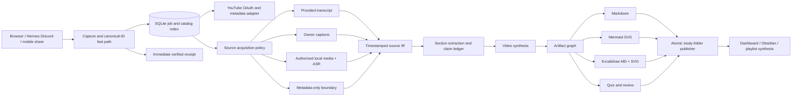

# Research - YouTube Learning Center

This dossier refines **LongVid Learning Studio** into **YouTube Learning Center (YLC)**: a private, local-first learning workspace that combines a signed-in YouTube playlist browser, an embedded video player, a Clipper-like structured Markdown workspace, scene and timestamp bookmarks, diagrams, quizzes, and durable folder-based learning artifacts. It is intended to be concrete enough to guide the replacement project specification and implementation README.

The research inspected:

- the current concept note at `F:\Vaults\LLMWiki\Ideas\LongVid Learning Studio.md`;
- its existing dossier section in `Index and Research/Research - Information and Learning Ideas.md`;
- the mirrored project README at `E:\GIT_ROOT\Projects\longvid-learning-studio\README.md`;
- the source, tests, UI, deployment unit, Hermes plugin, and architecture case study in `E:\GIT_ROOT\Projects\social-capture`;
- current Google/YouTube, Tailscale, FFmpeg, Mermaid, Excalidraw, and Obsidian-Excalidraw primary documentation.

The path that exists locally is `E:\GIT_ROOT\Projects\social-capture`; the supplied `E:\GIT\_ROOT\Projects\social-capture` spelling does not exist. The repository was inspected read-only.

## Executive finding

**YouTube Learning Center** is the better name and the correct product category. The product should not be described as a “summarizer.” It should be specified as:

> **A local-first, playlist-aware learning workstation that turns selected YouTube videos into source-grounded Markdown study folders while keeping the original player, timestamps, learning hotspots, diagrams, quizzes, and personal notes in one fast interface.**

The strongest product is a three-pane dashboard:

1. **Library rail:** signed-in YouTube account, owned playlists, imported playlists, ad hoc collections, inbox, processing state, and search.
2. **Learning canvas:** embedded YouTube player plus chapter/timestamp navigation, learning-hotspot filmstrip, and a rendered/editable Markdown note that feels like Obsidian Web Clipper applied to a video.
3. **Learning dock:** quiz session, flashcards, glossary, mind map, evidence ledger, open questions, review schedule, and job status.

Every playlist or user-created collection becomes a folder. Every video becomes a stable Markdown-backed learning record with adjacent generated artifacts. Markdown is the durable, human-readable output; a small SQLite database is only a rebuildable catalog, job queue, and cache.

The decisive platform constraint is ingestion. Supported YouTube APIs provide account playlist metadata and embedded playback, but **not** a universal transcript endpoint, arbitrary scene frames, automatic chapter data, or the public “Most replayed” curve. YLC therefore needs two explicit operating modes:

- **Supported YouTube mode:** OAuth playlist browsing, metadata, official embedded player, creator-written description chapters when parseable, timestamp bookmarks, user notes, and any analysis based on a user-provided or otherwise permitted transcript.
- **Permission-gated media mode:** for user-owned, downloaded-by-YouTube, Creative Commons with an independently lawful copy, or otherwise authorized local media/transcript; this mode may run FFmpeg, ASR, OCR, local VLM scene ranking, and richer artifact generation.

Do not silently make `yt-dlp` the ingestion foundation. YouTube's Terms restrict automated access and downloading outside permitted means, and the YouTube API developer policies separately prohibit API clients from downloading, importing, backing up, caching, or storing copies of YouTube audiovisual content without approval. `yt-dlp` can exist only as an unbundled, explicit expert adapter for material the user is authorized to process, with no claim that personal use alone resolves the platform-terms issue. [YouTube Terms](https://www.youtube.com/static?template=terms), [YouTube API Services developer policies](https://developers.google.com/youtube/terms/developer-policies), [yt-dlp source and capabilities](https://github.com/yt-dlp/yt-dlp)

## 1. YouTube Learning Center

### Product contract

### Core job

The user should be able to sign in, select an owned YouTube playlist or create an ad hoc collection, choose one or more videos, and immediately enter a study workspace. YLC should preserve the original video as the source, then progressively create useful learning artifacts without making the user wait for an all-or-nothing “final summary.”

The user-visible sequence should be:

1. select a playlist, paste a URL, or receive a URL from a Hermes Discord route;
2. show the video and metadata immediately;
3. deduplicate by YouTube video ID and acknowledge the durable job quickly;
4. discover the best available ingestion basis and state it visibly;
5. stream section-level notes and artifacts as they finish;
6. let the user watch, seek, bookmark, annotate, and quiz while background work continues;
7. write a complete Markdown study folder with provenance and generated-file versions;
8. preserve user notes and corrections across regeneration.

### Non-goals for the personal V0

- It is not a generalized YouTube downloader.
- It does not promise transcripts for every public video.
- It does not pretend a model-derived hotspot is YouTube's “Most replayed” metric.
- It does not mirror-delete local notes when a YouTube playlist changes.
- It does not require Gemini or any one hosted provider.
- It does not use the Hermes conversational loop for long-running video analysis.
- It does not let a model invent paths, video IDs, source provenance, completion state, or successful-write claims.

## 2. Interface recommendation

### Desktop layout

```text
┌─────────────────────┬─────────────────────────────────────────┬──────────────────────────┐
│ YLC library rail    │ Learning canvas                         │ Learning dock            │
│                     │                                         │                          │
│ Account + Sync      │ Embedded YouTube player                 │ Quiz                     │
│ Inbox               │ Chapter / YLC-section strip             │ Flashcards                │
│ Owned playlists     │ Learning-hotspot filmstrip              │ Glossary                  │
│ Imported playlists  │                                         │ Mind map                 │
│ Collections         │ Markdown: Learn / Evidence / Apply      │ Evidence + questions      │
│ Processing          │ Diagrams / scenes rendered inline       │ Progress + review         │
│ Search              │                                         │                          │
└─────────────────────┴─────────────────────────────────────────┴──────────────────────────┘
```

The canvas should feel closer to an Obsidian Clipper result than a generic chat response: frontmatter-like source properties at the top, a template/recipe selector, clean Markdown sections, collapsible evidence, editable personal annotations, visible generation basis, and source timestamps. The model output should be a document the user can continue editing, not a transient message bubble.

### Left rail

- **Account:** avatar/channel title, connected host, token health, and last playlist sync.
- **Quick capture:** paste video/playlist URL; optional `Add from clipboard`.
- **Inbox:** videos captured from the browser, mobile share, or Hermes but not assigned to a collection.
- **YouTube playlists:** playlists owned by the authenticated channel, paginated and cached with a refresh timestamp.
- **Imported playlists:** arbitrary playlist URLs the user explicitly adds; these are not represented as owned account playlists.
- **Collections:** local-only folders such as `Random AI videos`, `Physics`, or `Build next`.
- **Processing:** queued, acquiring source, transcribing, extracting, synthesizing, generating artifacts, ready, needs source, and failed.
- **Saved views:** unread, needs review, incomplete evidence, quiz due, and recently changed.

The rail should use the same compact, precise visual discipline as Social Capture: narrow rows, meaningful counts, one restrained accent, fast search, keyboard navigation, and no oversized marketing cards.

### Learning canvas

The upper half contains the official IFrame Player. The IFrame API supports loading videos/playlists, seeking, current-time access, state events, and JavaScript control; use it for timestamp-linked notes and a `Save moment` action. The minimum embedded-player size and autoplay restrictions documented by YouTube must be respected. [YouTube IFrame Player API](https://developers.google.com/youtube/iframe_api_reference)

Directly below the player:

- **Source navigation strip:** creator-written chapters parsed from description timestamps when valid; otherwise YLC-generated semantic sections clearly labelled `YLC sections`.
- **Learning hotspots:** moments ranked because they contain a demonstration, dense slide, definition, diagram, code change, example, contradiction, or high-value explanation. Never label these “Most replayed.”
- **Scene cards:** thumbnail/frame, timestamp, reason selected, section, OCR snippet, and `Jump to`.
- **Manual moments:** the user's bookmarks and notes, which always outrank generated suggestions and are never overwritten.

Below that, use document tabs rather than chat:

- **Learn:** executive orientation, navigable map, substantive explanation, durable takeaways.
- **Evidence:** claim/evidence ledger, transcript spans, uncertainty, external verification.
- **Apply:** ordered procedure, prerequisites, risks, failure modes, tests, and applicability boundaries.
- **Artifacts:** Mermaid diagrams, Excalidraw mind map, scene gallery, glossary, timeline, and comparison tables.
- **Source:** transcript or supplied source text with timestamp search and coverage highlighting.
- **My notes:** user-authored notes only; protected from regeneration.

### Right learning dock

The right dock is contextual and should remain usable while the video plays:

- `Quiz`: recall, multiple choice, explain-back, sequence ordering, scenario application, and misconception correction.
- `Cards`: candidate flashcards with approve/edit/reject; generated cards do not become durable review items until approved.
- `Map`: compact mind-map overview and links to the editable Excalidraw artifact.
- `Questions`: open questions, disputed claims, missing prerequisites, and prompts to ask the model about selected transcript spans.
- `Review`: confidence, quiz history, last reviewed, next review, and weak concepts.
- `Job`: live stage, elapsed time, model/recipe, source basis, warnings, and retry only for the failed stage.

On smaller screens, the rail becomes a drawer and the learning dock becomes a bottom sheet. The player stays first, followed by hotspots and the active document tab.

## 3. Learning artifact system

The current `/longvid` design already contains a strong content model: analysis-basis disclosure, separation of the video's content from inference and external verification, adaptive routing by video type, timestamped content maps, evidence ledger, critical evaluation, application boundaries, selective-viewing guidance, and a final reference card. YLC should turn that model into typed artifacts rather than one enormous generated note.

### Required per-video artifacts

1. **Study note (`index.md`)**
   - source identity, analysis basis, recipe and model version;
   - executive orientation and central thesis;
   - timestamped content map;
   - substantive content breakdown;
   - key concepts and reasoning chain;
   - critical evaluation and uncertainty;
   - practical application and applicability boundaries;
   - durable takeaways, open questions, and selective-viewing recommendation;
   - protected `My notes` and `Corrections` sections.

2. **Evidence ledger (`evidence.md` or a generated section in `index.md`)**
   - claim ID, faithful claim text, speaker, start/end timestamp;
   - support type: demonstration, cited data, logical argument, expertise, anecdote, unsupported assertion, speculation, or promotion;
   - strength and limitation;
   - transcript-span hash and ingestion basis;
   - optional primary-source verification.

3. **Quiz (`quiz.md`)**
   - question, answer rubric, supporting timestamp, difficulty, concept ID, and artifact version;
   - recall first, then application; avoid trivia unless the detail is genuinely reference-worthy;
   - confidence capture and review history stored separately so regenerated questions do not erase attempts.

4. **Concept graph**
   - one source-neutral graph object containing nodes, typed edges, supporting claim IDs, and confidence;
   - render that graph to Mermaid for compact deterministic diagrams and to Excalidraw for a spacious editable mind map.

5. **Scene/moment gallery**
   - timestamp, selection reason, source permission mode, frame path if one may be stored, and fallback YouTube timestamp link;
   - generated frames must not be the only route back to the source.

### Conditional artifacts by content type

| Video type | High-value artifacts |
|---|---|
| Lecture / explanation | concept hierarchy, causal graph, glossary, misconceptions, Feynman questions |
| Tutorial / demo | prerequisite checklist, ordered runbook, settings table, failure-mode tree, expected-result screenshots |
| Interview / panel | speaker map, agreements/disagreements matrix, attributed claims, question trail |
| Argument / commentary | thesis tree, premise/evidence map, assumptions, counterarguments, rhetoric versus evidence |
| News / update | before/after state, timeline, effective dates, confirmed versus speculative changes |
| Review / comparison | evaluation rubric, test-method audit, trade-off table, recommendation by user type |
| Documentary / case study | chronology, decision points, causal graph, perspective gaps, transferable lessons |
| List / roundup | deduplicated items, ranking rationale, effort/impact matrix, what not to adopt |

Conditional generation is important: no model should invent a “timeline,” “debate,” or “implementation plan” merely to fill a fixed template.

### Playlist-level artifacts

Playlist synthesis must not concatenate summaries. It should build:

- a curriculum/prerequisite order distinct from YouTube's playlist order;
- a coverage matrix with videos as rows and concepts as columns;
- recurring concepts and duplicated explanations;
- contradictions and speaker/creator disagreements;
- best explanation/example for each concept;
- missing prerequisites and recommended external gaps;
- playlist glossary and concept graph;
- cumulative quiz and review plan;
- explicit status for videos that contributed no unique material or lacked an analyzable source.

## 4. Markdown library and folder contract

### Recommended layout

```text
YouTube Learning Center/
├── _YLC Index.md
├── Inbox/
├── Collections/
│   └── Random AI Videos/
│       ├── _Collection.md
│       └── <video-id> - <short-title>/
├── Playlists/
│   └── <playlist-id> - <playlist-title>/
│       ├── _Playlist.md
│       ├── 001 - <video-id> - <short-title>/
│       │   ├── index.md
│       │   ├── evidence.md
│       │   ├── quiz.md
│       │   ├── transcript.vtt          # only when permitted
│       │   └── artifacts/
│       │       ├── concept-map.mmd
│       │       ├── concept-map.svg
│       │       ├── mind-map.excalidraw.md
│       │       ├── mind-map.svg
│       │       └── scenes/
│       └── _Playlist Synthesis.md
└── _System/
    ├── recipes/
    ├── schemas/
    └── generation-ledger/
```

Use YouTube IDs in folder and record identity so title edits cannot create duplicate videos. Playlist order belongs in frontmatter and `_Playlist.md`; it is not the video's identity. The same video may appear in several playlists while pointing to one canonical video record plus collection-specific aliases, or it may be materialized per collection if independent notes are a deliberate feature. Choose one rule and make it explicit before implementation.

### Suggested frontmatter

```yaml
---
type: ylc-video
video_id: dQw4w9WgXcQ
youtube_url: https://www.youtube.com/watch?v=dQw4w9WgXcQ
channel_id: UC...
playlist_ids: [PL...]
source_basis: provided-transcript
source_acquired_at: 2026-08-29T12:00:00+05:30
youtube_metadata_refreshed_at: 2026-08-29T12:00:00+05:30
analysis_status: ready
recipe: lecture-v1
model_profile: local-balanced
prompt_version: sha256:...
transcript_hash: sha256:...
generation_id: ylcgen_...
user_notes_revision: sha256:...
---
```

Keep refreshable YouTube API metadata separate from the user's durable analysis. YouTube API policies generally require stored API data to be refreshed or deleted within 30 days; user-authored notes, model-produced learning artifacts, and immutable provenance about how an artifact was made should not be conflated with a stale API cache. [YouTube API Services developer policies: data storage and refresh](https://developers.google.com/youtube/terms/developer-policies)

### Write and regeneration rules

- User-authored `My notes`, corrections, ratings, quiz attempts, and approved cards are never overwritten.
- Regeneration writes a new generated revision, then atomically updates the active projection after validation.
- Generated sections have stable IDs and expected hashes; stale browser writes receive a conflict instead of silently replacing newer Markdown.
- A removed/private playlist item becomes `source_status: unavailable` or `removed_from_playlist`; do not delete its learning folder.
- Unknown frontmatter keys and user-added Markdown sections are preserved.
- Every artifact records source basis, recipe, prompt/model versions, generated time, and evidence coverage.
- SQLite may index file paths, job state, transcript segments, and search text, but the library must be rebuildable from files and generation ledgers.
- Only one service owns writes to the canonical YLC library. Obsidian Sync and multiple dashboards are not a distributed lock.

## 5. What to reuse from Social Capture

The local Social Capture repository is valuable because it solved a closely related class of problem: a compact local dashboard, Markdown-backed state, private Spark hosting, and a low-latency Hermes capture path. Reuse the architecture lessons, not its task-specific schema.

| Reusable pattern | Local evidence | YLC application |
|---|---|---|
| Markdown is canonical; browser state is a view | `AGENTS.md`, `server.py`, `social_capture.py` | Markdown study folders and user notes remain durable; SQLite is a rebuildable catalog/queue |
| Compact left rail, top toolbar, dense rows, inspector | `static/index.html`, `static/app.css`, `static/app.js` | playlist/library rail, processing counts, search, and a right learning dock |
| Narrow JSON API and local static app | `server.py` | typed collection/video/job/artifact endpoints rather than arbitrary filesystem access |
| Revision tokens and conflict response | `server.py`, `social_capture.py` | protect user notes and generated-block replacement |
| Localhost-only listener behind Tailscale Serve | `deploy/social-capture.service`, `README.md` | Spark-hosted YLC remains bound to `127.0.0.1`; private HTTPS is supplied by Serve |
| PWA shell but no authoritative API caching | `static/manifest.webmanifest`, `static/service-worker.js` | installable dashboard; cache shell/assets, not stale library/job API responses |
| Deterministic pre-agent deduplication | `hermes_social_capture_plugin.py`, commit `f8f87c0` | duplicate video/job lookup before any agent/model work |
| One bounded structured call for a bounded decision | `hermes_social_capture_plugin.py` | quick intake classification/recipe choice only; not full long-video synthesis |
| Identity and success rendering outside model control | `capture_pipeline.py`, `hermes_social_capture_plugin.py` | code owns video ID, folder path, source URL, job state, and durable receipt |
| Locked UV environment and fixture-heavy verification | `pyproject.toml`, `uv.lock`, `tests/` | reproducible workstation/Spark runtime and transcript/Markdown/UI regression fixtures |

The Social Capture latency case study is particularly relevant. The original route paid minutes of latency because a bounded capture was implemented as an open-ended conversational turn with large history and tool retries. The corrected design classifies the URL before agent construction, returns duplicates with zero provider calls, gives a new source one bounded structured model call, writes and reads back canonical Markdown, and renders success from verified proof. A duplicate handler measured 0.0006 seconds and one real new-source path measured 4.904 seconds; the durable design guarantee was a 12-second deadline and fail-closed behavior, not the sample timing. See `docs/SYSTEM_DESIGN_CASE_STUDY.md`, especially section 10.8.

### How YLC should adapt that pattern for Hermes/Discord

Long-video analysis cannot honestly promise a five-second finished artifact. “Low latency like Social Capture” should mean **fast intake and visible progress**, not blocking the Discord gateway until the playlist is analyzed.

Recommended Hermes plugin surface:

- `youtube_learning_lookup(video_url, collection?)`
- `youtube_learning_enqueue(video_url, collection, recipe, goal?)`
- `youtube_learning_status(job_id)`
- `youtube_learning_cancel(job_id)` only before destructive publication or while a stage is safely cancellable

Gateway behavior:

1. authenticate and restrict the exact Discord route before the fast path owns the event;
2. parse one URL, canonicalize only for lookup, and retain the exact inbound URL as provenance;
3. return an existing artifact/job immediately without model work;
4. create a durable job and deterministic receipt before any long processing;
5. reply with video title, collection, job ID, dashboard deep link, and current source basis;
6. run acquisition and analysis in the YLC worker, not the gateway process;
7. post one completion/failure update or let the dashboard show progress; do not spam per-stage messages;
8. keep conversational handling only for ambiguous collection choice, user goals, corrections, or follow-up questions.

The Telegram chat IDs and task schemas in Social Capture are not reusable. The ownership split, hook ordering, deterministic lookup, structured validation, and proof-bound receipts are reusable.

## 6. YouTube account, OAuth, playlists, and quotas

### OAuth deployment choice

Use the narrow read-only scope `https://www.googleapis.com/auth/youtube.readonly` for playlist browsing. Google documents that scope as “View your YouTube account.” Request stronger `youtube.force-ssl` only for a separately enabled owner-caption feature because it can see, edit, and permanently delete YouTube videos, ratings, comments, and captions. [Google OAuth scopes](https://developers.google.com/identity/protocols/oauth2/scopes), [YouTube OAuth guide](https://developers.google.com/youtube/v3/guides/authentication)

Use two OAuth client configurations if both deployment modes are supported:

- **Desktop-local:** Desktop OAuth client and loopback redirect such as `http://127.0.0.1:<ephemeral-port>`. Google recommends loopback for macOS/Linux/Windows desktop apps and no longer supports manual copy/paste out-of-band authorization. [YouTube installed-app OAuth](https://developers.google.com/youtube/v3/guides/auth/installed-apps)
- **Spark-hosted:** Web Application OAuth client with the exact Tailscale HTTPS callback, for example `https://<spark>.<tailnet>.ts.net/oauth/google/callback`. Web redirect URIs must be pre-registered and normally use HTTPS; localhost is the exception. Protect the callback with `state`, PKCE where supported, secure same-site cookies, and a one-time login transaction. [Google web-server OAuth](https://developers.google.com/identity/protocols/oauth2/web-server)

Do not put OAuth refresh tokens, client secrets, or browser cookies in the Obsidian vault. Store tokens in an OS credential store or a host-private file with strict permissions. Do not copy one host's token state to another host.

Do not plan a service-account shortcut: YouTube user data requires an interactive user OAuth grant, and YouTube does not support the service-account flow for channel/library access. [YouTube authentication guide](https://developers.google.com/youtube/v3/guides/authentication)

For a personal app, OAuth verification is not mandatory below 100 known users, but an unverified warning remains. An External app left in `Testing` expires test-user authorizations and offline refresh tokens after seven days because `youtube.readonly` is beyond basic identity scopes. For a durable personal deployment, move the consent configuration to `In production` and accept the unverified personal-use warning/cap, or use an Internal app if the account belongs to a suitable Google Workspace organization. [When OAuth verification is not needed](https://support.google.com/cloud/answer/13464323), [Google OAuth audience and publishing status](https://support.google.com/cloud/answer/15549945)

### What the playlist sidebar can actually enumerate

`playlists.list(part=snippet,contentDetails,status,mine=true,maxResults=50)` returns playlists **owned by** the authenticated user and costs one quota unit per page. `playlistItems.list(...,playlistId=...,maxResults=50)` returns item order, video IDs, titles, descriptions, and thumbnails and costs one unit per page. Batch video details with `videos.list` rather than calling once per item. [playlists.list](https://developers.google.com/youtube/v3/docs/playlists/list), [playlistItems.list](https://developers.google.com/youtube/v3/docs/playlistItems/list), [YouTube quota calculator](https://developers.google.com/youtube/v3/determine_quota_cost)

Important limitation: `mine=true` is not a complete copy of the user's YouTube Library. It returns owned/user-created playlists. The method has no “saved third-party playlists” filter, so YLC must allow importing an arbitrary playlist URL. Uploads and Likes may be exposed through related system playlist IDs, but current `playlistItems.list` documentation explicitly reports Watch History and Watch Later as inaccessible/unsupported. The UI should show the exact supported sources rather than promise “every playlist in YouTube.” [YouTube sample requests: user-created and system playlists](https://developers.google.com/youtube/v3/sample_requests), [playlistItems.list errors](https://developers.google.com/youtube/v3/docs/playlistItems/list)

### Quota design

The current default is 10,000 daily units for endpoints other than the separately bucketed search/upload operations. Playlist, playlist-item, channel, and video list calls cost one unit per page; caption-track listing costs 50 and caption download costs 200. This makes normal sidebar sync inexpensive if YLC paginates, batches video IDs, uses ETags/refresh timestamps, and avoids `search.list` for known playlist/video URLs. Every extra result page is another request. [YouTube quota calculator](https://developers.google.com/youtube/v3/determine_quota_cost), [captions.list](https://developers.google.com/youtube/v3/docs/captions/list), [captions.download](https://developers.google.com/youtube/v3/docs/captions/download)

## 7. Player, chapters, captions, Most replayed, and scenes

### Embedded playback

Use the official IFrame API rather than recreating a player. It supports cue/load, seek, current time, duration, playback state, and playlist operations. Enable JavaScript control with `enablejsapi=1`, set `origin` to YLC's exact browser origin, preserve YouTube's required controls/functionality, and respect the documented minimum player size. YLC can attach every timestamp link to `player.seekTo(seconds, true)` while also emitting a durable YouTube URL such as `https://youtu.be/<id>?t=<seconds>`. The API exposes caption-display options, but it does not expose caption text. [YouTube IFrame Player API](https://developers.google.com/youtube/iframe_api_reference), [player parameters](https://developers.google.com/youtube/player_parameters), [required minimum functionality](https://developers.google.com/youtube/terms/required-minimum-functionality)

Some videos disable embedding or require sign-in/age checks. Map player errors into explicit source states for deleted/private, embedding-disabled, and identity-restricted videos, each with an `Open on YouTube` path, rather than treating them as a generic ingestion failure.

### Chapters

YouTube supports creator-written chapters using ascending description timestamps beginning at `00:00`, with at least three timestamps and a minimum chapter length of ten seconds. It also supports automatic chapters, but those are a YouTube product feature rather than a documented structured Data API or IFrame API field. [YouTube chapter help](https://support.google.com/youtube/answer/9884579)

YLC should therefore:

1. parse valid creator-written chapter lines from the Data API description;
2. label them `YouTube creator chapters`;
3. use automatic chapters only if the embedded player itself visibly supplies them, without trying to scrape them;
4. generate its own semantic boundaries from the transcript/source as `YLC sections`;
5. preserve both when they differ.

### Captions and transcripts

The official Caption API is not a public transcript service. `captions.list` returns caption-track metadata and requires OAuth with strong YouTube scopes; the response explicitly omits caption text. `captions.download` costs 200 units and requires the authenticated user to have permission to edit the video. It cannot download arbitrary public captions. [captions.list](https://developers.google.com/youtube/v3/docs/captions/list), [captions.download](https://developers.google.com/youtube/v3/docs/captions/download)

Supported ingestion priority:

1. user-provided transcript/VTT/SRT;
2. captions for a video the authenticated user owns and may edit;
3. user-provided or otherwise authorized local media, transcribed locally;
4. an optional provider adapter that lawfully accepts the YouTube URL directly;
5. metadata-only note with no fabricated content when none of the above exists.

Every artifact must display one of: `full transcript`, `partial transcript`, `direct permitted media`, `user notes only`, or `metadata only`. The model must not reconstruct a video from title, thumbnail, description, comments, or search snippets.

### “Most replayed” and retention

YouTube's user interface shows a graph of frequently replayed moments while seeking, but YouTube may withhold it for new, low-view, struck, or otherwise ineligible videos. Neither the documented Data API video resource nor the IFrame API exposes that public graph as data. The app can let the official embedded player display its native UI when YouTube chooses, but it must not scrape or duplicate the curve. [YouTube help: most replayed](https://support.google.com/youtube/answer/12825599), [YouTube video resource](https://developers.google.com/youtube/v3/docs/videos), [YouTube IFrame Player API](https://developers.google.com/youtube/iframe_api_reference)

For videos owned by the authenticated channel, an optional **Creator analytics** mode may query audience-retention metrics. YouTube Analytics documents `elapsedVideoTimeRatio` with 100 points and metrics including `audienceWatchRatio`, `relativeRetentionPerformance`, `startedWatching`, `stoppedWatching`, and `totalSegmentImpressions`. These are owner analytics, not the public “Most replayed” feature and not available for videos in other channels' learning playlists. [YouTube Analytics retention dimensions](https://developers.google.com/youtube/analytics/dimensions), [YouTube Analytics retention metrics](https://developers.google.com/youtube/analytics/metrics), [channel retention report](https://developers.google.com/youtube/analytics/channel_reports)

For ordinary learning videos, YLC should create a separate **Learning hotspots** layer based on source value, not popularity:

- chapter/section boundaries;
- transcript phrases such as “as you can see,” “the important point,” “here is the result,” or “let's demonstrate”;
- definitions, code/settings changes, worked examples, diagrams, and counterexamples;
- scene-change novelty;
- OCR text density and slide uniqueness;
- local VLM instructional-value score;
- user bookmarks, rewatches within YLC, and quiz mistakes.

Every generated hotspot needs a reason and timestamp. Personal playback telemetry should remain local and be labelled as the user's own learning behavior.

### Scene/frame extraction

The browser cannot read arbitrary pixels from the cross-origin YouTube iframe, and official APIs provide thumbnails rather than arbitrary scene frames. Scene extraction therefore belongs only in permission-gated media mode.

FFmpeg's official filters support scene-change selection. The documentation gives this example and describes scene thresholds from 0.3 to 0.5 as generally sane:

```bash
ffmpeg -i input.mp4 -vf "select='gt(scene\,0.4)',scale=160:120,tile" -frames:v 1 preview.png
```

The `scdet` filter also emits scene-change score and timestamp metadata. A production pipeline should detect candidates, then rank and deduplicate them rather than storing every cut. [FFmpeg select/scdet filter documentation](https://ffmpeg.org/ffmpeg-filters.html)

Recommended frame pipeline for authorized media:

1. extract candidate timestamps at creator/YLC section boundaries and FFmpeg scene changes;
2. reject blurred, blank, transition, duplicate, sponsor, and talking-head-only frames unless expression/delivery matters;
3. run OCR and preserve slides, diagrams, code, settings, equations, and before/after results;
4. ask a local VLM for a bounded instructional-value label and reason;
5. retain one to three frames per meaningful section by default;
6. store frame timestamp, source permission mode, extraction command/version, OCR text, perceptual hash, and selection reason;
7. link every image back to the source timestamp.

When media is unavailable, store a timestamp bookmark card, official video thumbnail, and reason without pretending a scene image was acquired.

## 8. Mermaid, Excalidraw, and Markdown rendering

### Mermaid

Mermaid is well suited to deterministic concept, causal, sequence, flow, state, timeline, and comparison diagrams. Store the source in a fenced `mermaid` block inside Markdown and/or a sibling `.mmd` file, validate it before publication, and render a sibling SVG for dashboard/portable preview. Mermaid's browser API supports `parse`, `render`, and `run`; keep `securityLevel: strict` because model-generated diagrams are untrusted. The default strict mode encodes HTML and disables click behavior. [Mermaid usage/API](https://mermaid.js.org/config/usage), [Mermaid security-level schema](https://mermaid.js.org/config/schema-docs/config-properties-securitylevel.html)

Do not ask the model to directly freehand Mermaid syntax and accept it unchecked. Generate a typed graph intermediate representation, validate node/edge IDs, render, and if rendering fails retain the source plus a visible error rather than a blank artifact.

### Excalidraw

Use Excalidraw for the editable, spatial mind map. The Obsidian Excalidraw plugin stores modern drawings in Markdown, supports YAML metadata and links, and can auto-export SVG/PNG previews; this fits the YLC folder model. Generate both `mind-map.excalidraw.md` and `mind-map.svg` so the artifact renders in the dashboard even if the Obsidian plugin is unavailable. [Obsidian Excalidraw source/documentation](https://github.com/zsviczian/obsidian-excalidraw-plugin)

For the dashboard MVP, render the exported SVG and offer `Open in Obsidian`. If in-browser editing is later required, the official `@excalidraw/excalidraw` package provides the editor component and export utilities, but it adds a React-oriented UI dependency and should not be required merely to display a static mind map. [Excalidraw developer docs](https://docs.excalidraw.com/), [Excalidraw package source](https://github.com/excalidraw/excalidraw/tree/master/packages/excalidraw)

The safest generation path is:

1. create a typed concept graph with evidence links;
2. lay it out deterministically by hierarchy/edge type;
3. serialize valid Excalidraw scene JSON inside the plugin's current Markdown format;
4. render/export SVG using the same version pinned by the project;
5. open both artifacts in regression fixtures before release.

### Markdown renderer

Render a conservative Markdown subset. Raw model HTML is disabled or sanitized. Mermaid code is intercepted and rendered by the pinned Mermaid bundle; Excalidraw is represented by its validated SVG preview. Timestamp links are generated by trusted code from validated seconds and video ID, not emitted as arbitrary model HTML.

## 9. Recommended architecture



### Components

1. **Web UI:** Vite + TypeScript SPA. React is the pragmatic choice if interactive Excalidraw is on the near-term roadmap; otherwise a smaller framework or plain TypeScript remains possible. Use the Social Capture visual system as a starting point, not its single-file UI architecture.
2. **API:** Python 3.12, FastAPI/Pydantic, narrow resource endpoints, server-sent events for job progress, and strict host/origin/CSRF handling.
3. **Catalog/job store:** SQLite in WAL mode for one service owner. Store jobs, aliases, file paths, hashes, stage results, review events, and OAuth/account metadata pointers. Do not store OAuth secrets in the database if it is synced with the library.
4. **YouTube adapter:** official OAuth client, playlist/channel/video pagination, quota accounting, ETags, 30-day refresh policy, embeddability status, and creator-written chapter parser.
5. **Source adapters:** provided transcript, owner captions, authorized local media/ASR, optional hosted URL provider, and metadata-only fallback. Each returns the same timestamped source IR plus a rights/basis record.
6. **Worker:** durable stage machine with idempotent stage keys. Start with one process and a SQLite-backed queue; add Redis only if measured multi-worker coordination demands it.
7. **Model router:** OpenAI-compatible adapter with per-stage profiles such as `fast-extract`, `balanced-synthesis`, `vision-rank`, and `quiz`. Configuration supplies `base_url`, model ID/alias, context limit, concurrency, timeout, and structured-output capability.
8. **Artifact publisher:** validates Markdown/frontmatter, Mermaid, Excalidraw, timestamp links, and protected user blocks before same-directory atomic publication.
9. **Indexer:** rebuildable FTS5 index over approved Markdown and transcript spans. A vector database is not necessary for the MVP.
10. **Hermes plugin:** exact-route capture/status tools and deterministic receipts; it submits work to the YLC API rather than running video analysis inside Hermes Gateway.

### Local model and Spark strategy

Gemini must be optional, not architectural. The model interface should support any OpenAI-compatible local endpoint, including the existing Spark route/alias pattern used by Social Capture. Different stages can use different models:

- fast small model for type/section extraction, glossary candidates, and quiz drafting;
- stronger local text model for evidence-aware video and playlist synthesis;
- local VLM for frame ranking only when authorized frames exist;
- local ASR for authorized media;
- optional hosted provider fallback behind a disabled-by-default adapter.

Do not send a whole playlist to one call. Cache and version the hierarchy: transcript segment → section extraction → video synthesis → playlist synthesis. A changed transcript chunk or recipe should invalidate only downstream nodes.

### Deployment profiles

**Desktop solo**

- API, UI, queue, and library writer run on the workstation.
- Desktop OAuth loopback.
- Local or Spark inference endpoint is selected by profile.
- Best for easiest initial development.

**Spark hosted**

- Spark is the single API/worker/library writer.
- Service binds only to `127.0.0.1` and runs under a hardened user systemd unit.
- Tailscale Serve proxies the local port over private tailnet HTTPS and access rules.
- Use a Web OAuth client with the exact `*.ts.net` callback.
- Desktop/mobile browsers are thin clients and never write the vault paths directly.

**Split UI/control and compute**

- One canonical API host owns OAuth, queue, and Markdown writes.
- Spark is an inference/ASR/VLM worker reached through a private endpoint.
- Do not run independent desktop and Spark writers against synced copies.

Tailscale documents Serve as a private tailnet reverse proxy to local services, with HTTPS and tailnet access rules; Funnel is the public alternative and should not be used for YLC. [Tailscale Serve](https://tailscale.com/docs/features/tailscale-serve), [Serve examples](https://tailscale.com/docs/reference/examples/serve)

## 10. Low-latency operating model

YLC needs separate latency targets for the interactive and analytical paths:

| Path | Target behavior |
|---|---|
| App shell / playlist selection | local UI feels immediate; cached sidebar paints before network refresh |
| Existing video/artifact lookup | deterministic, zero model calls, return current artifact/job |
| New URL enqueue | validate, deduplicate, create durable job, return dashboard deep link quickly |
| Metadata sync | background pagination with visible partial results and quota count |
| Transcript/source acquisition | cancellable/retryable stage with explicit basis/failure |
| Long analysis | background, section artifacts stream as completed; no gateway blocking |
| Regeneration | only invalidated stages rerun; existing approved artifact remains visible until replacement validates |

Implementation rules inherited from Social Capture:

- classify before agent/model construction;
- keep deterministic reads out of the model path;
- make stage deadlines explicit;
- use structured outputs and validation for bounded extraction;
- count provider calls and time each stage;
- render status from durable state;
- fail closed without claiming a note was saved;
- make retries idempotent by video ID, source hash, recipe, and stage version;
- exercise the real configured local model in release verification, not only mocks.

## 11. Data and evidence model

The source IR should preserve enough information to audit and regenerate artifacts:

| Object | Key fields |
|---|---|
| `VideoSource` | video ID, exact URL, channel, source basis, rights/permission mode, acquired/refreshed times |
| `CollectionMembership` | collection/playlist ID, position, added/removed state, first/last seen |
| `TranscriptSegment` | segment ID, start/end, speaker, text, source type, confidence, hash |
| `Section` | start/end, title, source (creator chapter/YLC), supporting segment IDs |
| `Claim` | claim ID, faithful text, speaker, evidence type/strength, segment IDs, verification state |
| `Concept` | concept ID, definition, aliases, prerequisite IDs, claim IDs |
| `FrameCandidate` | timestamp, file/thumbnail ref, perceptual hash, OCR, selection scores, permission mode |
| `Artifact` | kind, path, content hash, source graph hash, recipe/model/prompt versions, validation state |
| `QuizItem` | concept/claim IDs, question, answer rubric, timestamp, difficulty, approval state |
| `ReviewEvent` | item/concept ID, response, confidence, correctness, reviewed time |
| `GenerationRun` | stage DAG, inputs/outputs, model endpoint/profile, timings, token counts, errors |

Separate faithfully extracted content, model inference, external verification, and user corrections. A manual correction should become a protected override linked to the original evidence rather than destructively rewriting the evidence ledger.

## 12. Build order

### Slice 0 — contract and fixtures

- freeze folder/frontmatter schemas and protected user regions;
- create transcript, no-transcript, private, unembeddable, malformed-chapter, multi-speaker, tutorial, and playlist fixtures;
- freeze source-basis and rights-mode states;
- define one canonical writer and deployment profile for the first beta.

### Slice 1 — useful signed-in shell

- OAuth, account identity, owned playlists, imported playlist URL, pagination, quota accounting;
- three-pane UI with player, rail, empty learning dock, and ad hoc collections;
- playlist/video folders and Markdown skeletons;
- no analysis dependency.

### Slice 2 — timestamped Markdown learning note

- provided transcript/VTT/SRT ingestion;
- timestamped source IR, content map, study note, evidence ledger;
- player seek links and manual `Save moment`;
- protected user notes and conflict handling;
- one local text-model profile.

### Slice 3 — fast durable intake

- Hermes Discord plugin enqueue/lookup/status;
- deterministic URL/video-ID dedupe and job receipts;
- durable background stage machine, SSE progress, safe retry/resume;
- browser/mobile share capture can use the same API.

### Slice 4 — artifacts and active learning

- quiz dock, approved cards, review events;
- typed concept graph, validated Mermaid/SVG;
- Excalidraw Markdown plus SVG preview;
- recipe routing by video type.

### Slice 5 — permission-gated multimodal path

- authorized local media import and rights acknowledgement;
- ASR, FFmpeg scene candidates, OCR/VLM ranking, scene gallery;
- storage/retention limits and purge controls;
- do not make this path a hidden fallback for arbitrary YouTube URLs.

### Slice 6 — playlist synthesis

- coverage matrix, curriculum order, contradictions, glossary, cumulative quiz;
- incremental invalidation when playlist membership or a video artifact changes;
- explicit `metadata only` and `no unique contribution` states.

### Slice 7 — Spark-hosted private service

- locked UV/runtime metadata and production systemd unit;
- localhost bind, Tailscale Serve, Web OAuth callback, secret storage;
- deployed asset/version checks, model endpoint health, real workload verification;
- prove that the hosted service writes only the intended canonical library.

## 13. Acceptance gates

### Platform/account

- OAuth uses the narrowest configured scope and survives restart without leaking a token to the vault/logs.
- Owned playlists and private owned playlist items paginate correctly.
- Imported public/unlisted playlist URLs work without being mislabelled as owned.
- Watch Later and saved-third-party-library limitations are stated in the UI.
- API metadata records refresh age and a 30-day refresh/delete job exists.

### Player/source integrity

- Timestamp links seek the embedded player and retain a normal YouTube deep link.
- A missing transcript produces `needs source` or metadata-only output, never invented analysis.
- Creator-written chapters and YLC sections are visually distinct.
- Public “Most replayed” is never claimed unless YouTube itself displays it in the player; YLC hotspots use a different name and explain selection reasons.
- No arbitrary media or caption download occurs in supported YouTube mode.

### Markdown and artifacts

- Regeneration preserves manual notes, corrections, approved cards, quiz history, and unknown frontmatter.
- Every nontrivial claim has evidence span(s) and timestamp(s) when the source supports them.
- Mermaid parses and renders under strict security.
- Excalidraw Markdown opens in the pinned Obsidian plugin and its SVG matches the source artifact.
- Broken artifacts remain visible as a diagnosed validation failure rather than a blank panel.
- The SQLite index can be deleted and rebuilt from the library and generation ledger.

### Latency and reliability

- Existing video/job lookup makes zero model calls.
- Enqueue returns only after the job is durably readable.
- The dashboard shows stage progress without reloading and remains usable during analysis.
- Worker restart resumes or safely retries the exact incomplete stage.
- Duplicate enqueue is idempotent across dashboard, Hermes, and mobile capture.
- Real local model tests record retrieval, inference, publication, and end-to-end timings separately.

### Deployment

- raw service listener is `127.0.0.1` only;
- Tailscale Serve, not Funnel, is active and governed by tailnet access rules;
- OAuth callback matches the actual HTTPS host;
- hosted UI asset hashes/version match the reviewed build;
- model health, one representative note, one Mermaid render, one quiz, and one Markdown read-back all pass after restart.

## 14. Resolved Product Decisions from the 2026-08-29 Interview

The user completed a six-part grilling session covering authority, source access, navigation, artifacts, active learning, models, deployment, and build order. The decisions are:

1. Markdown is authoritative for durable learning artifacts and manual notes; SQLite owns jobs, caches, OAuth pointers, indexing, and review scheduling.
2. Windows or Spark may become the single writer, but only through an explicit drain, stop, sync/hash verification, authority-epoch handoff, and target write/read-back test. They must never write simultaneously.
3. The intended library location is `F:\Vaults\LLMWiki\Agent Inbox\YouTube Learning Center`. Code, SQLite/WAL, credentials, temporary media, and caches remain outside the vault.
4. Use official OAuth for channel-owned playlists and supported collections; accept explicit playlist/video URLs for account-library items the API does not expose. Watch Later is not a V0 promise.
5. Sync playlist metadata and preview all items, then process selected or newly chosen videos. Do not automatically analyze an entire playlist.
6. Keep one canonical folder per video and link it from playlist manifests; do not copy full notes for every membership.
7. Official metadata/player is the default source path. ASR and frames require media/captions the user explicitly supplies, owns, or is otherwise authorized to process. A missing source produces a metadata-only `needs source` state.
8. Delete temporary media after verified processing; retain permitted transcript Markdown, selected learning scenes, hashes, and source provenance.
9. External fact verification is opt-in per video or playlist and remains visibly separate from the video's own claims.
10. The primary UI is a three-pane Clipper-like studio. Mobile emphasizes capture, resume, reading, and quizzes; deep editing stays desktop-first.
11. Dashboard edits may write personal notes, corrections, locks, playlist intent, and quiz ratings through revision-checked atomic Markdown operations.
12. The default learning pack includes structured notes, evidence, selective viewing, scenes, glossary, independent Mermaid and Excalidraw artifacts, exercises, and quizzes. Mermaid and Excalidraw are separate generation runs but share evidence/concept IDs and receive a post-generation consistency audit.
13. Adaptive recipes choose structures for lectures, tutorials, interviews, arguments, news, reviews, documentaries, and lists.
14. Learning is explicitly before, during, and after consumption: prior-knowledge priming; comprehension monitoring, paraphrase, prediction, first-principles reconstruction, connections, and analogies during playback; then explanation, examples, limitations, edge cases, and elaborative integration afterward.
15. The user's **Dwarkesh Test** is a first-class mastery gate: a technically accurate, accessible, interesting two-minute podcast-style explanation with context, limitations, connections, and three sharp follow-ups answered without notes, long pauses, or vague language.
16. Quizzes exist per video, per playlist, and in a library-wide FSRS-style review queue. Evidence-linked rubric scoring is suggested by a model and confirmed by the user.
17. Models are assigned by role—fast extraction, deep video synthesis, playlist-deep synthesis, vision, embedding, ASR, and quiz. Local models are defaults; hosted fallback is explicit and provider-adapted.
18. “Fast” means proof-bound enqueue, streamed progress, an early usable note, and background completion—not forcing long analysis into a chat latency budget.
19. A playlist **Build Mastery Pack** button waits for selected per-video outputs, then uses a smarter large-context `playlist-deep` model to create a single Pareto guide, curriculum, coverage matrix, contradictions, independent playlist mind maps, cumulative quiz, review plan, and playlist Dwarkesh Test. Per-video processing may run in parallel with bounded concurrency.
20. The dashboard is V0. An existing Hermes bot and Discord channel named `#youtueb-analysis` can be linked later through deterministic duplicate lookup, asynchronous enqueue, and proof-bound completion/failure receipts.
21. Tailscale Serve plus a short-lived YLC application session and origin checks protects Spark hosting. Funnel/public deployment is out of scope.
22. Versioned backups and a clean restore test are required; Obsidian Sync alone is not backup proof.
23. The first build proves one captioned video → synced player → timestamped Markdown → active-learning loop → quiz/Dwarkesh rehearsal → safe regeneration.
24. V0 is tested below 500 videos and 50 playlists.

## 15. Principal risks and recommended decisions

| Risk | Consequence | Decision |
|---|---|---|
| No universal transcript API | many public videos cannot be analyzed locally from official APIs | explicit source modes and `needs source`; never fabricate |
| Automated download/scraping terms risk | account/API enforcement and rights exposure | no default `yt-dlp`; permission-gated expert adapter only |
| “All playlists” promise exceeds API | sidebar differs from YouTube Library | owned playlists + explicit imports + documented system-list limits |
| OAuth test tokens expire in seven days | recurring “login broke” experience | production personal app or internal Workspace configuration |
| Public Most replayed unavailable as API data | tempting brittle scraping | native player only; separate YLC learning-hotspot model |
| Cross-origin iframe has no scene pixels | scene strip cannot be created in supported mode | timestamp cards/official thumbnail; frames only from permitted media |
| Long model jobs block capture | Discord/dashboard feels slow | durable enqueue, background stages, streaming progress |
| Model overwrites human knowledge | trusted corrections disappear | protected user regions and versioned generated projections |
| Obsidian Sync plus two service hosts | lost updates or duplicate jobs | one canonical writer API; other devices are clients |
| Diagram syntax hallucination | blank/broken artifacts | typed graph IR, parse/render validation, source + error retention |
| Playlist-scale context omission | minority topics disappear | section/video hierarchy and explicit coverage matrix |
| API metadata becomes stale | wrong titles/privacy/membership and policy violation | refresh timestamps, ETags, 30-day refresh/delete maintenance |

## 16. Primary sources

### Local implementation evidence

- `E:\GIT_ROOT\Projects\social-capture\AGENTS.md`
- `E:\GIT_ROOT\Projects\social-capture\README.md`
- `E:\GIT_ROOT\Projects\social-capture\docs\SYSTEM_DESIGN_CASE_STUDY.md`
- `E:\GIT_ROOT\Projects\social-capture\server.py`
- `E:\GIT_ROOT\Projects\social-capture\static\index.html`
- `E:\GIT_ROOT\Projects\social-capture\static\app.css`
- `E:\GIT_ROOT\Projects\social-capture\static\app.js`
- `E:\GIT_ROOT\Projects\social-capture\capture_pipeline.py`
- `E:\GIT_ROOT\Projects\social-capture\hermes_social_capture_plugin.py`
- `E:\GIT_ROOT\Projects\social-capture\plugins\social-capture-pipeline\plugin.yaml`
- `E:\GIT_ROOT\Projects\social-capture\deploy\social-capture.service`
- `E:\GIT_ROOT\Projects\social-capture\tests\`

### Google and YouTube

- [YouTube Data API reference](https://developers.google.com/youtube/v3/docs)
- [YouTube OAuth guide](https://developers.google.com/youtube/v3/guides/authentication)
- [OAuth for installed YouTube apps](https://developers.google.com/youtube/v3/guides/auth/installed-apps)
- [Google OAuth for web-server applications](https://developers.google.com/identity/protocols/oauth2/web-server)
- [Google OAuth scopes](https://developers.google.com/identity/protocols/oauth2/scopes)
- [OAuth personal-use verification exception](https://support.google.com/cloud/answer/13464323)
- [OAuth audience and publishing status](https://support.google.com/cloud/answer/15549945)
- [playlists.list](https://developers.google.com/youtube/v3/docs/playlists/list)
- [playlistItems.list](https://developers.google.com/youtube/v3/docs/playlistItems/list)
- [YouTube API sample requests](https://developers.google.com/youtube/v3/sample_requests)
- [YouTube quota calculator](https://developers.google.com/youtube/v3/determine_quota_cost)
- [YouTube IFrame Player API](https://developers.google.com/youtube/iframe_api_reference)
- [YouTube embedded-player parameters](https://developers.google.com/youtube/player_parameters)
- [YouTube required minimum player functionality](https://developers.google.com/youtube/terms/required-minimum-functionality)
- [captions.list](https://developers.google.com/youtube/v3/docs/captions/list)
- [captions.download](https://developers.google.com/youtube/v3/docs/captions/download)
- [YouTube video resource](https://developers.google.com/youtube/v3/docs/videos)
- [Video chapters](https://support.google.com/youtube/answer/9884579)
- [Chapters, seeking, and Most replayed](https://support.google.com/youtube/answer/12825599)
- [YouTube Analytics dimensions](https://developers.google.com/youtube/analytics/dimensions)
- [YouTube Analytics metrics](https://developers.google.com/youtube/analytics/metrics)
- [YouTube Analytics channel reports](https://developers.google.com/youtube/analytics/channel_reports)
- [YouTube Terms](https://www.youtube.com/static?template=terms)
- [YouTube API Services developer policies](https://developers.google.com/youtube/terms/developer-policies)

### Artifacts and deployment

- [FFmpeg filter documentation](https://ffmpeg.org/ffmpeg-filters.html)
- [Mermaid usage and API](https://mermaid.js.org/config/usage)
- [Mermaid security level](https://mermaid.js.org/config/schema-docs/config-properties-securitylevel.html)
- [Excalidraw developer documentation](https://docs.excalidraw.com/)
- [Excalidraw source and packages](https://github.com/excalidraw/excalidraw)
- [Obsidian Excalidraw plugin source/documentation](https://github.com/zsviczian/obsidian-excalidraw-plugin)
- [Tailscale Serve](https://tailscale.com/docs/features/tailscale-serve)
- [Tailscale Serve examples](https://tailscale.com/docs/reference/examples/serve)
- [Tailscale grants](https://tailscale.com/docs/features/access-control/grants)
- [yt-dlp source and capability reference](https://github.com/yt-dlp/yt-dlp)

## Verdict

**Build YouTube Learning Center as a fast library-and-study dashboard, not as a downloader with a summary page.** Reuse Social Capture's compact interface discipline, Markdown ownership, private deployment, deterministic capture fast path, structured validation, and proof-bound persistence. Expand the architecture where the domain demands it: a folder library, durable background jobs, official YouTube OAuth/playlist adapters, explicit source-permission modes, typed learning artifacts, and progressive rendering.

The most important implementation rule is honesty about source access. A YLC note is valuable only when it states what it actually analyzed, links learning claims back to timestamps/evidence, preserves human corrections, and distinguishes supported YouTube data from local inferences. With that boundary, the product can be model-agnostic, fast in daily use, private over Tailscale, and substantially more useful than the current high-level concept.
