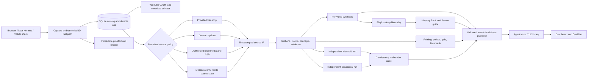

# YouTube Learning Center

> **YLC** is a local-first, playlist-aware learning workstation that keeps the YouTube player, source-grounded Markdown, chapters, learning peaks, visual scenes, diagrams, active-recall probes, playlist synthesis, and personal notes in one fast interface.

This replaces the pedestrian “send a video, receive a summary” framing of **LongVid Learning Studio**. The product category is a **learning center**, not a summarizer. Its value is the complete learning loop: prepare before watching, understand while watching, encode afterward, rehearse a technically accurate explanation, and revisit weak concepts later.

The implementation must be usable locally on Windows or hosted privately on Spark through Tailscale. It must default to local models, remain provider-agnostic, preserve Markdown as durable human-owned knowledge, and state honestly what source material it actually analyzed.

## Product Outcome

Opening YLC should feel like applying Obsidian Web Clipper to a video while the video is still present and controllable. The user signs into YouTube, sees supported playlists in a compact left rail, selects or imports videos, and enters a three-pane study workspace:

1. **Library rail:** account, Inbox, owned YouTube playlists, imported playlists, local collections, processing state, search, and review-due views.
2. **Learning canvas:** official embedded player, chapters/YLC sections, aligned learning tracks, selected scenes, rendered Markdown, Mermaid, Excalidraw previews, evidence, and personal notes.
3. **Learning dock:** priming, in-video probes, quizzes, flashcards, glossary, open questions, review schedule, Dwarkesh Test, and job progress.

The home screen must answer:

- What can I learn next from my playlists without losing another video in a watch queue?
- What did this video actually claim, and which timestamp supports each important point?
- Which sections are worth watching directly even if I skip the rest?
- Where am I confused, and what should I explain in my own words before continuing?
- Which concepts across a playlist account for most of its practical learning value?
- Can I give a two-minute, technically correct, accessible, interesting explanation and survive three sharp follow-ups?
- Which concepts are due for review across the entire library?

### Product principles

- **The video remains the source.** Every important generated claim points back to a timestamp, transcript span, scene, or explicitly labelled external source.
- **Markdown is durable knowledge.** The browser is a high-quality view and safe editor, not the only place the output exists.
- **Learning is staged.** Priming, active consumption, self-explanation, encoding, and review are separate interactions—not one enormous final summary.
- **Fast means progressive.** Intake and existing-item lookup are immediate; long analysis runs as durable background work and publishes useful stages early.
- **Local first, provider optional.** No Gemini model or hosted provider is architectural. Model roles use replaceable adapters.
- **Human corrections win.** Regeneration never overwrites My Notes, locked corrections, approved cards, quiz history, or manually edited diagrams.
- **Source access is explicit.** Metadata-only output is never presented as transcript-based analysis; local-media processing requires an explicit permitted source.

## Personal V0

The personal V0 is a dashboard-first system for fewer than **500 videos and 50 playlists**. Its intended Markdown library is:

```text
F:\Vaults\LLMWiki\Agent Inbox\YouTube Learning Center
```

The application code, virtual environment, SQLite database, OAuth tokens, temporary media, caches, and model logs remain outside the Obsidian vault. Only intentional Markdown learning artifacts, permitted transcript text, selected images, diagram sources/previews, and durable review records belong in the YLC library.

V0 must provide:

- official YouTube OAuth with `youtube.readonly` for the signed-in channel's owned playlists and supported collections;
- explicit URL import for saved third-party playlists or videos that the official account API does not enumerate;
- a compact three-pane desktop UI and a focused mobile capture/read/review experience;
- the official YouTube IFrame player with timestamp seeking and ordinary YouTube deep links;
- one canonical folder per video, linked from any number of playlist manifests;
- provided transcript/VTT/SRT ingestion and a metadata-only `needs source` state when no permitted transcript exists;
- one captioned-video vertical slice that produces a timestamped study note, evidence ledger, learning peaks, quiz, protected notes, and safe regeneration;
- pre-consumption priming, active-consumption probes, post-consumption encoding, and a Dwarkesh Test session;
- independent Mermaid and Excalidraw generation from the same evidence base, followed by a consistency audit;
- a playlist **Build Mastery Pack** button that combines completed per-video outputs into a Pareto guide, curriculum, coverage map, playlist diagrams, cumulative quiz, and Dwarkesh Test;
- local-first model profiles for fast extraction, deep synthesis, vision, embeddings, ASR, quiz generation, and playlist-deep reasoning;
- SQLite-backed durable jobs, server-sent progress events, stage retry/resume, and proof-bound publication receipts;
- a Windows-authoritative mode and a Spark-authoritative mode, with only one writer at a time and an explicit drain-and-handoff procedure;
- localhost-only service binding and private Spark HTTPS through Tailscale Serve;
- versioned backup plus a tested clean restore.

The existing Discord channel named `#youtueb-analysis` and its configured Hermes bot are a known integration target, but the **dashboard is the V0 interaction surface**. Hermes integration begins only after the local dashboard and one-video learning loop are trusted.

### Resolved product decisions

| Decision | Chosen contract |
|---|---|
| Durable authority | Markdown owns learning artifacts and manual knowledge; SQLite owns operational state, caches, OAuth pointers, search index, jobs, and scheduling |
| Writer ownership | Windows or Spark may be authoritative, but never simultaneously; authority changes only through an explicit verified handoff |
| Playlist coverage | Official OAuth account sync plus pasted playlist/video URLs for unsupported Library items |
| Source boundary | Official metadata/player first; ASR and frames only for captions/media the user explicitly supplies, owns, or is otherwise authorized to process |
| Learning goal | Understand, apply, and retain with evidence-grounded practice |
| Models | Local-first task router; hosted fallback is opt-in per job/profile and never provider-specific |
| Playlist import | Sync metadata and preview; process selected or newly chosen videos, not an entire playlist automatically |
| Video identity | One canonical video folder; playlist manifests link to it rather than duplicating notes |
| Temporary media | Delete after verified processing; retain permitted transcript Markdown, selected learning scenes, hashes, and provenance |
| External verification | Off by default; opt in per video/playlist and keep it visibly separate from “the video says” |
| Desktop layout | Three-pane studio with aligned tracks under the player |
| Mobile | Capture, resume, read, and quiz; deep editing is desktop-first |
| Dashboard edits | Notes, corrections, locks, playlist intent, and quiz ratings write safely back to Markdown |
| Diagrams | Mermaid and Excalidraw are generated independently for complementary views, then cross-checked against the same evidence/concept IDs |
| Review | Per-video, per-playlist, and global FSRS-style review with a Markdown history/export |
| Hermes | Dashboard-only V0; use the existing YouTube-analysis channel later |
| Scale | Validate V0 below 500 videos and 50 playlists |

## Interface and Navigation Contract

### Desktop shell

```text
┌──────────────────────┬────────────────────────────────────────────┬──────────────────────────┐
│ YLC library rail     │ Learning canvas                            │ Learning dock            │
│                      │                                            │                          │
│ Account + Sync       │ Official YouTube player                    │ Prime                    │
│ Quick capture        │                                            │ Quiz                     │
│ Inbox                │ Chapters / YLC sections                    │ Explain                  │
│ Owned playlists      │ Learning Peaks / scenes / notes / probes   │ Cards                    │
│ Imported playlists   │                                            │ Map                      │
│ Collections          │ Learn / Evidence / Apply / Source          │ Questions                │
│ Processing           │ Markdown + Mermaid + Excalidraw previews   │ Review                   │
│ Review due           │                                            │ Dwarkesh Test            │
│ Search               │ My Notes                                   │ Job                      │
└──────────────────────┴────────────────────────────────────────────┴──────────────────────────┘
```

Use resizable panes and remember widths per browser without making browser storage authoritative. At approximately tablet width, the rail becomes a drawer and the learning dock becomes a bottom sheet. The player, learning tracks, and active document remain first-class at every width.

### Library rail

The rail is dense and calm, borrowing Social Capture's compact information hierarchy rather than YouTube's entertainment feed.

- **Account:** avatar, channel name, connected writer host, OAuth health, playlist-sync age, and authority epoch.
- **Quick capture:** paste a video/playlist URL; later accept browser share or Hermes intake.
- **Inbox:** captured videos not yet assigned to a playlist or local collection.
- **Owned playlists:** playlists returned by `playlists.list(mine=true)`, with pagination, cached counts, and local processing progress.
- **Imported playlists:** explicitly added playlist URLs not mislabelled as account-owned.
- **Collections:** local-only learning folders such as `Random AI Videos`, `Physics`, or `Build Next`.
- **Processing:** queued, metadata ready, needs source, acquiring, transcribing, extracting, synthesizing, generating artifacts, ready, blocked, and failed.
- **Saved views:** unprocessed, partially learned, quiz due, weak concepts, incomplete evidence, recently changed, and ready for Mastery Pack.
- **Search:** title/channel/playlist plus full-text search over approved Markdown and permitted transcript spans.

Selecting a playlist opens its metadata and ordered videos immediately from cache, then refreshes in the background. It does not begin model processing. Checkboxes support selected videos, unprocessed videos, a bounded rolling batch, or all videos after explicit confirmation.

### Learning canvas

The upper canvas uses the official IFrame Player with required YouTube controls. Trusted code owns `video_id`, validated timestamps, seeking, and deep links.

Directly below the player, align these tracks to one time axis:

1. **YouTube creator chapters:** parsed from valid description timestamps.
2. **YLC sections:** semantic boundaries derived from an actual transcript/source and visibly distinguished from creator chapters.
3. **Learning Peaks:** locally ranked definitions, explanations, demonstrations, diagrams, code/settings changes, counterexamples, and dense moments.
4. **Scenes:** 6–12 adaptive, nonduplicate learning scenes per hour when authorized media is available; otherwise timestamp cards and official thumbnails.
5. **My moments:** user bookmarks, notes, confusion markers, and personal rewatches.
6. **Claims:** important evidence-ledger claims.
7. **Probes:** priming, prediction, paraphrase, retrieval, and quiz checkpoints.

YouTube's public **Most replayed** curve is not available through the documented Data API or IFrame API. The native player may display it when YouTube chooses. YLC must never scrape or fabricate it. For videos owned by the authenticated channel, a later Creator Analytics adapter may show an explicitly labelled audience-retention track; it is not the public Most replayed feature.

Below the timeline, document tabs replace chat bubbles:

- **Learn:** orientation, central thesis, content map, substantive explanation, key concepts, reasoning chain, and durable takeaways.
- **Evidence:** claims, speakers, transcript spans, support type/strength, uncertainty, and opt-in external verification.
- **Apply:** procedures, prerequisites, examples, failure modes, tests, applicability boundaries, and what not to copy.
- **Artifacts:** diagrams, scene gallery, tables, glossary, comparison matrix, and playlist handoffs.
- **Source:** transcript/source text with search, timestamp navigation, and coverage highlighting.
- **My Notes:** user-owned Markdown only; regeneration cannot modify it.

### Learning dock

The right dock remains usable while the video plays:

- **Prime:** prior knowledge, expectations, why the topic matters, goals, essential questions, and predicted answer.
- **Quiz:** free recall, explain-back, application, misconception repair, ordering, timestamp hunt, and selected multiple choice.
- **Explain:** paraphrase, first-principles reconstruction, analogy, prediction, connection to prior knowledge, and confusion capture.
- **Cards:** generated flashcard candidates with approve/edit/reject; only approved cards enter the review queue.
- **Map:** compact diagram preview and links to both Mermaid and Excalidraw artifacts.
- **Questions:** open questions, missing prerequisites, contradictions, and questions grounded in selected evidence spans.
- **Review:** confidence, weak concepts, attempts, next due date, and FSRS state.
- **Dwarkesh Test:** two-minute explanation rehearsal, rubric, sharp follow-ups, and improvement history.
- **Job:** stage, elapsed time, model profile, source basis, warnings, provider calls, retry failed stage, and cancel where safe.

### Visual direction

- Light-first, warm neutral canvas; white work surfaces; graphite type; one restrained forest/teal accent.
- Compact rows, subtle dividers, small status signals, and deliberate typography.
- No gradients, glassmorphism, giant metric cards, ornamental emoji, chat-bubble walls, or oversized radii.
- Source properties resemble a clean Obsidian Web Clipper result: video URL, channel, playlist, source basis, analysis recipe, model profile, refresh age, and generation revision.
- Keyboard navigation: `/` search, `N` note at current timestamp, `M` save moment, `Q` open quiz, `[`/`]` previous/next section, and a visible shortcut guide.
- All controls remain keyboard usable, focus visible, and screen-reader labelled.

## Learning Workflow and the Dwarkesh Test

YLC must treat learning as a state machine, not a single completion checkbox.

### Phase 1 — Pre-consumption priming

Before playback or analysis disclosure, the user can run a short primer:

1. What do I already know?
2. What do I expect this source to teach?
3. Why does it matter to a current topic, project, or goal?
4. Which terms or prerequisites may block understanding?
5. What do I predict the central explanation or conclusion will be?

The generated primer may reveal a high-level source map and prerequisite vocabulary, but should avoid spoiling every conclusion by default. Store the user's answers as durable personal evidence of learning change.

### Phase 2 — Active consumption and comprehension monitoring

During playback, YLC inserts bounded probes at section boundaries, Learning Peaks, confusing transitions, or user-selected intervals. Probes must be pausable and should not interrupt every few minutes by default.

- **Paraphrase:** explain the section in the user's own words.
- **First principles:** identify the problem, constraints, mechanism, and why the conclusion follows.
- **Connect:** link the concept to prior knowledge, a current project, or another video.
- **Predict:** state what should come next and why.
- **Analogy:** create a vivid but structurally faithful analogy, then name where it breaks.
- **Confusion marker:** record the exact missing step rather than “I don't get it.”
- **Active probe:** answer a small evidence-linked question before continuing.

The player can pause automatically for probes only when the user enables Focus mode. Standard mode shows nonblocking markers.

### Phase 3 — Post-consumption encoding

After a video or section, YLC creates an encoding session:

- Why does this concept exist?
- Explain it as if to a thoughtful twelve-year-old without making it false.
- Which details are indispensable, and which are examples or decoration?
- Give one concrete example, one counterexample, and one edge case.
- Debate the strongest limitation or alternative explanation.
- Connect it to at least two prior concepts or goals.
- State what evidence would change the conclusion.

The system compares the answer with evidence and a rubric, proposes corrections, and lets the user confirm the rating. Open-ended model grading is advisory, never final authority.

### The Dwarkesh Test

The user's mastery test is a first-class artifact and session type:

> Give a two-minute explanation as if answering on a technically serious podcast. It must be accurate, accessible to smart non-specialists, interesting because it includes context, limitations, and connections, and strong enough to survive three sharp follow-up questions without notes, long pauses, or vague language.

Rubric, each scored with evidence and user confirmation:

| Dimension | Passing behavior |
|---|---|
| Technical accuracy | No material factual or causal error; uncertainty is stated honestly |
| Accessibility | Terms are defined and the reasoning can be followed without domain shorthand |
| Structure | Clear problem → mechanism → evidence/example → implication arc within two minutes |
| Interest and depth | Includes a vivid accurate example/analogy, context, limitation, or surprising connection |
| Follow-up resilience | Answers three adversarial or clarifying questions precisely without evasive vagueness |
| Delivery | Minimal long pauses, filler, circular phrasing, or dependence on visible notes |

V0 supports a timed typed rehearsal and optional local microphone recording. If audio is recorded, local ASR measures duration, pauses, filler, and terminology; audio is deleted after review unless the user explicitly keeps it. The transcript, rubric, corrections, and follow-up history are durable Markdown.

## Learning Artifact Contract

### Required per-video artifacts

Every processed video folder contains:

1. **`Video.md`** — source properties, analysis-basis disclosure, orientation, timestamped map, substantive note, critical evaluation, applicability, durable takeaways, selective watch list, and current mastery state.
2. **`My Notes.md`** — user-authored notes, goals, connections, corrections, and saved moments. No generator may write here except through an explicit user edit command.
3. **`Evidence.md`** — claim IDs, faithful claims, speakers, timestamps, source spans/hashes, support type, limitation, and separate external-verification state.
4. **`Quiz.md`** — stable question IDs, concept/claim links, rubric, timestamp, difficulty, approval state, and generation version.
5. **`Learning Sessions.md`** — primer answers, active probes, confusion markers, post-encoding exercises, and Dwarkesh Test history.
6. **`Transcript.md`** — permitted transcript/source text with timestamp spans and source basis; raw media and non-Markdown caption formats remain outside the library unless explicitly retained.
7. **`Artifacts/Mermaid.md`** plus validated SVG preview.
8. **`Artifacts/Mind Map.excalidraw.md`** plus SVG preview.
9. **`Artifacts/Scenes.md`** plus selected permitted scene images or timestamp-card fallbacks.
10. **`Generation Ledger.md`** — input hashes, recipe/prompt/model versions, stage results, timings, provider calls, validation, and active artifact revision.

### Adaptive recipes

Do not force every section into every note. A visible recipe selector chooses or overrides:

| Source type | Primary artifacts |
|---|---|
| Lecture / explanation | concept hierarchy, causal model, glossary, misconceptions, Feynman/Dwarkesh prompts |
| Tutorial / demo | prerequisite checklist, ordered runbook, settings, failure tree, expected-result scenes |
| Interview / panel | speaker map, attributed claims, agreements/disagreements, question trail |
| Argument / commentary | thesis tree, premise/evidence map, assumptions, counterarguments, rhetoric/evidence split |
| News / update | before/after state, timeline, effective dates, confirmed/speculative changes |
| Review / comparison | rubric audit, test-method critique, trade-off matrix, recommendation by user type |
| Documentary / case study | chronology, decisions, causal graph, perspective gaps, transferable lessons |
| List / roundup | deduplicated items, ranking rationale, effort/impact, what not to adopt |

### Independent diagram contract

The user explicitly chose independent Mermaid and Excalidraw generation. Implement them as two separate artifact runs:

- **Mermaid:** compact logical view optimized for hierarchy, causality, sequence, state, or comparison.
- **Excalidraw:** spacious memory-oriented mind map optimized for clustering, visual cues, examples, and associative recall.

Both runs consume the same validated evidence ledger and stable concept IDs but may select different edges and layouts. After generation, a deterministic consistency audit checks that both maps:

- contain no unsupported factual node;
- retain evidence/timestamp links;
- do not define the same concept incompatibly;
- record omissions as intentional view differences;
- parse/render successfully before publication.

A manually edited Excalidraw file is never overwritten. Regeneration creates a dated proposal beside it and asks which version should become active.

### Playlist Mastery Pack

Every imported/owned playlist has a prominent **Build Mastery Pack** button. It is disabled until at least one selected video is ready and shows a coverage warning until all selected videos are ready.

The button triggers a separate `playlist-deep` profile using a stronger-thinking, large-context model. Video jobs may run independently in parallel with bounded concurrency. Final synthesis never concatenates raw summaries or sends an unbounded playlist into one opaque call. It performs:

```text
validated per-video source IR and evidence
  → concept normalization and deduplication
  → video × concept coverage matrix
  → prerequisite and contradiction analysis
  → hierarchical deep synthesis
  → Pareto ranking for the user's goals
  → independent playlist Mermaid and Excalidraw runs
  → cumulative quiz, review plan, and Dwarkesh Test
  → validation and atomic publication
```

The **Pareto guide** is an explicit heuristic, not a fake mathematical guarantee. Rank the small set of concepts likely to produce most learning value using prerequisite power, recurrence, explanatory centrality, applicability to the user's stated goals, uniqueness, and quiz weakness. Show why each concept ranked highly and which videos/timestamps teach it best.

Playlist folder artifacts:

- `Playlist.md` — ordered membership, processing status, intent, and links to canonical video folders;
- `Mastery Pack.md` — one coherent conceptual learning location spanning the playlist;
- `Pareto Guide.md` — highest-leverage concepts, best explanations, dependencies, and watch recommendations;
- `Coverage Matrix.md` — concepts × videos, evidence coverage, gaps, and no-unique-contribution states;
- `Curriculum.md` — source order and recommended prerequisite order;
- `Contradictions.md` — disagreements, changed claims, alternative frameworks, and unresolved questions;
- `Playlist Quiz.md` and `Review Plan.md`;
- `Dwarkesh Test.md` — two-minute playlist explanation plus sharp follow-ups;
- `Playlist Mermaid.md` and `Playlist Mind Map.excalidraw.md`, both covering the complete synthesized evidence;
- `Mastery Generation Ledger.md` — selected videos, missing/blocked videos, model/context profile, stage hashes, and validation.

## Build Boundary

### MVP

- one provided-caption YouTube video;
- official embedded player and timestamp seeking;
- one local text-model profile;
- progressive timestamped `Video.md` and `Evidence.md`;
- protected `My Notes.md` and safe regeneration;
- priming, one active probe type, post-encoding, quiz, and typed Dwarkesh rehearsal;
- local Windows dashboard at `127.0.0.1`;
- Markdown read-back verification and fixture tests.

### Personal V0

Everything in Personal V0 above, including OAuth playlist browsing, imported URLs, adaptive recipes, diagrams, authorized scene extraction, FSRS review, playlist Mastery Pack, writer handoff, Spark/Tailscale profile, backup/restore, and sub-500-video validation.

### Later

- existing `#youtueb-analysis` Hermes/Discord capture, lookup, status, and completion cards;
- browser extension and mobile share target;
- voice-first Dwarkesh interview with live local feedback;
- Creator Analytics retention for videos owned by the signed-in channel;
- optional embedded Excalidraw editing rather than SVG preview plus Open in Obsidian;
- Anki export, audio overview, NotebookLM source-pack handoff, and personal curriculum integration;
- cross-playlist concept graph and semantic library search after FTS proves insufficient;
- Dashboard Command Center registration.

### Explicitly out of scope

- generalized or hidden YouTube downloading;
- promising every saved YouTube Library playlist or Watch Later through unsupported APIs;
- scraping the public Most replayed curve, automatic chapters, captions, or iframe pixels;
- fabricating analysis from title, thumbnail, description, comments, or search snippets;
- public internet deployment or Tailscale Funnel;
- two active Markdown writers;
- Redis/Celery, PostgreSQL, vector database, Kubernetes, or microservices before measured need;
- multi-user accounts, billing, collaboration, or public SaaS concerns in personal V0;
- letting a model invent file paths, IDs, job status, evidence, or successful-write receipts.

## Existing Products, Building Blocks, and Shortcuts

- The local Social Capture repository at `E:\GIT_ROOT\Projects\social-capture` is the architectural inspiration: compact rail/inspector UI, Markdown ownership, optimistic concurrency, PWA shell, localhost-only Tailscale deployment, deterministic pre-agent dedupe, background-safe operations, and proof-bound receipts. Reuse its disciplines, not its queue schema.
- [YouTube Data API](https://developers.google.com/youtube/v3/docs) supports official account metadata and owned playlist enumeration. [`playlists.list`](https://developers.google.com/youtube/v3/docs/playlists/list), [`playlistItems.list`](https://developers.google.com/youtube/v3/docs/playlistItems/list), and batched [`videos.list`](https://developers.google.com/youtube/v3/docs/videos/list) are the sidebar foundation.
- [Google's web-server OAuth flow](https://developers.google.com/identity/protocols/oauth2/web-server) fits Spark/Tailscale hosting; the [installed-app loopback flow](https://developers.google.com/youtube/v3/guides/auth/installed-apps) fits Windows-local operation. Use the narrow `youtube.readonly` scope.
- The [YouTube IFrame Player API](https://developers.google.com/youtube/iframe_api_reference) provides playback, state events, seeking, current time, and playlist control. It does not provide transcript text, arbitrary frames, automatic chapters, or Most replayed data.
- The official [captions API](https://developers.google.com/youtube/v3/docs/captions) is not a universal public transcript service. Caption download requires permission to edit the video.
- [FFmpeg](https://ffmpeg.org/ffmpeg-filters.html) supplies scene detection and frame extraction for explicitly authorized media. Candidate scenes still need OCR/VLM ranking and perceptual deduplication.
- [Mermaid](https://mermaid.js.org/config/usage) provides validated logical diagrams. Keep `securityLevel: strict`, generate trusted timestamp links in code, and retain visible render failures.
- [Excalidraw](https://docs.excalidraw.com/) and the [Obsidian Excalidraw plugin](https://github.com/zsviczian/obsidian-excalidraw-plugin) provide editable spatial maps and SVG previews.
- [faster-whisper](https://github.com/SYSTRAN/faster-whisper) or a compatible local ASR adapter can transcribe permitted media; the architecture should not bind to one ASR implementation.
- [Tailscale Serve](https://tailscale.com/docs/features/tailscale-serve) supplies private tailnet HTTPS to a localhost service. Do not use Funnel.
- [NotebookLM](https://support.google.com/notebooklm/answer/16215270) is the fastest no-code fallback for public captioned videos, but it primarily imports transcript text and does not replace YLC's player-synced notes, custom artifacts, protected Markdown, playlist coverage, or active-learning loop.
- `yt-dlp` is not a default dependency. An unbundled expert adapter may exist only for material the user is authorized to process, with a recorded source-rights basis and a clear YouTube-terms warning.

**Simplest reality check before coding everything:** manually run the existing `/longvid` recipe on five varied videos, store the results in the proposed folder grammar, and rehearse the priming/probe/Dwarkesh loop. Build only the interaction and automation that repeatedly improves learning.

## Recommended Free-First Stack

### Chosen implementation lane

- **Frontend:** React + TypeScript + Vite PWA. React is justified by the three-pane stateful workspace, future Excalidraw component option, and accessible component ecosystem. Use plain CSS variables/tokens and a compact custom design; do not introduce a general UI framework before need.
- **Player:** official YouTube IFrame API wrapper with exact-origin configuration and typed events.
- **Markdown:** `react-markdown`/unified pipeline with GFM and strict HTML sanitization; trusted code constructs timestamp links.
- **Mermaid:** pinned browser bundle, typed input adapter, `parse`/`render` validation, strict security, sibling SVG output.
- **Excalidraw:** generate Obsidian-compatible `.excalidraw.md` plus SVG preview; embed the full editor later only if browser editing earns its dependency cost.
- **API:** Python 3.12+, FastAPI, Pydantic, narrow resource endpoints, CSRF/origin checks, and server-sent events.
- **Environment:** UV with `.python-version`, `pyproject.toml`, and `uv.lock`; one pinned Node package manager/lock for the frontend.
- **Operational store:** SQLite WAL, foreign keys, busy timeout, FTS5, explicit migrations, and a single mutation service.
- **Markdown publisher:** stable IDs, revision hashes, same-directory atomic writes, protected user regions/files, conflict response, canonical read-back, and generation ledger.
- **Jobs:** SQLite-backed durable stage machine inside the API/worker codebase. Add Redis only after measured multi-process coordination failure.
- **YouTube:** official OAuth/Data API adapters, quota counters, pagination, ETags, embeddability status, and 30-day API-metadata refresh/delete maintenance.
- **Models:** OpenAI-compatible provider interface with task profiles; local Spark/workstation routes are defaults.
- **ASR/vision:** replaceable local adapters for faster-whisper-compatible ASR, OCR, perceptual hashing, and a local VLM.
- **Diagrams:** two independent generation workers plus a shared post-generation evidence/consistency validator.
- **Review:** FSRS-compatible scheduler in SQLite; durable questions, approvals, corrections, and review log in Markdown.
- **Testing:** pytest, property tests for paths/IDs/regeneration, golden Markdown fixtures, browser tests, model-schema contract tests, and representative real-model probes.
- **Deployment:** Windows local launcher first; systemd user service on Spark; raw listener `127.0.0.1`; Tailscale Serve; OAuth secrets in OS credentials or host-private config.

### Model profiles

| Profile | Work | Default behavior |
|---|---|---|
| `fast-extract` | content type, sections, glossary, claim candidates | small local model, structured output, bounded context |
| `video-deep` | evidence-aware per-video synthesis and critique | stronger local text model, hierarchical inputs |
| `playlist-deep` | Mastery Pack, Pareto guide, cross-video contradictions/maps | strongest available local reasoning model, large context, hierarchical fallback |
| `quiz` | probes, rubrics, follow-ups, misconception repair | local structured model grounded in concept/claim IDs |
| `vision-rank` | learning-scene instructional value | local VLM only for authorized frames |
| `embed` | optional semantic retrieval | local embedding model; FTS remains sufficient for MVP |
| `asr` | permitted media transcription | local ASR adapter with word/segment timestamps |
| `hosted-fallback` | explicitly approved difficult job | disabled by default; records provider, consent, cost/tokens, and evidence boundary |

## Architecture and Data Model

### System flow



### Storage boundary

```text
Application data (outside Obsidian Sync and Git)
  Windows: %LOCALAPPDATA%\YouTubeLearningCenter\
  Spark:   ~/.local/share/youtube-learning-center/
    ylc.sqlite
    cache/
    permitted-source-staging/
    temporary-media/
    model-logs/
    backups/

Private configuration (outside vault)
  Windows: OS credential store + %APPDATA%\YouTubeLearningCenter\config.toml
  Spark:   secret store or ~/.config/youtube-learning-center/config.toml (0600)

Durable learning library
  F:\Vaults\LLMWiki\Agent Inbox\YouTube Learning Center\
```

### Markdown library layout

```text
YouTube Learning Center/
├── _YLC Home.md
├── _Writer Authority.md
├── Inbox.md
├── Inbox/
├── Videos/
│   └── <video-id> - <short-title>/
│       ├── Video.md
│       ├── My Notes.md
│       ├── Evidence.md
│       ├── Quiz.md
│       ├── Learning Sessions.md
│       ├── Transcript.md
│       ├── Generation Ledger.md
│       └── Artifacts/
│           ├── Mermaid.md
│           ├── Mermaid.svg
│           ├── Mind Map.excalidraw.md
│           ├── Mind Map.svg
│           ├── Scenes.md
│           └── Scenes/
├── Playlists/
│   └── <playlist-id> - <playlist-title>/
│       ├── Playlist.md
│       ├── Mastery Pack.md
│       ├── Pareto Guide.md
│       ├── Coverage Matrix.md
│       ├── Curriculum.md
│       ├── Contradictions.md
│       ├── Playlist Quiz.md
│       ├── Review Plan.md
│       ├── Dwarkesh Test.md
│       ├── Playlist Mermaid.md
│       ├── Playlist Mind Map.excalidraw.md
│       └── Mastery Generation Ledger.md
├── Collections/
├── Review/
│   ├── Due.md
│   └── Review Log.md
└── _System/
    ├── Recipes/
    ├── Schemas/
    └── Migration Ledger.md
```

Playlist manifests contain ordered wikilinks to canonical video folders. The same video is never regenerated merely because it appears in another playlist. Playlist-specific goals, position, commentary, and inclusion decisions live in the playlist folder.

### Markdown ownership and regeneration

- `My Notes.md`, user corrections, approved cards, quiz attempts, review events, and accepted Dwarkesh revisions are human-owned.
- Generated files have stable block/artifact IDs, input hashes, active generation IDs, and expected revisions.
- Regeneration creates and validates a candidate revision before atomically replacing the active generated projection.
- Unknown frontmatter and user-added sections are preserved.
- A stale dashboard edit receives HTTP 409 with current revision and a diff/merge path.
- A manually edited generated diagram is detected by hash and protected; regeneration writes a proposal beside it.
- Removed/private videos remain in the library with changed source status; remote playlist changes never mirror-delete knowledge.
- SQLite can be deleted and rebuilt from Markdown, generation ledgers, and configured OAuth resync. Quiz due dates may be rebuilt from review events.

### Explicit writer authority and handoff

`_Writer Authority.md` records `authority_host`, `authority_epoch`, `prepared_at`, `accepted_at`, last library hash manifest, and handoff status. It is an extra fail-closed guard, not a distributed lock.

Implement three commands/API operations:

- `authority status` — current host, epoch, active jobs/writes, sync/hash health;
- `authority prepare --to <host>` — stop accepting new work, drain/cancel safe jobs, finish atomic publication, snapshot SQLite/library, stop writer, and emit a signed/hash manifest;
- `authority accept --from <host> --manifest <id>` — require complete sync and matching manifest, increment epoch, activate the target, run write/read-back probe, and leave the source read-only.

Handoff gate:

1. disable intake on the source;
2. drain all publishing jobs and prove no write lock is held;
3. create a versioned backup and integrity-check SQLite;
4. stop the source writer service;
5. wait for Obsidian Sync to report complete on both replicas;
6. verify the authority file, generation ledgers, and selected folder hashes against the manifest;
7. activate the target with the next authority epoch and host-local OAuth credentials;
8. run `/api/health`, one safe note write/read-back, model health, and rollback check;
9. keep the old host read-only until another explicit handoff.

If any hash/sync/epoch check fails, neither host may infer authority. The operation stops with recovery paths. Do not copy OAuth tokens, browser sessions, or active SQLite files between hosts.

### Job state machine

```text
discovered
  → metadata_ready
  → needs_source | source_ready
  → transcribing
  → source_ir_ready
  → extracting
  → video_synthesizing
  → early_note_ready
  → diagrams_generating
  → quiz_generating
  → validating
  → ready

Any stage → blocked | failed | cancelled
Playlist selection → waiting_for_videos → playlist_synthesizing → mastery_validating → mastery_ready
```

Every stage has an idempotency key derived from video/playlist ID, source hash, recipe version, prompt/schema version, model profile, and upstream artifact hashes. Retry only the failed/invalidated stage. Existing approved output remains visible until a replacement validates.

### Core records

| Record | Important fields/invariants |
|---|---|
| `VideoSource` | video ID, exact URL, channel, source basis, rights mode, acquired/refreshed times, availability |
| `CollectionMembership` | playlist/collection, video ID, position, first/last seen, local intent, removed state |
| `TranscriptSegment` | stable segment, start/end, speaker, text, source type, confidence, hash |
| `Section` | start/end, creator/YLC origin, title, supporting segment IDs |
| `Claim` | faithful claim, speaker, evidence type/strength, segment IDs, external-verification state |
| `Concept` | stable concept ID, definition, aliases, prerequisites, claim IDs, user correction |
| `LearningPeak` | timestamp/range, selection reason, evidence/concept IDs, score components, user override |
| `FrameCandidate` | timestamp, permission mode, file/thumbnail, perceptual hash, OCR, selection reason |
| `Artifact` | kind/path, input/output hash, generation ID, model/prompt/schema versions, validation state |
| `QuizItem` | concept/claim IDs, prompt, rubric, timestamp, difficulty, approval/lock state |
| `ReviewEvent` | item/concept, response, confidence, suggested/confirmed score, reviewed time |
| `LearningSession` | phase, answers, confusion markers, goals, connections, Dwarkesh rubric/follow-ups |
| `GenerationRun` | stage DAG, inputs/outputs, model endpoint/profile, timings, provider calls, errors |
| `AuthorityEpoch` | writer host, epoch, source/target state, manifest hashes, prepare/accept evidence |

Keep `video says`, `YLC inference`, `external verification`, and `user correction` distinct at storage and rendering layers.

### Source modes

1. `provided_transcript`
2. `owner_caption`
3. `authorized_local_media`
4. `hosted_url_adapter_opt_in`
5. `metadata_only`

Every visible artifact displays the source basis. The system never reconstructs a video from metadata. An expert `yt-dlp` adapter, if ever implemented, is unbundled and cannot run without an explicit authorization record.

### Latency contract

| Path | V0 target and invariant |
|---|---|
| Cached shell/sidebar | render useful cached state under 500 ms p95 on the host LAN/tailnet |
| Existing video/job lookup | under 500 ms p95 and exactly zero model calls |
| New URL enqueue | durable readable job plus deep link under 1 second p95 before analysis begins |
| Playlist metadata | partial paginated results visible while refresh continues |
| Captioned one-video pipeline | early usable note publishes before optional diagrams/scenes; record actual stage timings |
| Long analysis | never blocks the UI or Hermes gateway; progress streams through SSE |
| Playlist Mastery Pack | background deep job with partial coverage state; no fixed wall-clock promise until benchmarked |
| Regeneration | unchanged stages are cache hits; active approved output remains available |

Targets are acceptance goals, not invented model-performance claims. Record p50/p95, provider-call count, token counts, queue wait, inference, validation, publication, and end-to-end time on representative real models.

## API and Code Layout

### Intended repository

```text
E:\GIT_ROOT\Projects\youtube-learning-center\
├── AGENTS.md
├── README.md
├── pyproject.toml
├── uv.lock
├── .python-version
├── backend/
│   └── ylc/
│       ├── api/             # narrow routes, auth, errors, SSE
│       ├── authority/       # writer epochs and handoff
│       ├── youtube/         # OAuth, playlist/video API, chapters, quota
│       ├── sources/         # transcript/caption/media/provider policies
│       ├── jobs/            # durable stage machine and retries
│       ├── models/          # task profiles and provider adapters
│       ├── learning/        # primers, probes, quiz, FSRS, Dwarkesh
│       ├── artifacts/       # Markdown, Mermaid, Excalidraw, scenes
│       ├── playlists/       # coverage, Pareto, Mastery Pack
│       ├── storage/         # SQLite, files, revisions, atomic publisher
│       └── security/        # secrets, origin/CSRF, path/SSRF validation
├── web/
│   ├── package.json
│   ├── lockfile
│   └── src/
│       ├── shell/
│       ├── library-rail/
│       ├── player/
│       ├── timeline/
│       ├── markdown-canvas/
│       ├── learning-dock/
│       ├── diagrams/
│       ├── quiz/
│       └── api/
├── plugins/
│   └── youtube-learning-center/    # later Hermes plugin mirror
├── deploy/
│   ├── youtube-learning-center.service
│   └── tailscale-runbook.md
├── tests/
│   ├── fixtures/
│   ├── golden/
│   ├── backend/
│   ├── browser/
│   ├── model-contracts/
│   └── deployment/
└── scripts/
```

This tree is a future implementation contract. This specification task must not scaffold it beyond the README.

### Required API surface

| Method/path | Purpose |
|---|---|
| `GET /api/health` | writer authority, library/database/model/OAuth health, version markers |
| `GET /api/auth/youtube/status` | account and token health without exposing secrets |
| `GET /api/auth/youtube/start` / callback | deployment-specific OAuth transaction |
| `POST /api/auth/youtube/logout` | revoke/remove host-local credential after confirmation |
| `GET /api/library` | cached navigation counts and saved views |
| `GET /api/playlists` | owned/imported/local playlists with pagination and refresh age |
| `POST /api/playlists/import` | validate and add explicit playlist URL |
| `POST /api/playlists/{id}/sync` | metadata-only sync with quota/read-back receipt |
| `GET /api/playlists/{id}/videos` | ordered membership and processing state |
| `POST /api/videos/enqueue` | canonicalize ID, dedupe, create durable selected job |
| `GET /api/videos/{id}` | note/artifact/source/job summary |
| `PATCH /api/videos/{id}/notes` | revision-checked user note/correction/lock update |
| `POST /api/videos/{id}/moments` | save timestamped manual moment |
| `POST /api/videos/{id}/regenerate` | invalidate selected artifact/stages only |
| `POST /api/playlists/{id}/mastery-pack` | deep playlist synthesis over selected ready video revisions |
| `GET /api/jobs/{id}` | durable status, stages, warnings, timings |
| `GET /api/events` | SSE job/library/review updates |
| `POST /api/quiz/session` | priming, active probe, encoding, review, or Dwarkesh session |
| `POST /api/quiz/items/{id}/attempt` | store response and suggested/confirmed rating |
| `GET /api/review/due` | global FSRS due queue |
| `GET /api/models/profiles` | configured role/profile health, never raw secrets |
| `GET /api/authority` | writer epoch and handoff readiness |
| `POST /api/authority/prepare` / `accept` | explicit confirmed host handoff |

No endpoint accepts an arbitrary filesystem path from the browser. Configure one library root; resolve and verify every target beneath it. Reject traversal, symlink aliases that escape the root, oversized requests, private-network fetches from untrusted URLs, and cross-origin mutations.

### Adapter contracts

- `YouTubeAccountAdapter`
- `PlaylistMetadataAdapter`
- `TranscriptSourceAdapter`
- `AuthorizedMediaAdapter`
- `ASRAdapter`
- `TextModelAdapter`
- `VisionModelAdapter`
- `EmbeddingAdapter`
- `MermaidRenderer`
- `ExcalidrawRenderer`
- `MarkdownPublisher`
- `ReviewScheduler`
- `AuthorityManager`

Adapters return typed results with source basis, rights mode, version, timing, and error category. Model output is always a proposal validated against IDs and schemas owned by code.

## Build Slices

### Slice 0 — Freeze contracts and fixtures

- write `AGENTS.md` from the non-negotiables in this README;
- freeze folder grammar, frontmatter, protected files/regions, ID formats, source modes, and writer authority states;
- create synthetic fixtures for captioned, no-transcript, private, unembeddable, malformed chapters, tutorial, panel, visual demo, long interview, duplicate video, multi-playlist membership, and partial playlist;
- freeze API schemas and model structured-output schemas;
- create golden Markdown, Mermaid, Excalidraw, and conflict fixtures.

**Gate:** parsers and validators round-trip every fixture without losing unknown/user content; no product code writes outside a temporary test library.

### Slice 1 — One-video learning vertical slice

- Windows-local server and React shell;
- paste one YouTube URL and provide VTT/SRT/transcript;
- embedded player, timestamps, manual moment, section extraction, progressive `Video.md`, `Evidence.md`, `My Notes.md`, and `Quiz.md`;
- one local model profile;
- priming, one active probe, post-encoding, and typed Dwarkesh Test;
- revision conflict and safe regeneration.

**Gate:** one captioned 60-minute fixture goes URL → player → evidence-linked note → quiz → edited My Notes → regeneration with the edit unchanged. Restart the worker mid-stage and recover without duplicate publication.

### Slice 2 — Active-learning system

- full Prime/Explain/Quiz/Dwarkesh dock;
- probe scheduling and Focus/Standard modes;
- misconception repair, examples/counterexamples, first-principles and analogy prompts;
- FSRS-compatible review scheduling plus Markdown review log;
- optional local audio rehearsal, local ASR, and delete-by-default retention.

**Gate:** the user can complete a full before/during/after session, explain the topic, answer three follow-ups, and revisit a due concept without losing evidence or prior attempts.

### Slice 3 — Signed-in library and playlist shell

- `youtube.readonly` OAuth for Windows loopback;
- owned playlists, supported system collections, imported URL playlists, pagination, batching, quota tracking, ETags, and 30-day API-metadata maintenance;
- canonical video folders and playlist manifests;
- rail, search, processing states, selected/new-only enqueue.

**Gate:** reconcile API pages without duplicate videos, document unsupported Watch Later/saved-library gaps, and prove no model call occurs during metadata-only sync.

### Slice 4 — Diagrams and richer artifacts

- adaptive recipes;
- independent Mermaid and Excalidraw generation;
- strict validation, SVG previews, evidence links, consistency audit, and manual-edit protection;
- glossary, scene-card fallbacks, selective watch guide, and source coverage.

**Gate:** both diagram formats open/render for golden fixtures; deliberate syntax/evidence failures produce diagnosed artifacts, not blank panes or false success.

### Slice 5 — Permission-gated multimodal path

- explicit authorized-media import and rights/source record;
- local ASR, FFmpeg candidates, OCR, local VLM ranking, perceptual dedupe, 6–12 adaptive scenes/hour;
- media purge after verified artifacts; selected scene/hash/provenance retention;
- no hidden automatic download fallback.

**Gate:** media is processed only after explicit source-basis acknowledgement; purge removes temporary source media while every retained scene still links to a timestamp and ledger entry.

### Slice 6 — Playlist Mastery Pack

- parallel bounded per-video processing;
- coverage matrix, deduplicated concepts, prerequisites, contradictions, best explanations, and missing-source states;
- `playlist-deep` model profile with hierarchical large-context fallback;
- Build Mastery Pack button, Pareto guide, independent playlist maps, playlist quiz/review, and Dwarkesh Test;
- incremental invalidation when a video revision or playlist membership changes.

**Gate:** a varied ten-video fixture produces a coherent synthesis that accounts for every selected video, links every important playlist claim to video/timestamps, exposes omissions, and reruns only affected downstream nodes after one video changes.

### Slice 7 — Writer authority and Spark hosting

- authority epochs, prepare/accept commands, source read-only mode, manifests, and failure recovery;
- Spark systemd user service, host-private secrets, web OAuth callback, localhost listener, Tailscale Serve, PWA install;
- versioned backup and clean restore test;
- representative model, note, quiz, diagram, handoff, and restart verification.

**Gate:** perform Windows → Spark → Windows handoffs without concurrent writers, lost notes, copied tokens, duplicated jobs, stale authority, or hash mismatch. A failed handoff leaves both sides safe and one recoverable source of truth.

### Slice 8 — Existing Hermes/Discord route

- inspect the live configured `#youtueb-analysis` route and exact spelling/IDs before changing anything;
- route-specific authentication and pre-agent URL classification;
- existing video/job fast path with zero model calls;
- new URL durable enqueue and deterministic receipt/deep link;
- one final completion/failure card; progress on demand;
- ambiguous goals/corrections remain conversational.

**Gate:** Discord capture cannot claim success without a durable readable job/artifact, never blocks on long analysis, and does not alter unrelated Hermes routes.

## Drawbacks, Concerns, and Failure Modes

### Platform limitations

- Official OAuth does not guarantee every saved YouTube Library playlist and does not expose Watch Later items. The UI must say what is account-owned versus explicitly imported.
- There is no universal official transcript endpoint for arbitrary public videos. Missing source is a normal state, not a model invitation to guess.
- Automatic chapters and public Most replayed data are not structured API fields. Preserve native player behavior and build clearly labelled YLC sections/peaks.
- The cross-origin player does not expose arbitrary pixels. Scene extraction requires permitted local media.
- YouTube API metadata has refresh/delete obligations. Keep refreshable API cache separate from durable notes and generation provenance.

### Learning-quality risks

- Auto-captions can corrupt names, code, equations, accents, and domain terminology; downstream confidence must reflect source quality.
- Long-context models can omit minority topics even when all text fits. Coverage matrices and claim-level evidence are mandatory.
- Too many artifacts become another unread knowledge graveyard. Adaptive recipes, artifact budgets, approvals, and review behavior matter more than maximum generation.
- Interleaved probes can destroy flow. Standard mode is nonblocking; Focus mode controls pauses and frequency.
- Analogies can aid recall while teaching a false mechanism. Every analogy must state where it breaks.
- Pareto ranking may overvalue repeated ideas and undervalue rare prerequisites. Show ranking reasons, allow pins/overrides, and preserve full coverage.
- Model grading can be overconfident. Expose rubrics/evidence and require user confirmation for open-ended ratings.
- Two independent diagrams may disagree. The consistency audit must surface disagreement rather than silently choosing one.

### Operational risks

- Windows/Spark switching is dangerous if treated as “both can run.” Only explicit drain-and-handoff makes the selected option safe.
- Obsidian Sync is not a distributed lock or backup. Authority epoch, stopped source service, sync/hash gates, and restore tests are mandatory.
- SQLite WAL must remain on the authoritative host's local filesystem, never in Obsidian Sync/SMB/NVIDIA Sync.
- OAuth test-mode refresh tokens may expire quickly; configure a durable personal consent setup and monitor token health.
- A PWA can cache an old shell. Version assets and never cache authoritative API state.
- Local models have variable context, structured-output support, and speed. Discover capabilities, record model manifests, and test real routes.
- Background jobs can starve interactive use. Apply bounded concurrency by role, priority lanes, cancellation points, and GPU/model health checks.

### Privacy and security

- OAuth tokens, browser sessions, audio rehearsals, and source media are sensitive. Keep them host-private, log-redacted, and excluded from the vault/Git.
- Model-generated Markdown/Mermaid/Excalidraw is untrusted input. Sanitize HTML, use Mermaid strict security, validate links/paths, and never execute embedded instructions.
- External verification and hosted fallbacks transmit content. Require explicit per-job consent and record the provider/data boundary.
- Localhost plus Tailscale reduces exposure but does not replace origin/CSRF checks, secure sessions, request limits, safe fetch rules, and path confinement.

## Clever Hacks and Simpler Alternative

### Clever hacks worth implementing

- **Publish an early note:** render source basis, chapters/sections, glossary, and initial evidence before deep artifacts finish.
- **Content-address every stage:** source/segment/recipe/model hashes prevent redoing a 60-minute video because one playlist label changed.
- **Use a vocabulary correction pass:** build names/terms from metadata and early chunks, then improve later ASR sections without rewriting evidence silently.
- **Select scenes semantically:** sample boundaries and high-value phrases before expensive uniform frame sampling.
- **Use one canonical video folder:** playlist manifests and stable IDs eliminate duplicate model work and drifting notes.
- **Make confusion useful:** a confusion marker stores the exact missing premise and can generate a targeted explanation/probe.
- **Rank playlist value explicitly:** combine centrality, prerequisite power, user goals, uniqueness, and quiz weakness for a transparent Pareto guide.
- **Deep synthesis as a button:** keep routine video processing fast; spend the strongest model/context only when the user requests the Mastery Pack.
- **Proof-bound UX:** show `saved`, `ready`, and `complete` only from canonical read-back and artifact validation.
- **Diagram disagreement as a learning aid:** when independent maps differ, expose the difference and ask whether it reflects complementary views or a factual inconsistency.

### Simpler alternative

Before building OAuth, Spark handoff, scenes, or Discord:

1. Create the proposed Agent Inbox folder manually.
2. Use the official YouTube player in the browser.
3. Provide a transcript to the existing `/longvid` process.
4. Save `Video.md`, `My Notes.md`, `Evidence.md`, `Quiz.md`, and one playlist synthesis by hand.
5. Run the Prime → probe → Encode → Dwarkesh loop on five videos.

If the Markdown is not revisited, the probes are irritating, or the Dwarkesh Test does not improve explanation quality, stop. The simplest useful product may be a URL intake form plus a Markdown renderer and review queue, not the entire dashboard.

## Verification and Evaluation Plan

### Representative corpus

Maintain at least twenty permitted fixtures/sources spanning:

- short and long lectures;
- visual tutorial/code demo;
- panel/interview with speaker attribution;
- argument/commentary;
- documentary/case study;
- review/comparison;
- multilingual/accented audio;
- correct, noisy, partial, and absent transcripts;
- creator chapters, malformed chapters, and no chapters;
- private/deleted/unembeddable videos;
- duplicate video in several playlists;
- ten-video playlist with repetition, disagreement, missing source, and prerequisite disorder.

### Deterministic tests

- URL/video/playlist ID parsing and alias dedupe;
- folder/path confinement and stable slugs;
- frontmatter and Markdown preservation;
- stale revision conflict and safe merge;
- user-note/lock/diagram preservation under regeneration;
- job idempotency, restart, retry, cancellation, and invalidation;
- OAuth state/PKCE/callback/origin and secret redaction;
- playlist pagination/quota/ETag/refresh maintenance;
- creator chapter parsing and YLC-section distinction;
- timestamp seek/deep-link correctness;
- Mermaid and Excalidraw parse/render/consistency failures;
- media permission gate and purge postconditions;
- FSRS/review-log round trip;
- writer prepare/accept epochs and injected handoff failures;
- Markdown/SQLite rebuild and clean backup restore.

### Model-quality evaluation

Human-mark essential concepts, claims, scenes, and misconceptions for a small golden subset. Measure:

- essential-concept recall and unsupported-claim rate;
- timestamp/evidence correctness;
- source/inference/verification separation;
- speaker attribution;
- selective-watch usefulness;
- learning-scene relevance and duplicate rate;
- diagram factual consistency and render success;
- quiz answerability from cited evidence;
- Mastery Pack coverage of every selected video;
- Pareto ranking usefulness for stated goals;
- Dwarkesh rubric improvement from first to later attempt.

Do not accept a model profile because one output looks polished. Run the real configured local model, record timings/provider calls/tokens, and keep regressions as fixtures.

### Deployment completion evidence

- locked backend/frontend dependencies and clean tests;
- raw listener verified on `127.0.0.1` only;
- Tailscale Serve route and private HTTPS health;
- OAuth callback matches the actual host and tokens are absent from logs/vault;
- reviewed UI asset version matches served asset version;
- one representative real local-model video job succeeds after restart;
- Mermaid, Excalidraw, quiz, Markdown read-back, and review scheduling pass;
- backup integrity and clean restore pass;
- Windows↔Spark handoff tested with hash/epoch evidence;
- no `.git`, code, cache, database, token, or temporary media appears in the Obsidian YLC library.

## Success Measures

### Learning utility

- At least 90% of human-marked essential concepts appear in the evidence-linked note or are explicitly flagged as missed during evaluation.
- Unsupported factual claims are zero in the golden release set; uncertain inferences are labelled.
- Every nontrivial source claim has a timestamp/evidence path when the source basis permits it.
- The user can locate the best explanation/example for a playlist concept in under 30 seconds.
- The user completes at least one primer, active probe, encoding exercise, and Dwarkesh Test for a meaningful subset of processed videos.
- Later Dwarkesh attempts improve technical accuracy, structure, accessibility, follow-up resilience, or delivery without hiding weaknesses.
- Playlist Mastery Pack accounts for every selected video as contributed, blocked, duplicate, or no unique contribution.

### Speed and reliability

- Cached navigation and existing-item lookup meet the latency targets above and use zero model calls.
- Enqueue returns only after durable read-back and never blocks on long analysis.
- The dashboard remains interactive during processing and resumes incomplete stages after restart.
- Duplicate intake across dashboard and later Hermes resolves to one canonical video/job.
- Regeneration preserves all protected human content in every fixture and representative live test.
- Windows/Spark handoff completes without overlapping writers, stale authority, lost notes, duplicated jobs, or copied credentials.

### Product discipline

- Notes are reopened, annotated, quizzed, or included in Mastery Packs—not merely generated.
- Artifact budgets keep a one-hour video readable rather than producing a pile of low-value files.
- The UI never promises unsupported playlist, transcript, automatic chapter, frame, or Most replayed access.
- The library remains understandable and recoverable without the application running.

## Product Path

1. **Personal proof:** one-video learning loop and five-video dogfood set.
2. **Personal library:** signed-in playlist shell, active learning, review queue, and adaptive artifacts.
3. **Playlist mastery:** parallel video processing and deep one-button Mastery Pack.
4. **Private everywhere:** tested Windows/Spark handoff, Spark Tailscale PWA, and mobile capture/review.
5. **Existing Hermes route:** low-latency capture/status through `#youtueb-analysis` after the dashboard contract is stable.
6. **Optional ecosystem:** browser extension, voice rehearsal, Anki/NotebookLM handoffs, Personal Study Curriculum integration, and cross-playlist learning graph.
7. **Only after personal evidence:** consider an open-source bring-your-own-model tool. Revisit YouTube API policies, rights, privacy, accessibility, hosted-model terms, and OAuth verification before any public or paid release via [[Scope Expansion Checklist]].

The defensible feature is not “AI summarizes YouTube.” It is a private, source-honest learning environment that helps the user understand, explain, challenge, retain, and connect video knowledge.

## Implementation Agent Contract

A future coding agent must:

1. read this README and the linked research dossier completely before creating code;
2. create `AGENTS.md` that restates the non-negotiable authority, source, UI, security, regeneration, and verification contracts;
3. implement one build slice at a time and stop at its acceptance gate;
4. use real representative endpoints/models only in isolated test profiles, never overwrite live library data during tests;
5. keep code, databases, secrets, caches, and temporary media outside the Obsidian vault;
6. preserve all existing user changes and avoid initializing/publishing a remote repository unless separately asked;
7. make every schema/path/state transition deterministic and keep model output advisory;
8. measure the full latency path instead of blaming or swapping models blindly;
9. convert every discovered correctness failure into a regression fixture;
10. provide exact completion evidence: files, tests, hashes/versions, runtime health, model probe, artifact render, read-back, and recovery result.

The first implementation prompt should be:

> Read `README.md` and the linked research dossier. Create `AGENTS.md` from the non-negotiables. Implement only Slice 0 and Slice 1 using a temporary test library and one provided-caption fixture. Do not add YouTube downloading, Spark deployment, OAuth playlist sync, Hermes integration, or playlist synthesis yet. Verify player seeking, evidence-linked Markdown, protected My Notes, safe regeneration, restart recovery, and the complete Prime → probe → Encode → typed Dwarkesh loop before proposing Slice 2.

## Related

- [[Research - YouTube Learning Center]]
- [[Personal Study Curriculum]]
- [[Personal Signal Intelligence OS]]
- [[Creator Content Engine]]
- [[Longform-to-Shorts Studio]]
- [[Social Subscription Curator]]
- [[Dashboard Command Center]]
- [[First Month Build Program]]
- [[Project Ideas Index]]
