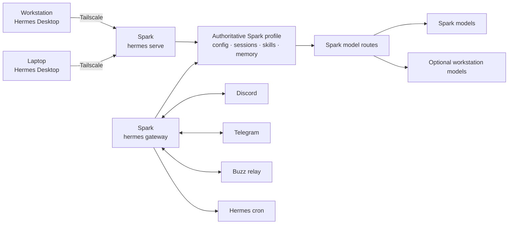

# Always-On Hermes on DGX Spark

## Decision

The DGX Spark is the single authoritative personal Hermes host.

- Spark runs one current Hermes profile under a dedicated, unprivileged service account.
- `hermes serve` is the remote backend for Hermes Desktop on the workstation and laptop.
- `hermes gateway` is the separate 24×7 messaging and Hermes-cron daemon.
- Both processes use the same explicit Spark `HERMES_HOME`/profile.
- The workstation keeps an optional, separately named local profile only for work that must directly access workstation-only files.
- The phone talks to the Spark gateway through Discord or Telegram rather than running another personal Hermes installation.



## The naming trap

| Component | Actual job |
|---|---|
| `hermes serve` | Remote Hermes Desktop and WebSocket/JSON-RPC backend |
| `hermes gateway` | Messaging platforms and Hermes cron |
| ODS `hermes-proxy` | Browser-cookie authentication wrapper around the ODS web dashboard |
| Hermes Desktop local connection | Uses a Hermes backend on that local computer |
| Hermes Desktop remote connection | Thin client to `hermes serve` on Spark |

Running only `hermes gateway` does not create the native Desktop remote endpoint. Running only `hermes serve` does not keep Telegram, Discord, Buzz, or Hermes cron alive. Supervise both processes independently. [Hermes Desktop documentation](https://hermes-agent.nousresearch.com/docs/user-guide/desktop), [Hermes CLI reference](https://hermes-agent.nousresearch.com/docs/reference/cli-commands), [Hermes cron](https://hermes-agent.nousresearch.com/docs/user-guide/features/cron)

## What is shared across devices

| Change | Location | Shared? |
|---|---|---|
| Skills, MCPs, providers, memory, sessions, and cron changed while Desktop is connected remotely | Spark profile | Yes, for surfaces using that profile |
| Discord/Telegram/Buzz conversations | Spark gateway session store | Centrally stored, but each chat/thread remains a distinct session unless resumed or handed off |
| Desktop connection entry, layout, and app notification preferences | Each Desktop installation | No |
| Skill/config installed into a separate local profile | That device | No |
| File operation from remote Desktop | Spark filesystem | Only the resulting file is shared if Git, Obsidian Sync, or another deliberate file mechanism shares it |

Do not live-sync `~/.hermes`, `state.db`, gateway state, credentials, or cron state between devices. Back up the one authoritative Spark profile with Hermes's database-aware backup command.

One profile does not mean one endless transcript. Each Desktop session, Discord channel/thread, Telegram chat/topic, and Buzz channel can have its own conversation context while sharing profile-level memory and configuration. Resume or hand off a session deliberately, and avoid sending simultaneous prompts from two clients into the exact same active session.

Install profile-level skills and MCP definitions once on Spark. Install binaries separately wherever they execute:

- a remote HTTP/SSE MCP can run centrally; every client needs only its endpoint and local secret;
- a stdio MCP must be installed on the machine that launches it;
- browser tools using workstation cookies stay on the workstation;
- filesystem tools in remote Hermes operate on Spark unless explicitly bridged to a narrow workstation service.

## Local workstation projects

Remote Hermes Desktop does not make `D:\` or other workstation folders appear on Spark.

Use one of these patterns:

1. Clone the repository on Spark and coordinate through Git.
2. Give Spark a narrow SSH/SFTP or repository tool for explicitly selected paths.
3. Use a narrowly scoped network share when live access is truly necessary.
4. Switch Hermes Desktop to the separate workstation-local `desktop-files` profile for direct local edits.

The local profile should not run the production Telegram/Discord bot tokens or duplicate Spark schedules.

## 24×7 service shape

On Spark:

1. Install a current Hermes release under a dedicated service account.
2. Set one explicit profile/Hermes home for both processes.
3. Install `hermes gateway` as a boot-time system service.
4. Create a separate systemd service for `hermes serve`.
5. Use absolute executable paths, start after network-online, and restart on failure.
6. Bind the remote backend to the Spark Tailscale address or protect it with an equivalent private ingress.
7. Retain Hermes authentication; do not rely on Tailscale as the only application control.
8. Restrict port 9119 with Tailscale ACLs to the user's workstation and laptop identities.
9. Back up the profile and test restore, Spark reboot, session resume, gateway delivery, and missed-job behavior.

Do not run the same Telegram, Discord, or Buzz bot identity from a second gateway.

## ODS Hermes auth proxy

The reviewed ODS deployment works like this:

```text
Browser
  → ods-hermes-proxy/Caddy on :9120
  → forward_auth subrequest
  → ods-dashboard-api /api/auth/verify-session
  → HMAC verification of the ods-session browser cookie
  → authenticated HTTP/SSE/WebSocket proxy
  → ods-hermes internal :9119
```

This is a browser SSO gate. It is not the native Hermes Desktop remote-authentication path.

The ODS proxy is primarily gating, not per-user Hermes isolation: a valid `ods-session` cookie permits access to the same underlying Hermes instance, memory, skills, and sessions. Treat access to that cookie as access to the agent. Use separate Hermes profiles or deployments when multiple users require isolation rather than assuming the proxy creates one Hermes tenant per login.

The reviewed ODS compose pins:

```yaml
nousresearch/hermes-agent:v2026.5.16
```

That is Hermes v0.14. Native Hermes Desktop and explicit remote-backend support arrived later. Therefore:

- do not point Desktop at ODS `:9120` and assume it is a compatible remote gateway;
- do not expose the internal ODS `:9119`, which is intentionally configured insecurely only behind the proxy;
- initially run a current standalone Hermes beside ODS;
- disable or clearly rename the older ODS-bundled Hermes so there is no accidental second personal agent;
- later upgrade the ODS extension in a branch, pin a tested image/digest, and validate HTTP, WebSocket, auth, cron, channels, model routing, and reboot recovery.

ODS remains useful for LiteLLM, model serving, n8n, Qdrant, dashboards, and other services. The authoritative Hermes can call authenticated ODS model routes without living inside the ODS Hermes container.

## Model routing

Spark Hermes should depend only on an always-available Spark route. Workstation inference is an optional upstream, never the sole backend for a production cron job.

Use stable capability aliases:

- `fast`
- `code`
- `deep`
- `vision`
- `ocr-doc`
- `private-local`

Keep frequently used models in dedicated vLLM/SGLang/llama.cpp services. Use Ollama or LM Studio for the on-demand catalog. Automatic model selection means routing, health checks, queues, prewarming, and controlled eviction—not replacing the one busy process underneath concurrent callers.

External users need separate API keys, quotas, model allowlists, logs, and preferably a separate LiteLLM deployment or network boundary. An external route must never fall back into a private workstation endpoint.

## Obsidian on Spark

Use a separate Spark replica through official Obsidian Headless Sync.

- Begin in `pull-only` mode for retrieval and evaluation.
- If Spark Hermes must create notes, change the Spark replica to `bidirectional`.
- Restrict Hermes filesystem/tool permissions to a dedicated subtree such as `Agent Inbox/Spark Hermes/`.
- Use unique timestamp/task filenames and serialize updates to shared canonical notes.
- Do not run two sync systems against the same replica.
- Do not put Hermes state, credentials, or databases inside the vault.
- Treat Sync as synchronization, not backup; keep an independent backup from one designated replica.

If Git history is wanted, one designated replica should create serialized snapshots. Do not let all three devices independently auto-commit and push the live vault while Obsidian Sync is also active.

## Daily phone interface

Hermes Desktop is currently a desktop application, not the phone client for this design. The phone reaches the same Spark profile through a messaging adapter or a privately exposed web surface.

Use Discord as the primary organized interface:

- `#inbox`
- `#daily-brief`
- `#automation-alerts`
- `#approvals`
- `#research`
- `#coding`
- `#agent-ops`
- a Projects forum

Allowlist only the user's Discord identity. Make only `#inbox` free-response; keep other channels mention-gated. Route routine jobs to `#daily-brief`, failures to `#automation-alerts`, and consequential actions to `#approvals`.

Keep Telegram as a private quick-capture and emergency fallback. Mute noisy apartment groups individually and leave the Hermes bot enabled for important notifications. Use WhatsApp only with a dedicated-number requirement; it is less suitable as an organized control plane. [Discord](https://hermes-agent.nousresearch.com/docs/user-guide/messaging/discord/), [Telegram](https://hermes-agent.nousresearch.com/docs/user-guide/messaging/telegram), [WhatsApp](https://hermes-agent.nousresearch.com/docs/user-guide/messaging/whatsapp/)

## Buzz

Buzz is a promising self-hostable project workspace in which people, agents, workflows, and Git events share a signed Nostr event log. Its mobile clients, push notifications, and parts of workflow approvals are still immature, so it should not replace Discord or Telegram for dependable alerts. [Block Buzz](https://github.com/block/buzz)

Do not confuse its two Hermes shapes:

- Buzz Desktop's Hermes preset launches a local `hermes-acp` subprocess.
- Current Hermes `main` separately documents and implements a native Buzz gateway adapter, allowing the Spark gateway to join Buzz with the same Hermes profile, memory, skills, sessions, and cron.

For this architecture, use the Spark-side native gateway adapter. Verify that the exact tagged Hermes build/image contains the adapter and that `hermes gateway setup` offers Buzz before depending on it; do not assume the older ODS image contains it. [Hermes Buzz integration](https://github.com/NousResearch/hermes-agent/blob/main/website/docs/integrations/buzz.md)

Run Buzz in its own pinned Compose project, volumes, network, TLS/private ingress, backups, and Nostr identity. Give Hermes only the necessary channel memberships.

## Rollout

1. Back up existing Spark ODS/Hermes data.
2. Install current standalone Hermes under a dedicated Spark service account.
3. Configure and test an always-available Spark model route.
4. Supervise `hermes serve` and `hermes gateway` separately.
5. Connect workstation and laptop Desktop clients over Tailscale.
6. Verify central skill/MCP/config changes and session resume.
7. Configure Discord; retain Telegram as fallback.
8. Add the Spark Obsidian headless replica in pull-only mode.
9. Enable cron jobs one by one with pinned routes, timeouts, budgets, delivery targets, and idempotency.
10. Add Buzz only after the core deployment is stable.
11. Evaluate upgrading the ODS Hermes extension separately.

## Related notes

- [[Local Setup Index]]
- [[personal-hermes-obsidian-multinode-design|Personal Hermes, Obsidian, and Multi-Node Inference Design]]
- [[local-ai-architecture-research|Local AI Architecture Research]]
- [[local-ai-tooling-catalog-and-rollout|Local AI Tooling Catalog and Rollout]]
