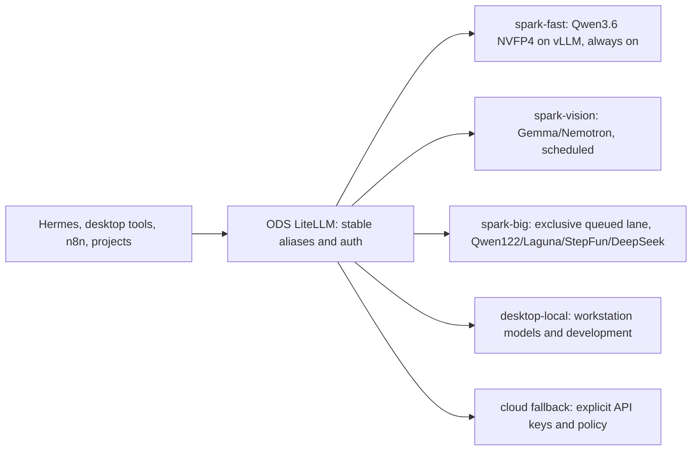

 
# DGX Spark ODS Playbook and Model Roadmap

> [!important] Verified scope
> This guide was checked on 2026-08-02 against the 44 unique playbooks visible in the live [NVIDIA DGX Spark playbook catalog](https://build.nvidia.com/spark), the local ODS checkout, official model cards, the NVIDIA developer forum, and the DGX bookmark export. "ODS provides this" does not mean it is enabled on the Spark. Verify the Spark itself with `ods status` and `ods list`.

Related: [[Local Setup Index]] | [[Always-On Hermes on DGX Spark]] | [[local-ai-architecture-research|Local AI Architecture Research]]

## The short answer

- Do not install all 44 live-catalog playbooks as permanent services. Most are labs, alternative runtimes, or reference applications.
- ODS already provides the main llama.cpp server, Open WebUI, Dashboard, and model/API integration layer. It also has optional Hermes, Tailscale, ComfyUI, Ollama, OpenClaw, n8n, Qdrant, embeddings, Langfuse, and other extensions.
- vLLM is documented by ODS but is **not a first-class ODS extension yet**. Run it beside ODS and register its OpenAI-compatible endpoint in LiteLLM.
- SGLang, TensorRT-LLM, NIM, NeMo, Unsloth, LLaMA Factory, and NVIDIA Model Optimizer are new learning/deployment lanes, not things ODS has already completed.
- For the career goal, prioritize serving, evaluation, fine-tuning, quantization, observability, security, and two production-shaped FDE applications. Skip hardware/domain demos that do not support a target role.

## ODS overlap: do not repeat these installations

| NVIDIA playbook | What ODS already has | What to do |
|---|---|---|
| Run models with llama.cpp | `llama-server` is ODS core and exposes an OpenAI-compatible API. | Do not install a second permanent server. Use the playbook to compare build flags, MTP, and benchmarks. Run a separate pinned build only for a model needing newer/custom support. |
| Open WebUI with Ollama | Open WebUI is ODS core. | Keep the ODS UI. Add another backend to it or LiteLLM; do not create a second WebUI database. |
| Run Hermes Agent with Local Models | Hermes and `hermes-proxy` are ODS services. | Configure the authoritative Hermes instance. Do not let the playbook create a second Hermes home, memory database, gateway, or messaging bot. |
| Set up Tailscale | Tailscale is an ODS optional service. | Configure and test the existing service/host install; do not create overlapping network ownership blindly. |
| Comfy UI | ComfyUI is an ODS optional service. | Enable/configure it in ODS and share one model/output directory. |
| Ollama (repo-only NVIDIA recipe; not currently a separate live-catalog card) | Ollama exists in the ODS extension library but is not required by the core stack. | Enable it only for Ollama-specific convenience or compatibility. ODS llama.cpp is already the default inference path. |
| OpenClaw | ODS still includes it as a deprecated optional service and documents migration to Hermes. | Skip unless performing an isolated comparison. Hermes remains the personal agent. |
| CLI Coding Agent / Vibe Coding in VS Code | ODS has OpenCode plus optional Ollama/Continue-style integrations. | Reuse the ODS or vLLM endpoint. The agent UX exercise is useful; its duplicate model stack is not. |
| RAG Application in AI Workbench | ODS can already provide Qdrant, TEI embeddings, Open WebUI RAG, n8n, and Langfuse. | Do the Workbench project as a reproducibility/FDE lab, while reusing ODS services where practical. |
| Multi-Agent Chatbot / Live VLM WebUI | ODS can supply model, vector, workflow, and UI layers. | Treat these as reference applications, not replacement infrastructure. |

> [!note] Similar name, different product
> The NVIDIA **DGX Dashboard** and the ODS **Dashboard** are different. Keep both: the NVIDIA dashboard covers system/firmware/Jupyter functions; ODS covers the ODS service plane.

## Playbook order for Staff DS to AI Engineer/FDE

### Phase 0 - Make the Spark a safe appliance

1. [Set Up Local Network Access](https://build.nvidia.com/spark/connect-to-your-spark)
2. [Set up Tailscale on Your Spark](https://build.nvidia.com/spark/tailscale) - configure the existing ODS/host path.
3. [DGX Dashboard](https://build.nvidia.com/spark/dgx-dashboard)
4. [VS Code](https://build.nvidia.com/spark/vscode) over SSH/Tailscale.
5. Audit `ods status`, `ods list`, ports, model caches, free disk, unified memory, restart policies, backups, and secrets.
6. [CUDA-X Data Science](https://build.nvidia.com/spark/cuda-x-data-science) - an early bridge from the current data-science background.

### Phase 1 - Serving and inference engineering

1. Benchmark the existing ODS llama.cpp path; do not reinstall it.
2. Complete [vLLM for Inference](https://build.nvidia.com/spark/vllm) and serve Qwen3.6 NVFP4.
3. Put vLLM behind the existing ODS LiteLLM endpoint and expose a stable alias to Hermes/projects.
4. Complete [SGLang for Inference](https://build.nvidia.com/spark/sglang) and A/B it against vLLM with the **same** model, quant, context, prompts, and concurrency.
5. Learn [TRT LLM for Inference](https://build.nvidia.com/spark/trt-llm), then [NIM on Spark](https://build.nvidia.com/spark/nim-llm).
6. Add [NVFP4 Quantization](https://build.nvidia.com/spark/nvfp4-quantization), then [Speculative Decoding](https://build.nvidia.com/spark/speculative-decoding) after a non-speculative baseline exists.
7. Use [Nemotron Model Family](https://build.nvidia.com/spark/nemotron) as the NVIDIA ecosystem exercise.

Record output quality, tool-call validity, p50/p95 time to first token, inter-token latency, prompt/decode throughput, peak memory, cold start, cache hit rate, and failures. A tokens/second number alone is not an engineering result.

### Phase 2 - Fine-tuning and SLM engineering

1. [Fine-tune with PyTorch](https://build.nvidia.com/spark/pytorch-fine-tune) - understand the actual PEFT/SFT loop.
2. [Unsloth on DGX Spark](https://build.nvidia.com/spark/unsloth) - build the fast iteration path.
3. [LLaMA Factory](https://build.nvidia.com/spark/llama-factory) - learn repeatable dataset/template/config workflows.
4. [Fine-tune with NeMo](https://build.nvidia.com/spark/nemo-fine-tune) - learn NVIDIA's scalable, enterprise-oriented recipe system.
5. Quantize the same result with the NVFP4 playbook, deploy it with vLLM, and compare it with the baseline.

Use the same small model, train/validation split, task, LoRA targets, evaluation harness, and serving test across frameworks. The portfolio artifact should be one reproducible pipeline, not four unrelated notebooks.

### Phase 3 - FDE portfolio applications

Recommended order:

1. [RAG Application in AI Workbench](https://build.nvidia.com/spark/rag-ai-workbench)
2. [Text to Knowledge Graph](https://build.nvidia.com/spark/txt2kg)
3. [Build and Deploy a Multi-Agent Chatbot](https://build.nvidia.com/spark/multi-agent-chatbot)
4. [Multi-modal Inference](https://build.nvidia.com/spark/multi-modal-inference)
5. [Build a Video Search and Summarization Agent](https://build.nvidia.com/spark/vss) as the capstone

For two of these, publish requirements, architecture, evaluation data, latency/memory measurements, observability, security boundaries, failure handling, and rollback. That evidence is more valuable for FDE interviews than completing every demo.

### Phase 4 - Agent security, not agent sprawl

- Keep [Hermes](https://build.nvidia.com/spark/hermes-agent) authoritative.
- Learn [OpenShell](https://build.nvidia.com/spark/openshell) for sandboxing long-running agents.
- Evaluate [NemoClaw](https://build.nvidia.com/spark/nemoclaw) and its [example agents](https://build.nvidia.com/spark/nemoclaw-applications) in an isolated workspace only after Hermes is stable.
- Treat [OpenClaw](https://build.nvidia.com/spark/openclaw) as a comparison, not another permanent agent with the same files and secrets.

### Phase 5 - Electives and deferrals

| Category | Playbooks | Recommendation |
|---|---|---|
| Advanced performance | Optimized JAX, cuTile Kernels | Do after serving and training baselines. |
| Vision specialization | FLUX DreamBooth LoRA, ComfyUI, Live VLM WebUI | Useful if targeting multimodal roles; configure ODS ComfyUI rather than duplicating it. |
| Domain demos | Portfolio Optimization, Single-cell RNA Sequencing | Pick only if relevant to a target customer/role. |
| Physical AI | Isaac Sim/Lab, Reachy Photo Booth | Skip unless targeting robotics and the required hardware is available. |
| Developer convenience | LM Studio | Optional; it is not required for the 24x7 ODS/Hermes architecture. `register-to-brev` exists as a repository utility but is not a current live-catalog playbook. |
| Multi-Spark only | Connect Two Sparks, NCCL, Three-Spark Ring, Multiple Sparks Through a Switch | Defer. The RTX workstation is not a second Spark for these topology recipes. |

## Models to install now

> [!warning] Capacity reality
> The Spark has 128 GB unified memory but community operators commonly see only about 119-121 GiB available to model processes after the system is running. You can keep many checkpoints on SSD, but you cannot keep every recommended model resident without contention. No engine can guarantee conflict-free concurrency if independent services allocate the same unified memory. The safe design is one resident primary model plus an admission-controlled, exclusive big-model lane.

### Recommended core set

| Priority | Exact model/artifact | Role | Engine | Practical Spark fit and caution |
|---:|---|---|---|---|
| 1 | [`nvidia/Qwen3.6-35B-A3B-NVFP4`](https://huggingface.co/nvidia/Qwen3.6-35B-A3B-NVFP4) | 24x7 Hermes default; agents, coding, general chat, concurrent projects | **vLLM** | 35B total/3B active, Apache-2.0, native 262K. NVIDIA publishes a Spark-specific vLLM recipe; one tuned 262K profile observed about 42.7 GB peak memory. Current reproducible results span roughly 82-104 tok/s single-stream, while aggregate numbers use different workloads. Validate tools and MTP at the exact profile. |
| 2 | [`Qwen/Qwen3.5-4B`](https://huggingface.co/Qwen/Qwen3.5-4B) or a trusted Q4 GGUF | Cron triage, classification, extraction, short summaries, router fallback | **ODS llama.cpp** or ODS Ollama extension | Keep this cheap tier resident at 16K-32K rather than waking the main model for every hourly task. Small does not mean safe for unsupervised shell access; retain schemas and command guardrails. |
| 3 | [`Qwen/Qwen3-Embedding-0.6B`](https://huggingface.co/Qwen/Qwen3-Embedding-0.6B) + [`Qwen/Qwen3-Reranker-0.6B`](https://huggingface.co/Qwen/Qwen3-Reranker-0.6B) | RAG, code/document retrieval, Obsidian/project indexing | **TEI plus a separate reranker service** | Apache-2.0, 32K inputs. Batch embeddings and benchmark retrieval on the actual vault. Upgrade the embedding model to 4B only if measured recall justifies its extra resident memory. |
| 4 | [`nvidia/Gemma-4-26B-A4B-NVFP4`](https://huggingface.co/nvidia/Gemma-4-26B-A4B-NVFP4) | Multimodal/reasoning alternative; document and image work | **vLLM**, loaded on demand | About 25.2B total/3.8B active and roughly 16.5 GB reported weights. Community Spark profiles range roughly 23-52 tok/s; NVIDIA's published card tests are not Spark benchmarks. Start at 64K and 4-8 sequences. Current card support is TP=1. |
| 5 | [`nvidia/Qwen3.5-122B-A10B-NVFP4`](https://huggingface.co/nvidia/Qwen3.5-122B-A10B-NVFP4) | Large evaluator, difficult reasoning, quality comparison | **vLLM**, exclusive on-demand profile | Roughly 65-75 GB, 122B total/10B active. Community Spark recipes report about 28-35 tok/s normally and up to 51-52 with a specific patched profile. Treat the high figure as a tuned ceiling and do not co-reside it with another large model. |
| 6 | [`nvidia/Nemotron-3-Nano-Omni-30B-A3B-Reasoning-NVFP4`](https://huggingface.co/nvidia/Nemotron-3-Nano-Omni-30B-A3B-Reasoning-NVFP4) | Document, OCR, image, audio, and video FDE work | NVIDIA-supported vLLM/NIM path | Install when starting the VSS/document-intelligence phase. It is an NVIDIA ecosystem learning target, not the first general Hermes model. Check NVIDIA Open Model Agreement terms rather than assuming Apache/MIT. |

### Install later or benchmark experimentally

| Model | Verdict | Why |
|---|---|---|
| [`poolside/Laguna-S-2.1-NVFP4`](https://huggingface.co/poolside/Laguna-S-2.1-NVFP4) + matching DFlash draft | **High-value agent-coding experiment** | 118B total/~8B active, 1M trained context, OpenMDW-1.1, about 73 GB for main plus draft. Use **vLLM 0.25.1+** in its own pinned environment; Poolside currently warns that SGLang NVFP4 can produce corrupt/NaN output. Start at 64K/128K. The official Spark recipe reports roughly 15 tok/s prose and 22-24 code, with better aggregate throughput at two requests. The saved 10-agent/~1K tok/s claim is DGX Station, not Spark. |
| [`stepfun-ai/Step-3.7-Flash-GGUF:IQ4_XS`](https://huggingface.co/stepfun-ai/Step-3.7-Flash-GGUF) | **Experimental, exclusive big-model lane** | IQ4_XS is about 105 GB plus a roughly 4 GB projector and about 7 GB runtime overhead. Use StepFun's llama.cpp branch and run it alone. Official Spark measurements fall from about 23.9 tok/s at an empty prompt to 19.6 at 32K, 16.1 at 64K, and 8.6 at 262K. Start at 32K/one sequence. |
| [`deepseek-ai/DeepSeek-V4-Flash-0731`](https://huggingface.co/deepseek-ai/DeepSeek-V4-Flash-0731) via a community Q2 GGUF/DSpark recipe | **Experimental last; not a dependable one-Spark service yet** | The official 304B-including-DSpark deployment example targets 4xGB300. A one-Spark community Q2 build is around 90 GiB and current reports are often around 15 tok/s; the `ds4-on-spark` recipe reports higher results under a tightly pinned setup. Aggressive Q2 can damage tool calls and reasoning. Start at 16K-64K, evaluate exact tasks, and never infer one-Spark performance from hosted, multi-Spark, or GB300 results. |
| [`nvidia/Qwen3.6-27B-NVFP4`](https://huggingface.co/nvidia/Qwen3.6-27B-NVFP4) | **Workstation-first quality comparison** | Dense 27B coding/vision model, Apache-2.0, 262K. Current Spark results are much slower than the 35B-A3B MoE because all 27B parameters are active. The RTX 5000 48 GB workstation is the better place to compare it. |
| [`unsloth/gemma-4-31B-it-qat-GGUF`](https://huggingface.co/unsloth/gemma-4-31B-it-qat-GGUF) | **Workstation-first dense verifier** | The QAT target is roughly 17-20 GB plus optional projector/drafter. It fits Spark, but dense decode is bandwidth-bound; use the 48 GB workstation unless a Spark-specific comparison is required. Bookmark speeds were RTX 4090, not Spark. |
| [`Qwen/Qwen3-Coder-Next`](https://huggingface.co/Qwen/Qwen3-Coder-Next) or a verified Spark-native NVFP4 derivative | **Optional code challenger** | Test after the Qwen3.6 baseline. Do not add another code model until repo-level evals show that it wins on the user's actual projects. |

### Do not install first

- Uncensored, abliterated, "heretic," APEX, and random merge variants. Establish official/base-model evals first. Derivatives can alter refusal behavior, tool schemas, templates, and licenses.
- Full BF16/FP8 versions that barely fit. A checkpoint fitting on disk or in nominal 128 GB does not leave space for the OS, engine, KV cache, ODS, or concurrent requests.
- Every Ollama and GGUF copy of the same weights. Use one canonical Hugging Face cache plus one deliberate GGUF cache.

## Which engine should run which model?

| Need | Default choice | Why | Avoid |
|---|---|---|---|
| Concurrent Hermes, agents, external users | **vLLM + NVFP4/FP8 safetensors** | Continuous batching, prefix caching, OpenAI API, strong Blackwell path. | Loading a different model for each request. |
| GGUF, very large tight-memory model, frequent experiments | **ODS llama.cpp or a separate pinned llama.cpp server** | Best format flexibility and memory control; MTP/GGUF ecosystem. | Running a duplicate server on ODS port 8080. |
| Prefix-heavy/structured agent workloads | **SGLang as an A/B candidate** | It may win on specific structured/prefix workloads. | Declaring it globally better without identical benchmarks; do not use Laguna NVFP4 while its official card reports corrupted output. |
| Fixed NVIDIA-optimized deployment | **TensorRT-LLM or NIM** | Good career value and NVIDIA deployment optimization. | Starting here before a working vLLM baseline. |
| Quick one-off model test | **Ollama** | Simplest pull/run lifecycle. | Treating it as the production concurrency scheduler. |
| GUI exploration | **LM Studio** | Good interactive catalog and remote developer UX. | Making a GUI-managed process the critical 24x7 Spark endpoint. |
| DeepSeek V4 Flash on one Spark | **Community Q2 GGUF with llama.cpp, or a pinned DS4-on-Spark evaluation** | These are the paths that can fit after aggressive quantization; neither is the official full-precision deployment. | Assuming generic vLLM/SGLang commands for the full checkpoint will fit, or treating it as production-ready. |

vLLM and SGLang do not have a separate model "installer." Their serve command downloads Hugging Face safetensors into the configured cache. llama.cpp/Ollama/LM Studio use GGUF or their own cache conventions. Standardize paths first so one model is not downloaded three times.

## Safe installation pattern

### 1. Preflight

```bash
ods status
ods list
nvidia-smi
free -h
df -h
docker ps --format 'table {{.Names}}\t{{.Ports}}\t{{.Status}}'
```

Keep a versioned record of DGX OS, driver, CUDA, ODS commit, engine image/digest, model revision, quant, flags, and benchmark data.

Use one canonical model root on the large NVMe volume. vLLM and Hugging Face can share the same downloaded safetensors; do not pull duplicate copies into every UI:

```bash
hf download nvidia/Qwen3.6-35B-A3B-NVFP4 --local-dir /srv/models/hf/qwen3.6-35b-a3b-nvfp4
hf download nvidia/Gemma-4-26B-A4B-NVFP4 --local-dir /srv/models/hf/gemma4-26b-a4b-nvfp4
hf download nvidia/Qwen3.5-122B-A10B-NVFP4 --local-dir /srv/models/hf/qwen3.5-122b-a10b-nvfp4
hf download Qwen/Qwen3-Embedding-0.6B --local-dir /srv/models/hf/qwen3-embedding-0.6b
hf download Qwen/Qwen3-Reranker-0.6B --local-dir /srv/models/hf/qwen3-reranker-0.6b
```

### 2. Qwen3.6 primary vLLM service

Complete NVIDIA's [vLLM playbook](https://build.nvidia.com/spark/vllm) first. The official NVIDIA model card currently recommends this Spark profile:

```bash
vllm serve nvidia/Qwen3.6-35B-A3B-NVFP4 \
  --host 0.0.0.0 --port 8000 \
  --tensor-parallel-size 1 \
  --trust-remote-code \
  --kv-cache-dtype fp8 \
  --attention-backend flashinfer \
  --moe-backend marlin \
  --gpu-memory-utilization 0.4 \
  --max-model-len 262144 \
  --max-num-seqs 4 \
  --max-num-batched-tokens 8192 \
  --enable-chunked-prefill \
  --async-scheduling \
  --enable-prefix-caching \
  --speculative-config '{"method":"mtp","num_speculative_tokens":3,"moe_backend":"triton"}' \
  --load-format fastsafetensors \
  --reasoning-parser qwen3 \
  --tool-call-parser qwen3_xml \
  --enable-auto-tool-choice
```

Start with 64K context and 4 sequences during validation if 262K is not actually needed. Increase only after mixed-load tests. Fast speculative settings that corrupt tool calls are a regression, not an optimization.

### 3. Gemma alternative and workstation GGUF

Validate `nvidia/Gemma-4-26B-A4B-NVFP4` with the vLLM version and flags specified by its current model card, starting at 64K and four sequences. Keep it mutually exclusive with the larger Qwen3.5/Laguna/StepFun/DeepSeek profiles. If a GGUF comparison is useful, run `unsloth/gemma-4-26B-A4B-it-qat-GGUF` with MTP on a non-ODS port or, preferably, on the RTX workstation. Confirm drafter discovery in startup logs and record a no-MTP baseline.

### 4. DeepSeek V4 experimental lane

Use the current [`Entrpi/ds4-on-spark`](https://github.com/Entrpi/ds4-on-spark) recipe. Clone and inspect the installer rather than piping a changing remote script directly into a shell:

```bash
git clone https://github.com/Entrpi/ds4-on-spark.git
cd ds4-on-spark
less install.sh
./install.sh --help
./install.sh --start
```

Pin the tested commit/release in the operations repo before making it persistent. Start at 16K-32K context; larger shared context directly reduces concurrent capacity. Treat this as a research profile until the exact Q2 build passes tool-use, code-edit, long-context, and stability evals. The official model's vLLM/SGLang recipes do not target one GB10.

## Concurrency-safe routing and automatic switching



Use stable aliases such as `spark-fast`, `spark-big`, `spark-vision`, and `spark-embed`; do not make Hermes know container ports or checkpoint names.

For the big lane, the swap sequence must be controlled:

1. Route new big jobs to a queue and stop admission.
2. Let active requests drain or cancel them by policy.
3. Stop the current big-model service.
4. Verify available memory and that no stale CUDA process remains.
5. Start the requested pinned service and wait through model load/warm-up.
6. Run model identity, output, tool-call, and context smoke tests.
7. Switch the LiteLLM alias only after health passes.
8. Apply an idle TTL; switch back to the default only when the queue is empty.

Do **not** hot-swap a production external-user endpoint based on individual requests. Keep its model fixed and versioned. Automatic swapping is appropriate for an internal queued lane, not for interactive traffic expecting stable latency and behavior.

vLLM sleep mode is not a second memory pool on Spark. Level-1 sleep can move weights from discrete GPU memory to CPU RAM on a conventional workstation, but Spark CPU and GPU already share the same 128 GB physical pool. Use level-2 discard or terminate the model process when the big lane must genuinely release unified memory. Do not expose vLLM's development sleep endpoints to untrusted clients.

Use four operational profiles rather than advertising maximum context to every request:

| Profile | Context | Initial concurrency | Intended traffic |
|---|---:|---:|---|
| `interactive` | 64K | 4-8 | Hermes desktop, coding, tools, normal RAG |
| `batch` | 32K-64K | 8-32 only after load tests | Cron extraction, summaries, queued automation |
| `long` | 128K-262K | 1-2 | Repository/document analysis, scheduled |
| `huge-experimental` | 262K-1M only after proving fit | 1 | Laguna/DeepSeek research, never the default route |

### Suggested resident allocation

- **Spark:** Qwen3.6-35B-A3B-NVFP4 vLLM, a small Qwen automation service, Hermes/ODS control plane, and optionally the 0.6B embedding/reranker services.
- **Spark exclusive lane:** Qwen3.5-122B first; then Laguna; Step-3.7 and DeepSeek only after the lane is reliable. Only one large on-demand model resident.
- **RTX 5000 48 GB workstation:** Gemma 4 26B-A4B/31B QAT, Qwen3.6-27B, coding experiments, evaluation, fine-tuning, dashboards, and development inference.
- **Laptop:** clients and small emergency local model only; normally use Tailscale endpoints.

## Benchmark truth rules

- Prefill tok/s, single-stream decode tok/s, and aggregate multi-request tok/s are different metrics.
- The saved Qwen3.6 95 tok/s and 317 tok/s at eight sessions are community claims, not NVIDIA guarantees.
- The saved DeepSeek result reporting about 26.7 tok/s at one session and about 59 aggregate tok/s at twelve comes from a specific community DS4 setup. Other current one-Spark Q2 reports are closer to 15 tok/s; per-stream speed falls as concurrency rises.
- Step-3.7 official IQ4_XS is about 105 GB. "Fits in 128 GB" is not equivalent to "safe beside ODS at long context."
- Gemma 4 31B/26B 60-160 tok/s results in the bookmark export are RTX 4090 results.
- Laguna's 10 agents at 256K and approximately 1K tok/s result is DGX Station, not DGX Spark.
- Artificial Analysis provider speeds measure hosted providers, not the local Spark. Use its scores for rough capability comparison only.

## Completion checklist

- [ ] `ods status` and `ods list` inventory captured from the actual Spark.
- [ ] Tailscale, firewall, auth, backups, secrets, and model cache paths documented.
- [ ] Existing ODS llama.cpp baseline measured.
- [ ] Qwen3.6 NVFP4 vLLM service deployed and routed to Hermes through a stable alias.
- [ ] vLLM versus SGLang A/B completed with identical conditions.
- [ ] Gemma 4 26B-A4B NVFP4 validated as an on-demand Spark alternative; GGUF/MTP compared on the workstation if useful.
- [ ] Qwen3.5-122B exclusive lane installed, pinned, isolated, and load-tested.
- [ ] Laguna, Step-3.7, and DeepSeek attempted only after production routing and drain/load safety are proven.
- [ ] Embedding/reranking retrieval evaluation completed before indexing the whole vault.
- [ ] PyTorch -> Unsloth -> LLaMA Factory -> NeMo comparison completed on one controlled SLM task.
- [ ] One quantized fine-tune served through the same gateway as the base model.
- [ ] Two FDE case studies include evals, observability, security, failure recovery, and a demo.

## Primary and supporting sources

- [NVIDIA DGX Spark playbook catalog](https://build.nvidia.com/spark)
- [NVIDIA DGX Spark playbooks repository](https://github.com/NVIDIA/dgx-spark-playbooks)
- [NVIDIA Qwen3.6-35B-A3B-NVFP4 model card](https://huggingface.co/nvidia/Qwen3.6-35B-A3B-NVFP4)
- [NVIDIA Gemma-4-26B-A4B-NVFP4 model card](https://huggingface.co/nvidia/Gemma-4-26B-A4B-NVFP4)
- [NVIDIA Qwen3.5-122B-A10B-NVFP4 model card](https://huggingface.co/nvidia/Qwen3.5-122B-A10B-NVFP4)
- [Qwen3.6 official collection](https://huggingface.co/collections/Qwen/qwen36)
- [Google Gemma 4 31B instruction model](https://huggingface.co/google/gemma-4-31B-it)
- [Unsloth Gemma 4 QAT collection](https://huggingface.co/collections/unsloth/gemma-4-qat)
- [StepFun Step-3.7-Flash official model card](https://huggingface.co/stepfun-ai/Step-3.7-Flash)
- [DeepSeek V4 Flash 0731 official model card](https://huggingface.co/deepseek-ai/DeepSeek-V4-Flash-0731)
- [DS4-on-Spark repository and reproducible benchmark notes](https://github.com/Entrpi/ds4-on-spark)
- [Poolside Laguna S 2.1 NVFP4 model card and Spark recipe](https://huggingface.co/poolside/Laguna-S-2.1-NVFP4)
- [Qwen3 Embedding collection](https://huggingface.co/collections/Qwen/qwen3-embedding)
- [NVIDIA Nemotron 3 Nano Omni NVFP4 model card](https://huggingface.co/nvidia/Nemotron-3-Nano-Omni-30B-A3B-Reasoning-NVFP4)
- [SparkBench single-Spark benchmark index](https://sparkbench.dev/)
- [vLLM sleep-mode documentation](https://docs.vllm.ai/en/v0.10.2/features/sleep_mode.html)
- [NVIDIA DGX Spark developer forum](https://forums.developer.nvidia.com/c/accelerated-computing/dgx-spark-gb10/742)
- Local bookmark evidence folder: `F:\Vaults\LLMWiki\Bookmarks\Twitter\DGX\Twitter-Exporter-Nitin_wysiwyg_Bookmark_Folder_DGX-2026-08-02_08-12-01`

### Catalog counting note

The live website currently exposes 44 unique playbooks. The repository tree can appear to contain more because `ollama` is present as a standalone repository recipe but is not a separate live-catalog card, `register-to-brev` is a repository utility, and a legacy Reachy folder duplicates the live Reachy Photo Booth playbook. This roadmap follows the live website and uses repository-only material only when it is useful to the ODS comparison.
