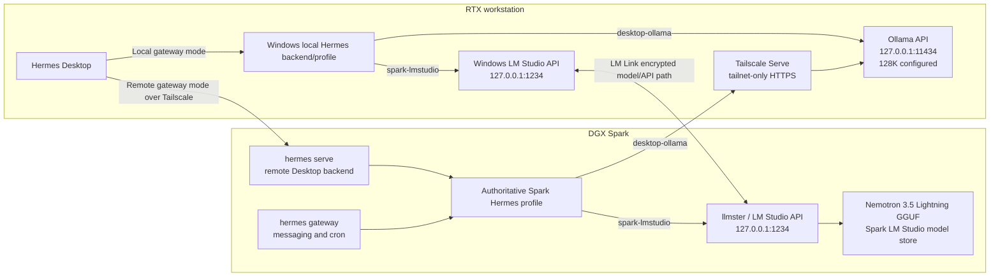

# Hermes LM Link And Workstation Model Routing Research

## Decision

The requested design is supported, including the important part that avoids a second vLLM deployment:

1. **DGX Spark owns the LM Studio copy of NVIDIA Nemotron 3.5 Lightning.** Install it in the Spark's existing `llmster` model store and run it with LM Studio's CUDA-enabled `llama.cpp` runtime, not vLLM.
2. **Windows LM Studio reaches that Spark model through LM Link.** The model remains stored and executed on Spark.
3. **A third-party client can use the linked Spark model through the Windows LM Studio API.** LM Studio explicitly says that a Windows request to `localhost:1234` can be fulfilled by the preferred linked remote device. Hermes can therefore use the normal OpenAI-compatible Windows LM Studio endpoint; it does not need a separate vLLM endpoint for this model.
4. **The Spark and Windows Hermes backends do not automatically share one provider/model list.** A Desktop connection uses the configuration owned by the backend/profile to which it is connected. Mirror the desired provider entries into both profiles, using different URLs where necessary.
5. **Workstation Ollama can be offered to Spark Hermes over Tailscale.** Prefer a tailnet-only reverse proxy to the loopback Ollama API instead of leaving Ollama open to the whole LAN. Ollama's local API has no built-in request authentication, so network scope matters.

This note complements [[DGX Spark Nemotron 3.5 Lightning Via LM Studio Research]], which already records the model-format and quantization comparison. It does not replace or modify the current index or tutorials.

## Live implementation evidence — 2026-08-15

- Windows Ollama 0.32.13 is back on `127.0.0.1:11434`; **Expose Ollama to the network** is off.
- Tailscale Serve publishes only `https://nike-workstation.tail4a1242.ts.net:8443/` to the tailnet and proxies it to loopback Ollama. The initially attempted HTTPS `11434` listener was removed.
- Ollama rejects a reverse-proxied tailnet hostname with HTTP 403. Supplying `Host: localhost:11434` succeeds, so only the Spark `desktop-ollama` provider carries that non-secret `extra_headers` override.
- Both Gemma 4 models passed harmless Hermes terminal-tool calls locally and from Spark. `ollama ps` reported `131072` and 100% GPU for each. `OLLAMA_MAX_LOADED_MODELS=1` was verified by selecting 26B and then 31B: only the newly selected model remained resident.
- Spark and Windows Hermes configs both contain `desktop-ollama` and `spark-lmstudio`; neither saved default changed. The Spark default remains `custom:spark-fast`, while Windows remains `openai-codex` / `gpt-5.5`.
- Spark LM Studio is loopback-only on `127.0.0.1:1234`. JIT loading and one-model Auto-Evict remain enabled; Nemotron was subsequently loaded manually without a TTL for deliberate warm co-residency with Qwen. Windows LM Studio is also running loopback-only on `127.0.0.1:1234`, and LM Link sees `spark-07a8`.
- ODS has no port collision with this layout. ODS LiteLLM is loopback `4000`; Qwen vLLM is loopback `8000`; LM Studio is `1234`; Hermes Serve is Spark tailnet `9119`. Qwen vLLM, not the small idle ODS services, is the large unified-memory occupant that must stop before loading Nemotron.
- The exact LM Studio package resolved as `NVIDIA Nemotron 3.5 Lightning 30B A3B Q4_K_M [GGUF]`, 24.52 GB. This is not Nemotron 3 Omni; existing Omni vLLM preparation remains separate.
- The completed 64K load used 22.83 GiB with full GPU offload and a 3,600-second TTL. Raw Spark completion and structured function-call tests passed; Spark Hermes returned `/home/snknitin` from a terminal tool; Windows LM Link returned `LM_LINK_OK`; Windows local Hermes also completed a terminal tool call through the same Spark model.
- The live Spark fallback chain points optional providers back to `custom:spark-fast`. Telegram and Discord both report `connected`; no bot message was sent automatically because that would be an external, representational action.
- After the final backend restart, Hermes Desktop briefly omitted both custom shelves even though the provider config and upstream APIs were healthy. Spark's `provider_models_cache.json` subsequently contained the correct Ollama and LM Studio IDs. Restarting only `hermes-serve` against that warmed cache made **Desktop Ollama** and **Spark LM Link** reappear; Qwen, the gateway, and bot connections were not restarted.

## Recommended topology



The same two friendly choices can appear in each Hermes backend:

| Hermes choice | Windows local backend resolves to | Spark remote backend resolves to |
| --- | --- | --- |
| `spark-lmstudio` | Windows `127.0.0.1:1234/v1`; LM Link forwards the model work to Spark | Spark `127.0.0.1:1234/v1`; direct local call to `llmster` |
| `desktop-ollama` | Windows `127.0.0.1:11434/v1` | Tailnet-only workstation Ollama URL |

This produces a consistent picker without pretending the two backends share state. The workstation must be awake for `desktop-ollama`; Spark Nemotron remains available whenever Spark and `llmster` are running.

## 1. Nemotron 3.5 Lightning belongs in the Spark LM Studio store

LM Studio and NVIDIA both document headless LM Studio/`llmster` on DGX Spark Linux ARM64. LM Studio's Spark build uses a CUDA 13 `llama.cpp` runtime. The current catalog has the exact model ID `nvidia/nemotron-3.5-lightning`, backed by `lmstudio-community/NVIDIA-Nemotron-3.5-Lightning-30B-A3B-GGUF`. This is the GGUF edition, not NVIDIA's separate NVFP4 + vLLM + DSpark deployment. [NVIDIA DGX Spark LM Studio playbook](https://build.nvidia.com/spark/lm-studio/instructions) [LM Studio Spark support](https://lmstudio.ai/blog/dgx-spark) [LM Studio model page](https://lmstudio.ai/models/nvidia/nemotron-3.5-lightning) [LM Studio GGUF repository](https://huggingface.co/lmstudio-community/NVIDIA-Nemotron-3.5-Lightning-30B-A3B-GGUF) [NVIDIA NVFP4 model card](https://huggingface.co/nvidia/NVIDIA-Nemotron-3.5-Lightning-30B-A3B-NVFP4)

Current LM Studio GGUF choices are:

| Quantization | File size | First-use decision |
| --- | ---: | --- |
| `Q4_K_M` | 24,515,129,280 bytes / 22.83 GiB | Start here |
| `Q6_K` | 33,508,166,592 bytes / 31.21 GiB | Later quality comparison |
| `Q8_0` | 33,585,494,976 bytes / 31.28 GiB | No useful storage advantage over Q6 for the first test |

The intended Spark commands are:

```bash
lms daemon up
lms get nvidia/nemotron-3.5-lightning@q4_k_m
lms ls --json
```

`lms get` officially accepts the catalog name plus an `@quantization` suffix. Use the exact model key printed by `lms ls --json` for later load and API tests rather than guessing how the installed key was normalized. [LM Studio `lms get`](https://lmstudio.ai/docs/cli/local-models/get) [LM Studio `lms ls`](https://lmstudio.ai/docs/cli/local-models/ls)

Before the first real load, stop any competing large Spark inference worker and estimate the selected context:

```bash
lms load ACTUAL_KEY_FROM_LMS_LS \
  --estimate-only \
  --context-length 65536 \
  --gpu max
```

Start at 64K for Hermes, then test 128K separately. The catalog's one-million-token model metadata is a model ceiling, not a sensible default allocation. The loader's estimator accounts for context and offload settings. [LM Studio `lms load`](https://lmstudio.ai/docs/cli/local-models/load) [Hermes local-provider context guidance](https://hermes-agent.nousresearch.com/docs/integrations/providers)

## 2. LM Link does expose the Spark model through the Windows API

This is a documented feature, not an inference:

- Headless Spark setup is `lms login` followed by `lms link enable`.
- After Windows LM Studio joins the same Link, Spark models appear in the Windows model loader and can be loaded and configured remotely.
- LM Studio says requests made to the Windows machine's `localhost` API continue to work normally and may be served by the preferred linked device.
- Its FAQ explicitly says tools already connected to `localhost:1234` can use remote models.

Therefore **Hermes running locally on Windows can point to `http://127.0.0.1:1234/v1` and use the Spark-hosted Nemotron through LM Link.** There is no need to expose the Spark's port 1234 to Windows for this path. [LM Link device setup](https://lmstudio.ai/docs/lmlink/basics/add-device) [LM Link with the REST API](https://lmstudio.ai/docs/developer/core/lmlink) [LM Link FAQ](https://lmstudio.ai/docs/lmlink/basics/faq)

Two settings make switching predictable:

1. Set the Spark as the preferred device in Windows LM Link when the same model exists on more than one linked device.
2. Enable LM Studio's Just-In-Time loading and auto-eviction if the goal is a downloaded-model shelf. With JIT on, `/v1/models` lists downloaded models and inference can load the requested one. With JIT off, `/v1/models` lists only models already in memory. [LM Link preferred-device behavior](https://lmstudio.ai/docs/lmlink/basics/faq) [LM Studio headless/JIT behavior](https://lmstudio.ai/docs/developer/core/headless)

Do not assume the catalog slug is the final OpenAI API model ID. After LM Link is connected, use the ID returned by:

```powershell
Invoke-RestMethod http://127.0.0.1:1234/v1/models
```

## 3. Hermes model lists belong to the active backend/profile

Hermes Desktop normally launches its own local `hermes serve` backend. In Remote gateway mode it instead attaches to a `hermes serve` process on Spark. The messaging `hermes gateway` process is separate. If Spark `hermes serve` and `hermes gateway` use the same `HERMES_HOME`/profile, they use that profile's same configuration. [Hermes Desktop architecture and remote mode](https://hermes-agent.nousresearch.com/docs/user-guide/desktop)

Each Hermes profile has its own `config.yaml`, including model and provider settings. Consequently:

- while connected remotely, the model picker reflects the Spark profile;
- while connected locally, it reflects the workstation profile;
- changing providers on one backend does not automatically update the other backend;
- two profiles with the same display name on two machines are still two separate homes unless deliberately managed as copies.

[Hermes profiles](https://hermes-agent.nousresearch.com/docs/user-guide/profiles)

The clean solution is to create the same friendly provider names in both configs but resolve them to backend-appropriate URLs. Current Hermes configuration uses a `providers:` dictionary for named OpenAI-compatible endpoints. A provider entry can discover `/v1/models` live or declare an explicit model list and per-model context. [Hermes named custom providers](https://hermes-agent.nousresearch.com/docs/integrations/providers#named-custom-providers) [Hermes model configuration](https://hermes-agent.nousresearch.com/docs/user-guide/configuring-models)

Conceptually, the local Windows profile should contain:

```yaml
providers:
  desktop-ollama:
    api: http://127.0.0.1:11434/v1
    transport: chat_completions
    discover_models: true
    models:
      gemma4:31b-it-qat:
        context_length: 131072
      gemma4:26b-a4b-it-qat:
        context_length: 131072

  spark-lmstudio:
    api: http://127.0.0.1:1234/v1
    transport: chat_completions
    discover_models: true
```

The Spark profile should use the same labels but different resolution for Ollama:

```yaml
providers:
  desktop-ollama:
    api: https://WORKSTATION.TAILNET-NAME.ts.net:8443/v1
    transport: chat_completions
    discover_models: true
    extra_headers:
      Host: localhost:11434
    models:
      gemma4:31b-it-qat:
        context_length: 131072
      gemma4:26b-a4b-it-qat:
        context_length: 131072

  spark-lmstudio:
    api: http://127.0.0.1:1234/v1
    transport: chat_completions
    discover_models: true
```

The actual tailnet hostname and exact LM Studio model ID must come from live checks. If the local Hermes backend runs inside WSL2 rather than as a native Windows process, `127.0.0.1` reaches Windows services only with mirrored networking; otherwise use the Windows host address documented by Hermes. [Hermes WSL2 networking guidance](https://hermes-agent.nousresearch.com/docs/integrations/providers#wsl2-networking-windows-users)

Hermes can then switch in the active session with the picker or the documented named-provider syntax:

```text
/model custom:spark-lmstudio:EXACT_LM_STUDIO_MODEL_ID
/model custom:desktop-ollama:gemma4:31b-it-qat
/model custom:desktop-ollama:gemma4:26b-a4b-it-qat
```

`/model` changes the current chat immediately. A dashboard/global model change applies to new sessions unless the active chat is explicitly switched. [Hermes switching syntax](https://hermes-agent.nousresearch.com/docs/integrations/providers#named-custom-providers) [Hermes model-change timing](https://hermes-agent.nousresearch.com/docs/user-guide/configuring-models#when-does-it-take-effect)

## 4. Secure workstation Ollama access from Spark

Ollama binds to `127.0.0.1:11434` by default. Its local API does not require request authentication, although it does expose an OpenAI-compatible `/v1/chat/completions` and `/v1/models` surface. Enabling **Expose Ollama to the network** makes the service reachable beyond loopback, so it should not be left broadly reachable merely because Tailscale is installed. [Ollama network configuration](https://docs.ollama.com/faq#how-can-i-expose-ollama-on-my-network) [Ollama authentication](https://docs.ollama.com/api/authentication) [Ollama OpenAI compatibility](https://docs.ollama.com/api/openai-compatibility)

### Preferred tailnet-only design

1. After validating the Tailscale path, turn **Expose Ollama to the network** back off so Ollama returns to loopback-only listening.
2. Use Tailscale Serve on the workstation to proxy a tailnet-only HTTPS port to `127.0.0.1:11434`:

```powershell
tailscale serve --bg --https=8443 http://127.0.0.1:11434
tailscale serve status
```

3. Use the HTTPS URL printed by `tailscale serve status` as the Spark Hermes `desktop-ollama` API base, appending `/v1`.
4. Add a tailnet grant allowing only the Spark identity/device to reach the workstation on TCP 8443.
5. Ensure an older broad allow-all rule does not remain in force. Tailscale grants are additive; a narrow rule does not subtract permission already granted by a broad one.
6. Never use Tailscale Funnel for Ollama; Funnel is the public-internet product, whereas Serve remains inside the tailnet.

Tailscale Serve is designed to publish a loopback service only to the tailnet, supports HTTPS, and remains subject to tailnet access controls. Tailscale recommends keeping the proxied backend on localhost. [Tailscale Serve](https://tailscale.com/docs/features/tailscale-serve) [Tailscale Serve CLI](https://tailscale.com/docs/reference/tailscale-cli/serve) [Tailscale grants](https://tailscale.com/docs/reference/syntax/grants)

If Tailscale Serve is not used, leave Ollama's network exposure enabled only with a Windows Firewall rule scoped to the Spark's Tailscale IP and a matching tailnet grant. Do not open port 11434 on the router or to the public network profile.

The 128K Ollama setting is appropriate for Hermes only after the loaded model reports the intended effective context. Load each model once and verify `ollama ps`; then keep Hermes's per-model `context_length` aligned with the observed `CONTEXT` value. The OpenAI-compatible API itself cannot raise Ollama's context length. [Ollama context length](https://docs.ollama.com/context-length) [Hermes Ollama guidance](https://hermes-agent.nousresearch.com/docs/integrations/providers#ollama-local-models-zero-config)

## 5. Security boundary for LM Studio

The recommended Spark-Nemotron path needs no network-exposed LM Studio API:

- Spark Hermes calls Spark `127.0.0.1:1234`.
- Windows local Hermes calls Windows `127.0.0.1:1234`.
- LM Link carries the Windows request to Spark over its own encrypted link.

LM Link is a separate, self-contained use of Tailscale primitives and coexists with the user's ordinary tailnet. It does not expose arbitrary Spark services and it does not bridge Ollama. [LM Link FAQ](https://lmstudio.ai/docs/lmlink/basics/faq)

Only if Spark Hermes later needs a model stored exclusively in workstation LM Studio should workstation LM Studio be exposed over the ordinary tailnet. In that case, enable LM Studio API authentication, use a distinct Tailscale Serve port, and grant only Spark access. LM Studio's API does not require authentication by default, and its own documentation recommends enabling tokens whenever binding beyond localhost. [LM Studio authentication](https://lmstudio.ai/docs/developer/core/authentication) [LM Studio server network warning](https://lmstudio.ai/docs/cli/serve/server-start)

## 6. Verification gates before editing the active tutorials

Treat this as complete only after all of these pass:

1. Spark `lms ls --json` shows the `Q4_K_M` Nemotron 3.5 Lightning download in the Spark LM Studio store.
2. Spark `lms load --estimate-only` succeeds at the selected context without another large Spark worker resident.
3. Windows LM Studio shows the Spark as the preferred linked device and lists the remote Nemotron.
4. Windows `GET http://127.0.0.1:1234/v1/models` returns the remote model ID.
5. A Windows OpenAI-compatible completion to `localhost:1234` is visibly executed on Spark.
6. Spark can fetch the workstation Ollama `/v1/models` endpoint only through the intended Tailscale route.
7. Both the Windows-local and Spark-remote Hermes profiles show `spark-lmstudio` and `desktop-ollama`.
8. From each Hermes backend, run one plain chat and one tool call against Nemotron and each intended Ollama model.
9. Switching models does not leave two large models resident on the same GPU; verify with `lms ps`, `ollama ps`, and GPU memory status.
10. Disconnect the workstation or stop Ollama and confirm Spark Hermes reports that provider unavailable instead of silently confusing it with the Spark LM Studio route.

## Primary sources

- [NVIDIA DGX Spark LM Studio playbook](https://build.nvidia.com/spark/lm-studio/instructions)
- [LM Studio DGX Spark support](https://lmstudio.ai/blog/dgx-spark)
- [LM Studio Nemotron 3.5 Lightning catalog entry](https://lmstudio.ai/models/nvidia/nemotron-3.5-lightning)
- [LM Studio Nemotron 3.5 Lightning GGUF repository](https://huggingface.co/lmstudio-community/NVIDIA-Nemotron-3.5-Lightning-30B-A3B-GGUF)
- [LM Link device setup](https://lmstudio.ai/docs/lmlink/basics/add-device)
- [LM Link REST API behavior](https://lmstudio.ai/docs/developer/core/lmlink)
- [LM Link FAQ](https://lmstudio.ai/docs/lmlink/basics/faq)
- [Hermes providers](https://hermes-agent.nousresearch.com/docs/integrations/providers)
- [Hermes Desktop](https://hermes-agent.nousresearch.com/docs/user-guide/desktop)
- [Hermes profiles](https://hermes-agent.nousresearch.com/docs/user-guide/profiles)
- [Hermes model configuration](https://hermes-agent.nousresearch.com/docs/user-guide/configuring-models)
- [Ollama network configuration](https://docs.ollama.com/faq)
- [Ollama OpenAI compatibility](https://docs.ollama.com/api/openai-compatibility)
- [Tailscale Serve](https://tailscale.com/docs/features/tailscale-serve)
- [Tailscale grants](https://tailscale.com/docs/reference/syntax/grants)

## Related notes

- [[DGX Spark Nemotron 3.5 Lightning Via LM Studio Research]]
- [[DGX Spark LM Studio And LM Link Tutorial]]
- [[Always-On Hermes on DGX Spark]]
- [[ODS Workstation Ollama Integration Research]]
- [[Local Setup Index]]
