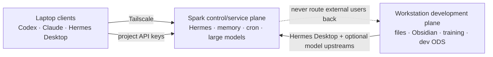

# Local AI Tooling Catalog and Rollout

## Scope and evidence standard

This catalog maps the names supplied by the user to first-party repositories, documentation, or product sites. A name is marked **ambiguous** when no unique first-party project could be established. It is marked **unverified** when a plausible name exists but the requested feature or relationship could not be confirmed. No installation should be based on a likely match alone.

“Free” below means the referenced source code or a stated free product tier, not that model inference, third-party APIs, proxies, storage, or GPU operation are free.

## Installation model

Use four installation scopes:

1. **Per harness** — skills, commands, hooks, and plugins must be installed separately in Codex, Claude Code, Hermes, Gemini CLI, or another agent unless the project explicitly supplies a universal installer.
2. **Per device** — local command guards, browser daemons, and desktop applications apply to the machine on which agents execute.
3. **Central service** — long-running HTTP MCPs, crawlers, RAG, workflow, memory, and sandbox control planes should run once in the trust domain that owns their data. The authoritative personal Hermes profile, its memory, messaging, and cron belong on Spark. Helpers that require workstation-only files or authenticated desktop browser sessions stay on the workstation and are exposed narrowly when needed. Large-model and external/project services also belong on Spark, but under separate identities, keys, routes, and permissions.
4. **Per project** — application frameworks and strict development methodologies belong in selected repositories, not in every global agent context.

Do not globally install several overlapping development methodologies at once. Their mandatory workflows and trigger rules can conflict, expand context, create duplicate slash commands, and make failures hard to attribute.

Account login is not configuration synchronization. Signing into Claude Code, Codex, or Gemini on a second machine may restore the vendor account experience, but it does not copy local skills, hooks, MCP processes, binaries, environment variables, browser profiles, or project instructions. Consumer subscriptions also are not generic API credit for LiteLLM, ODS, n8n, or unattended third-party applications. Use official subscription-authenticated clients interactively; use separately authorized APIs or local OpenAI-compatible endpoints for services and automation. The detailed subscription constraints are in [Local AI Architecture Research](local-ai-architecture-research.md).

## Recommended decisions

### Adopt first

- Install **DCG** on each machine/harness that supports its pre-tool hook. It provides mechanical protection that prompt-only safety rules cannot.
- Use **Addy Osmani Agent Skills as the first balanced, portable SDLC baseline**. Choose Compound Engineering instead when durable project learning is the priority, gstack for a founder/product/design/release factory, or Superpowers for strict specification/TDD/worktree discipline. Trial alternatives one at a time in isolated repositories.
- Add Matt Pocock's `/teach`, `/prototype`, and `/grill-me` selectively; they are focused helpers, not a reason to install a second full SDLC factory.
- Keep authenticated personal browser automation on the **workstation**. Run a dedicated cookie-free crawler centrally where practical. Use **Browser Use** for interactive browser action and one crawler—**Firecrawl** or **Crawl4AI**—for extraction.
- Run **Mem0 only if an application needs shared programmable memory**. Do not add it merely because Hermes already has personal memory.
- Use **Buffer’s official hosted MCP** for social publishing, with drafts/approval as the default.
- Use **Remotion** per video project, after checking its special commercial license.
- Use **Daytona** only for untrusted or high-risk code execution that warrants an external sandbox service.

### Evaluate later

- Paperclip or Multica for multi-agent work management.
- RAGFlow for a substantial document-RAG product.
- Langflow for visual workflow prototyping.
- Composio for broad third-party authentication/tool integration.
- Last30Days plus ScrapeCreators for social/trend research.
- here.now for disposable public artifacts.

### Do not add by default

- AutoGen for a new project: Microsoft now places it in maintenance mode and directs new users to Microsoft Agent Framework.
- CrewAI, AutoGen, Paperclip, Multica, Langflow, and existing Hermes orchestration together. They overlap at different levels and would create several schedulers and state stores.
- Firecrawl and Crawl4AI together unless benchmarks show that each covers a distinct required site class.
- Multiple global SDLC packs with auto-triggering rules.

## Skills, plugins, and development methodologies

### Addy Osmani Agent Skills / “7 steps of SDLC”

**Confirmed project:** [`addyosmani/agent-skills`](https://github.com/addyosmani/agent-skills). It is an MIT-licensed pack of 24 workflow skills and specialist personas. The current project exposes eight lifecycle commands—`/spec`, `/plan`, `/build`, `/test`, `/review`, `/webperf`, `/code-simplify`, and `/ship`—not “seven steps.” Its source documents Claude, Codex, Gemini, Cursor, OpenCode, and generic Markdown installation. [Repository and install matrix](https://github.com/addyosmani/agent-skills), [generic setup](https://github.com/addyosmani/agent-skills/blob/main/docs/getting-started.md)

**Scope:** per harness or per project. `npx skills add` can place skills in supported hosts, but each harness still discovers its own target directory.

**Strengths:** broad, explicit verification gates; portable plain Markdown; MIT; good default for conventional product engineering.

**Costs/red flags:** large overlapping pack; mandatory workflow language may conflict with Superpowers, gstack, or Compound Engineering. Install one methodology globally, or pin this pack only in chosen projects.

### gstack by Garry Tan

**Confirmed project:** [`garrytan/gstack`](https://github.com/garrytan/gstack). It is a workflow suite spanning product interrogation, planning, engineering/design review, browser QA, security, shipping, deployment, and retrospectives. It requires Git and Bun; Windows additionally requires Node.js. Its setup supports Claude Code and explicit hosts including Codex, Hermes, OpenCode, Cursor, and others. [Official repository and installation table](https://github.com/garrytan/gstack)

**Scope:** per harness; optional team/project bootstrap can commit required or optional integration into a repository.

**Strengths:** coherent end-to-end “sprint” with product and design review, real-browser QA, and multiple supported agent hosts.

**Costs/red flags:** broad and opinionated; installs many commands and can auto-update; its browser guidance can override another browser integration. Review its setup changes before using team “required” mode.

### Compound Engineering

**Confirmed project:** [`EveryInc/compound-engineering-plugin`](https://github.com/EveryInc/compound-engineering-plugin), the official Compound Engineering plugin for Claude Code, Codex, Cursor, and other targets. Claude installs from its plugin marketplace. Codex’s native plugin currently installs skills but not the custom reviewer/researcher agents, so the project documents a separate Bun-based follow-up. [Official repository](https://github.com/EveryInc/compound-engineering-plugin)

**Scope:** per harness; Bun is needed for converter-backed targets and Codex’s custom-agent supplement, not for normal Claude installation.

**Strengths:** planning, review, research, and learning are designed to leave reusable knowledge in the project.

**Costs/red flags:** Codex installation currently has two mechanisms; stale duplicate skills are a documented failure mode. Do not install beside another full global methodology until tested.

### Superpowers

**Confirmed project:** [`obra/superpowers`](https://github.com/obra/superpowers), an agentic development methodology centered on Socratic specification, detailed plans, TDD, worktrees, subagent execution, and review. It supports official Claude and Codex plugin marketplaces and several additional hosts. The project explicitly says installation is separate for every harness. [Official repository](https://github.com/obra/superpowers)

**Scope:** per harness.

**Strengths:** strong process enforcement, TDD, isolated work, and subagent review.

**Costs/red flags:** intentionally strict and context-heavy; best with subagent support; will conflict with other “always use this workflow” packs.

### Addy Osmani Web Quality Skills

**Confirmed project:** [`addyosmani/web-quality-skills`](https://github.com/addyosmani/web-quality-skills), a web-performance/accessibility/SEO/best-practices skill pack with Claude, Codex, Gemini, and generic Skills CLI installation. [Official repository](https://github.com/addyosmani/web-quality-skills)

**Scope:** per harness or project.

**Fit:** complementary if the chosen core methodology does not already cover Lighthouse/Core Web Vitals. The main Addy Agent Skills pack now includes `/webperf`, so check for duplication before adding both.

### “Find skills”

**Confirmed likely match:** [`vercel-labs/skills`](https://github.com/vercel-labs/skills) provides the MIT-licensed `npx skills find` command and a [`find-skills` skill](https://github.com/vercel-labs/skills/blob/main/skills/find-skills/SKILL.md). It can install globally or per project into many supported agents. [skills.sh API](https://www.skills.sh/docs/api)

**Red flags:** `npx` executes downloaded package code; the CLI collects anonymous install telemetry unless `DISABLE_TELEMETRY` or `DO_NOT_TRACK` is set; and skills.sh does not guarantee the quality or security of every listed skill. [skills.sh documentation](https://www.skills.sh/docs) Let it propose candidates, but never autonomously install them into production. Pin the source commit, scan and manually review it, then promote it to the approved skills repository.

### Matt Pocock `/teach`, `/prototype`, `/grill-me`, `/ponytail`

**Confirmed for the first three:** [`mattpocock/skills`](https://github.com/mattpocock/skills) is an MIT-licensed Agent Skills collection.

- [`teach`](https://github.com/mattpocock/skills/blob/main/skills/productivity/teach/SKILL.md) is a stateful, multi-session teaching workflow. It writes `MISSION.md`, `RESOURCES.md`, `NOTES.md`, learning records, and HTML teaching artifacts into the current directory. Use it only in a dedicated learning workspace.
- [`prototype`](https://github.com/mattpocock/skills/blob/main/skills/engineering/prototype/SKILL.md) builds a throwaway terminal or UI prototype to answer a design question. It intentionally omits persistence, tests, and production polish. Run it in a disposable branch/worktree and do not deploy the result.
- [`grill-me`](https://github.com/mattpocock/skills/blob/main/skills/productivity/grill-me/SKILL.md) invokes a structured interview to resolve branching design or plan decisions. It is useful before irreversible choices but unsuitable for unattended jobs.

These are instruction packs, not model services. Install selected skills per harness/project.

**Correction:** Ponytail is not a Matt Pocock project. [`DietrichGebert/ponytail`](https://github.com/DietrichGebert/ponytail) is an MIT-licensed cross-agent plugin/skill that enforces a YAGNI/minimal-code ladder. Node.js is required for its always-on Claude/Codex lifecycle hooks, although plain skills work without hooks. Hooks inject policy into turns and subagents; pin and audit them before enabling globally. Its benchmarks are author-produced and the repository itself says earlier larger savings were an artifact.

### Anthropic Claude Skills

**Confirmed official source:** [`anthropics/skills`](https://github.com/anthropics/skills). Skills contain `SKILL.md` plus optional scripts/resources. Do not assume one repository-wide license: Anthropic says many examples are Apache-2.0, while its document-format skills are source-available rather than open source. [Official licensing note](https://github.com/anthropics/skills#about-this-repository)

Claude’s consumer/business app supports custom skills on Free, Pro, Max, Team, and Enterprise when code execution is available. Individual uploads are private unless Team/Enterprise sharing or provisioning is used. [Using Skills in Claude](https://support.claude.com/en/articles/12512180-use-skills-in-claude), [skill security guidance](https://support.claude.com/en/articles/12512198-how-to-create-custom-skills)

Prefer a small official baseline plus reviewed community skills. Do not bulk-install a “100+ Claude skills” collection merely because the Markdown is visible.

### Headroom

**Confirmed project:** [`headroomlabs-ai/headroom`](https://github.com/headroomlabs-ai/headroom), an Apache-2.0 local-first context-compression system offered as Python/TypeScript library, proxy, MCP, and agent wrapper. It supports reversible retrieval/cache, shared memory, and a `headroom learn` workflow. Python requires 3.10+; the project recommends an isolated Python 3.13 `uv tool` install for its full CLI.

**Scope:** per client or one secured shared proxy.

**Strengths:** compresses large MCP/tool/log context before it reaches Claude, Codex, or LiteLLM.

**Red flags:** it sees full prompts and credentials and caches originals; shared memory can cross agent trust boundaries; `headroom learn` writes agent instruction files; shared proxy runtime overrides can affect other clients. Pilot input compression only, partition cache/memory by trust domain, and manually review learned files.

### I-have-adhd

**Confirmed project:** [`ayghri/i-have-adhd`](https://github.com/ayghri/i-have-adhd), an MIT-licensed output-style skill that puts action first, uses short numbered steps, suppresses tangents, and emphasizes visible completion.

**Scope:** interactive personal profiles only; no service or GPU runtime.

**Red flags:** always-on brevity can omit nuance and safety context. Avoid it in research, security, legal, and teaching profiles.

### Caveman

**Confirmed project:** [`JuliusBrussee/caveman`](https://github.com/JuliusBrussee/caveman), an MIT-licensed terse-prose prompt/skill/plugin with commit/review modes, a stats hook, prompt/MCP-description compression, and terse subagents. Its installer requires Node.js 18+. The repository states there is no account or network dependency after installation. [Install and privacy](https://github.com/JuliusBrussee/caveman#install)

**Red flags:** the repository reports roughly 1–1.5k additional input tokens per turn and possible net-negative savings on already terse tasks. [Author benchmarks](https://github.com/JuliusBrussee/caveman#benchmarks) Inspect installers instead of piping them to a shell. Choose Caveman or I-have-adhd for a profile, not both.

### Awesome Design Skills

**Confirmed likely project:** [`bergside/awesome-design-skills`](https://github.com/bergside/awesome-design-skills), an MIT-licensed curated collection of design-style skills installed with `npx typeui.sh pull <slug>`.

**Scope:** one or two reviewed styles per project.

**Red flags:** “awesome” means curated, not security-audited; `npx` executes third-party code; an umbrella license does not automatically resolve trademark or aesthetic provenance for every style. Bulk installation creates trigger conflicts.

### Claude Design

**Two distinct matches:**

- [Anthropic’s official Claude Design beta](https://support.claude.com/en/articles/14604416-get-started-with-claude-design) is a hosted collaborative design/prototype/presentation canvas included with Pro, Max, Team, and Enterprise and consuming shared Claude usage. Claude Code connects to its hosted MCP after login. It is paid SaaS, not a local/open-source tool. Anthropic documents limitations including simultaneous-editing reliability and large-codebase lag. [Anthropic launch](https://www.anthropic.com/news/claude-design-anthropic-labs)
- [`jiji262/claude-design-skill`](https://github.com/jiji262/claude-design-skill) is a community HTML-artifact skill whose README says it was adapted from an internal Claude Design prompt. That provenance creates an IP/licensing concern that the community repository’s MIT notice cannot necessarily cure. Avoid redistribution/use pending review.

### Frontend Slides

**Likely project:** [`zarazhangrui/frontend-slides`](https://github.com/zarazhangrui/frontend-slides), a skill/plugin for producing single-file HTML presentations with web-native layouts and animation. Install it only in presentation-producing harnesses/projects; it does not need a central service or GPU. Confirm this is the intended URL before promotion because similarly named slide skills exist.

### Shreya Shankar “plain writing”

**Status:** **unverified.** No first-party repository under Shreya Shankar’s public GitHub presence was found that confirms a skill with this title. Do not attribute a community plain-writing prompt to her without its source URL. A separately maintained `synthesisengineering/synthesis-skills` repository does contain writing methodology, but it does not establish the requested attribution. [Synthesis Skills repository](https://github.com/synthesisengineering/synthesis-skills)

### “100% coverage,” “daily docs,” and “logging” loops

These appear to be desired engineering policies rather than uniquely identifiable projects.

- Treat coverage as a measured quality signal, not proof of correct behavior. A line can execute with no meaningful assertion.
- Generate daily documentation from repository state only when it creates durable value; otherwise it creates churn and stale summaries.
- Use structured application logs and tracing at service boundaries; do not make an agent continuously rewrite narrative log files.

Encode these as small project-local policies with CI enforcement, not three autonomous always-running agents. The Addy pack already contains TDD, documentation/ADR, and observability workflows. [Addy Agent Skills inventory](https://github.com/addyosmani/agent-skills)

## Research, browser, and publishing tools

### Last30Days and ScrapeCreators

**Confirmed projects:** [`mvanhorn/last30days-skill`](https://github.com/mvanhorn/last30days-skill) and the official [`@scrapecreators/cli`](https://docs.scrapecreators.com/integrations/cli/). Last30Days researches recent discussion across Reddit, X, YouTube, TikTok, Hacker News, Polymarket, GitHub, and other sources and supports Claude Code, Codex, Hermes, and generic Skills hosts. Its zero-config sources are narrower; richer social sources require keys or browser sessions. [Last30Days repository](https://github.com/mvanhorn/last30days-skill), [ScrapeCreators CLI documentation](https://docs.scrapecreators.com/integrations/cli/)

ScrapeCreators is a hosted API/CLI/MCP covering 27+ social platforms and requires an API key for use. Install the CLI on the central research worker or expose its MCP centrally; install the Last30Days skill per harness that should invoke it.

**Strengths:** repeatable current-interest research and engagement signals.

**Costs/red flags:** recurring API costs, platform terms, personal/browser-session credentials, potentially sensitive social data, and an inherently noisy evidence base. Use it for trend discovery, not as the primary source for factual or high-stakes research.

### Browser Use and the “50 ms latency loop”

**Confirmed project:** [`browser-use/browser-use`](https://github.com/browser-use/browser-use). It provides Python/browser-agent tooling and a CLI/skill. Browser Use’s own release notes describe its newer CLI as a persistent direct-CDP daemon with approximately 50 ms command latency; this is the most likely meaning of “50ms latency,” not a separate autonomous loop. [Official repository](https://github.com/browser-use/browser-use), [official releases](https://github.com/browser-use/browser-use/releases)

**Scope:** per device if controlling that device’s real Chrome profile. For this setup, put the authenticated personal Browser Use profile on the workstation; a cookie-free research browser may be a separate central service. Do not put the laptop’s or workstation’s normal Chrome profile on Spark.

**Strengths:** interactive navigation and action; can use an existing Chrome profile.

**Red flags:** browser sessions contain high-value cookies; untrusted pages can prompt-inject an agent. Use a dedicated browser profile, domain allowlists, and separate read-only research from side-effecting account actions.

### Firecrawl

**Confirmed project:** [`firecrawl/firecrawl`](https://github.com/firecrawl/firecrawl), an AGPL-3.0 web search/scrape/crawl/interact system available as hosted API and self-hosted software. It returns Markdown, structured data, screenshots, and parsed documents and has official CLI/skills/MCP integrations. [Official repository](https://github.com/firecrawl/firecrawl), [official CLI](https://github.com/firecrawl/cli)

**Scope:** one centralized hosted account or self-hosted service.

**Strengths:** robust extraction, search, batch crawl, JS-heavy pages, hosted proxy/orchestration.

**Costs/red flags:** hosted usage costs; self-hosting the full reliability/proxy stack is operationally heavier; AGPL obligations matter for modifications/network use. Do not duplicate it on every device.

### Crawl4AI

**Confirmed project:** [`unclecode/crawl4ai`](https://github.com/unclecode/crawl4ai), an open-source Python crawler that converts web content to LLM-ready Markdown and structured output. [Official repository](https://github.com/unclecode/crawl4ai)

**Scope:** centralized Python service or per-project library.

**Strengths:** local control, good fit for RAG ingestion, no hosted API required.

**Costs/red flags:** you own browser dependencies, proxies, rate limits, site-specific failures, and legal/robots compliance. It overlaps heavily with Firecrawl; benchmark before choosing.

### Paper MCP

**Status:** **ambiguous.** At least two unrelated likely matches exist:

- [Paper Design’s official MCP](https://paper.design/docs/mcp) reads and writes Paper design files and requires the Paper Desktop app.
- [`guangxiangdebizi/papers-mcp`](https://github.com/guangxiangdebizi/papers-mcp) is a small third-party academic search/analysis MCP using OpenAlex, Crossref, and arXiv.

The latter repository currently shows only one commit and even contains inconsistent clone/repository names in its README, which is a maintenance red flag. Obtain the intended URL. For academic search, prefer the primary APIs directly or a mature reviewed connector.

### Buffer publisher

**Confirmed service:** Buffer’s official hosted MCP at `https://mcp.buffer.com/mcp`, authenticated by a Buffer API key. It can list channels and create/manage scheduled posts. Buffer has free and paid accounts; official documentation states free accounts can generate one personal API key and paid accounts up to five, with shared usage limits. [Official MCP guide](https://developers.buffer.com/guides/integrations/mcp.html/), [official API/account guidance](https://support.buffer.com/article/859-does-buffer-have-an-api), [publishing workflow](https://support.buffer.com/article/600-getting-started-with-buffers-publishing-features)

**Scope:** connect once as a centralized remote MCP and grant selected agents access.

**Strengths:** official API, multi-network scheduling, channel permissions and approval workflow.

**Red flags:** it performs public side effects. Default agents to creating ideas or drafts, require human approval for publishing, and never share a personal API key across untrusted agents.

### NotebookLM MCP / open-source NotebookLM alternative

**Status:** **unofficial and ambiguous.** Google’s official MCP repository has an open request for NotebookLM support rather than an official server. [Google MCP request](https://github.com/google/mcp/issues/19), [official catalog](https://github.com/google/mcp)

A likely match is the MIT-licensed [`PleasePrompto/notebooklm-mcp`](https://github.com/PleasePrompto/notebooklm-mcp). It uses Node.js 18+ and Patchright to drive Chrome, supports stdio/HTTP, and can query notebooks, add sources, retrieve citations, and create audio overviews. Headless Linux needs a display/Xvfb for first login; cookies then persist in its browser profile.

Run one pinned instance on a secured host. The browser profile contains high-value Google session state and is not an encrypted credential store. Bind to localhost/private VPN, separate personal/work accounts, and expect unsupported web automation to break. Google itself warns NotebookLM output may make mistakes. [NotebookLM help](https://support.google.com/notebooklm/answer/16179559)

## Safety, execution, and agent management

### NVIDIA SkillSpector

**Confirmed project:** [`NVIDIA/SkillSpector`](https://github.com/NVIDIA/SkillSpector), an Apache-2.0 pre-install/CI scanner for Agent Skills. It combines static rules, optional LLM semantic analysis, OSV dependency lookups, and JSON/Markdown/SARIF output. It installs through `uv`; an MCP extra and Python 3.12 Docker image are documented. [Features and CI integration](https://github.com/NVIDIA/SkillSpector#integrating-skillspector), [license](https://github.com/NVIDIA/SkillSpector/blob/main/LICENSE)

Run it once as the central intake gate before skills enter the approved repository. It is triage, not proof of safety. Optional LLM review may disclose code and incur cost; offline OSV coverage is limited; exit code 0 can include both SAFE and CAUTION, so CI must inspect structured output if CAUTION should block.

### DCG — Destructive Command Guard

**Confirmed project:** [`Dicklesworthstone/destructive_command_guard`](https://github.com/Dicklesworthstone/destructive_command_guard), a compiled pre-tool hook that blocks dangerous Git and shell commands. It has binaries for Linux x86-64/ARM64, macOS, and Windows, and documents integrations for Claude Code, Codex, Gemini CLI, Hermes, Cursor, Copilot CLI, and Aider. [Official repository](https://github.com/Dicklesworthstone/destructive_command_guard)

**Scope:** per device and per supported harness hook.

**Strengths:** deterministic, low-latency enforcement; test/explain mode; configurable command packs.

**Costs/red flags:** false positives and bypass governance; it covers command patterns, not all harmful API/MCP actions. Verify release checksums/signatures and test policy before enabling globally.

### Daytona

**Confirmed project/service:** [`daytonaio/daytona`](https://github.com/daytonaio/daytona) provides isolated, stateful sandboxes with dedicated kernel, filesystem, network, CPU/RAM/disk and SDK/API/CLI control. The self-hosted core is AGPL-3.0; the managed platform is usage-priced and requires an account/API key. Official skills can be installed with the Skills CLI. [Official documentation](https://www.daytona.io/docs/), [pricing](https://www.daytona.io/pricing), [scaling model](https://www.daytona.io/docs/en/scale/)

**Scope:** one centralized external sandbox provider; install only the SDK/skill in invoking agents.

**Strengths:** strong isolation for AI-generated code, snapshots, rapid provisioning, persistent tasks, fleet scaling.

**Costs/red flags:** cloud cost, code/data leaving local machines, network egress, and vendor dependency. It is not needed for trusted local development already isolated by a local container, but is valuable for untrusted repositories or web-derived instructions.

### Paperclip

**Confirmed project:** [`paperclipai/paperclip`](https://github.com/paperclipai/paperclip), an MIT-licensed Node.js server and React UI for organizing teams of external agents using goals, org charts, budgets, governance, tickets, heartbeats, and audit history. It is explicitly not an agent framework or chatbot. [Official repository](https://github.com/paperclipai/paperclip), [runtime guide](https://github.com/paperclipai/docs/blob/main/agents-runtime.md)

**Scope:** one centralized control plane. Start it on the workstation while evaluating personal coding workflows and use workers on the machines that own each checkout. Move an external/project-only control plane to Spark only after its authentication, isolation, and backup model is accepted.

**Strengths:** multi-agent ownership, scheduled/event wakeups, budget limits, auditability, and adapters for several coding agents.

**Costs/red flags:** adds another scheduler, database, dashboard, and governance model beside Hermes/ODS/n8n. The project roadmap still lists some cloud/sandbox capabilities as future work. Use only if its organizational work-management model solves a real problem; disable duplicate schedulers elsewhere.

Pin a release that includes the fix for the project's published security advisory, bind it to localhost/Tailscale during evaluation, and do not give its agents unrestricted credentials or host access. [Published advisory](https://github.com/paperclipai/paperclip/security/advisories/GHSA-68qg-g8mg-6pr7)

### Multica

**Confirmed likely project:** [`multica-ai/multica`](https://github.com/multica-ai/multica), described by its official repository as an open-source managed-agents platform for assigning tasks, tracking progress, and compounding skills. [Official repository](https://github.com/multica-ai/multica)

**Scope:** centralized service, not per harness, with harness adapters/workers.

**Fit and overlap:** directly overlaps Paperclip and parts of Hermes/ODS orchestration. Evaluate Paperclip and Multica against the same small workload; do not deploy both as production control planes.

**Red flag:** the repository uses a modified Apache-style license with restrictions around offering it as a third-party hosted service, embedding/white-label use, and branding; it is not equivalent to ordinary Apache-2.0. Rapidly evolving agent-management projects can also change persistence, authentication, and execution models. Review the exact pinned license, backup model, and supported worker versions before rollout. [Multica license](https://github.com/multica-ai/multica/blob/main/LICENSE)

### Composio

**Confirmed project:** [`ComposioHQ/composio`](https://github.com/ComposioHQ/composio), an MIT-licensed integration layer providing a large tool catalog, tool search, authentication, context management, and sandboxed workbench; its Rube product exposes tools through MCP. [Official repository](https://github.com/ComposioHQ/composio)

**Scope:** centralized hosted integration/auth service or per-application SDK; connect selected agents rather than copying credentials to every harness.

**Strengths:** avoids building OAuth and API wrappers for many SaaS products.

**Costs/red flags:** broad authorization blast radius, hosted dependency, per-service OAuth scopes, and overlap with native MCP connectors. Prefer native official connectors for critical systems; grant least privilege and separate read from write accounts.

## Memory, orchestration, workflow, and RAG frameworks

### Honcho and the DGX Spark

**Confirmed project:** [`plastic-labs/honcho`](https://github.com/plastic-labs/honcho), an AGPL-3.0 memory service for stateful agents. Its FastAPI server stores workspaces, peers, sessions, and messages; an asynchronous deriver builds conclusions, representations, and summaries. It has Python/TypeScript SDKs and an official Hermes memory integration. [Honcho repository](https://github.com/plastic-labs/honcho), [Hermes integration](https://github.com/NousResearch/hermes-agent/blob/main/plugins/memory/honcho/README.md)

Self-hosting requires Docker Compose or Python 3.10+/`uv`, PostgreSQL with pgvector, API and worker processes, and model/embedding endpoints. It supports OpenAI-compatible Ollama/vLLM/LiteLLM routes, but memory models must reliably perform tool calls. [Self-hosting](https://honcho.dev/docs/v3/contributing/self-hosting), [configuration](https://honcho.dev/docs/v3/contributing/configuration)

**Placement decision:** the authoritative personal Hermes now runs on Spark, so its built-in memory remains there. If Honcho is worth the added moving parts, run the personal Honcho workspace on Spark in the same personal trust boundary but separate from external/project tenants. Use separate databases/workspaces, credentials, backups, and network policies for any externally used Honcho service.

If Honcho is tested on Spark, remember that DGX Spark is ARM64 and no official Honcho-on-Spark validation was found, so test the complete Compose build on ARM64 first. Back up PostgreSQL and do not expose the example deployment—authentication is disabled by default. Honcho stores sensitive inferred profiles, background derivation is asynchronous, and AGPL network obligations matter if modified and served.

Honcho overlaps Mem0 and substantially augments/replaces Hermes’s simple built-in memory. Choose Honcho or Mem0 after an evaluation; retain Obsidian as curated human knowledge rather than a memory database.

### Voicebox

**Likely exact project:** [`jamiepine/voicebox`](https://github.com/jamiepine/voicebox), an MIT-licensed local-first voice studio with voice cloning, multiple TTS engines, Whisper transcription/dictation, REST API, and MCP speak/transcribe/profile tools. This is distinct from Meta’s research model also named Voicebox. [Official site](https://voicebox.sh/)

The desktop uses Tauri/Rust, React, and a Python FastAPI backend. Linux has no prebuilt desktop binary and requires source-build dependencies; NVIDIA acceleration uses CUDA PyTorch. The backend supports remote HTTP operation, so place it on Spark/workstation and use desktop/laptop clients. [Linux installation](https://voicebox.sh/linux-install), [remote mode](https://docs.voicebox.sh/overview/remote-mode), [Docker status](https://docs.voicebox.sh/overview/docker)

No official DGX ARM64 validation was found, and prebuilt Docker images are not yet available. Containerize and pin dependencies. Remote examples bind broadly without documented application authentication, so use VPN/firewall only. Voice cloning requires explicit consent, captures/profiles need backup and privacy controls, and TTS competes with LLM inference for GPU memory.

### Mem0

**Confirmed project:** [`mem0ai/mem0`](https://github.com/mem0ai/mem0), an Apache-2.0 programmable memory layer for AI agents, available as open-source library and hosted platform. An official MCP wrapper exists for the hosted Memory API. [Official repository](https://github.com/mem0ai/mem0), [official MCP repository](https://github.com/mem0ai/mem0-mcp)

**Scope:** one centralized memory service per application/tenant, not one copy per laptop.

**Strengths:** searchable application memory independent of a single agent harness.

**Costs/red flags:** personal-data retention, deletion/tenant isolation, embedding/vector-store dependencies, and overlap with Hermes memory and Obsidian. Define the system of record before adding it.

### CrewAI

**Confirmed project:** [`crewAIInc/crewAI`](https://github.com/crewAIInc/crewAI), an MIT-licensed Python framework for role-based multi-agent “Crews” and structured “Flows.” It has official Agent Skills for scaffolding and querying current docs. [Official repository](https://github.com/crewAIInc/crewAI)

**Scope:** per application, with one deployed runtime; not a global desktop plugin.

**Strengths:** approachable Python abstraction and explicit multi-agent/task concepts.

**Costs/red flags:** another orchestration framework and state/observability layer. Use it to build a specific application, not to coordinate existing Claude/Codex/Hermes desktop sessions by default.

### AutoGen

**Confirmed project:** [`microsoft/autogen`](https://github.com/microsoft/autogen), a Python/.NET multi-agent framework. Microsoft now marks AutoGen as in maintenance mode, community-managed, and recommends Microsoft Agent Framework for new projects. Python packages require Python 3.10+. [Official repository](https://github.com/microsoft/autogen)

**Decision:** retain only for existing AutoGen applications or migration work. Do not choose it for a new control plane.

### Langflow

**Confirmed project:** [`langflow-ai/langflow`](https://github.com/langflow-ai/langflow), an MIT-licensed visual builder for agents and workflows that can deploy flows as APIs or MCP tools. Local installation requires Python 3.10–3.14; Docker and Windows/macOS desktop distributions are documented. [Official repository](https://github.com/langflow-ai/langflow)

**Scope:** one centralized development/deployment instance, or a per-developer desktop for prototyping.

**Strengths:** rapid visual authoring, many providers/vector stores, API/MCP export.

**Costs/red flags:** visual flows can obscure code review and version semantics; adds another credential store and runtime. Best for prototypes or operator-built workflows, not as a second production scheduler beside n8n without a clear boundary.

### RAGFlow

**Confirmed project:** [`infiniflow/ragflow`](https://github.com/infiniflow/ragflow), an Apache-2.0 document-RAG/context engine with agent capabilities. Official deployment uses a multi-container stack. Published images are x86-only; ARM64 users must build compatible images. [Official repository](https://github.com/infiniflow/ragflow)

**Scope:** one centralized service. The x86 image constraint makes the RTX workstation/server the simpler target; DGX Spark ARM64 requires a custom build.

**Strengths:** document parsing, retrieval pipeline, citations/context, UI, and agent features in one system.

**Costs/red flags:** heavy operational footprint, multiple backing services, storage/backup requirements, and overlap with ODS Qdrant/Open WebUI RAG. Deploy only for a real document corpus and measured retrieval requirements.

## Creative, design, and publishing

### Remotion

**Confirmed project:** [`remotion-dev/remotion`](https://github.com/remotion-dev/remotion), a React/TypeScript framework for programmatic video and image rendering. It starts with `npx create-video@latest`. [Official repository](https://github.com/remotion-dev/remotion)

**License:** source-available under a special two-tier license, not a standard permissive open-source license. Individuals, nonprofits, and for-profit organizations with up to three employees are currently eligible for free commercial use; larger for-profit organizations need a company license. [Official license](https://github.com/remotion-dev/remotion/blob/main/LICENSE.md)

**Scope:** per video project or centralized render service. GPU acceleration/render workers can live on the workstation; skill instructions belong in the harness working on that repository.

**Strengths:** deterministic, reusable, data-driven video using the web/React ecosystem.

**Costs/red flags:** rendering/browser/font/media dependencies and license threshold. Pin versions because the project releases frequently.

### Higgsfield

**Confirmed product:** [Higgsfield](https://higgsfield.ai/) is a hosted image/video generation suite. Its official terms cover website, API, MCP, CLI, and agent services; plans are subscription/credit based and region-dependent. [Official terms](https://higgsfield.ai/terms-of-use-agreement), [official pricing explanation](https://geo.higgsfield.ai/task/blog/higgsfield-ai-pricing-plans-1)

**Scope:** centralized remote API/MCP integration or human web application, not local Spark inference.

**Strengths:** packaged creative models, character/marketing/video workflows.

**Costs/red flags:** credits, changing regional pricing/model availability, content/privacy terms, and no local-model substitution. Do not confuse a consumer subscription with general API entitlement.

### here.now

**Confirmed product:** [here.now](https://here.now/) is agent-oriented static/file hosting. Anonymous sites expire after 24 hours; accounts have a free tier, permanent sites, API keys, optional passwords/access controls, custom domains, and paid higher limits. It publishes via HTTP and explicitly states that it does not currently claim public MCP or OAuth support. [Official documentation and limits](https://here.now/docs)

**Scope:** central external hosting service; install its skill per publishing harness or call its API from a controlled deployment job.

**Strengths:** very fast artifact sharing and disposable previews.

**Red flags:** anonymous output is still public-by-default behind an unguessable URL, which is not equivalent to confidentiality. Never publish secrets, private datasets, or internal dashboards without authenticated restrictions.

### “Baidu/Baidy UnlimitedOCR”

**Confirmed correction:** Baidu’s project is [`baidu/Unlimited-OCR`](https://github.com/baidu/Unlimited-OCR), an MIT-licensed 3B multimodal document OCR/parser that converts page images/PDF content to Markdown, supports long output, and uses a specialized n-gram decoder. The official vLLM recipe recommends at least 8 GB VRAM and currently uses a custom image/logits-processor rather than a stable ordinary package path. [Official vLLM recipe](https://recipes.vllm.ai/baidu/Unlimited-OCR)

Deploy one pinned, containerized OCR endpoint on the 48 GB workstation or Spark. The laptop’s 6 GB RTX 3060 is below the official vLLM recommendation. Its recipes use custom code and `trust_remote_code=True`; isolate the service, pin model/revision/wheels, and never run it privileged. Cap PDF pages, pixels, output tokens, and concurrency because 300-DPI pages and very long generation can exhaust memory. Route it as `ocr-doc`, not as a general chat model, and benchmark on the user’s real document languages/layouts rather than relying on author quality claims.

## Application stack choices

### Next.js, Astro, Convex, and Vercel

These are application/deployment choices, not agent skills that belong on every machine.

- **Next.js** is a full-stack React framework supporting static, server, streaming, and hybrid rendering. It fits interactive applications and dashboards.
- **Astro** focuses on content-heavy sites and minimal client-side JavaScript. Static Astro sites deploy to Vercel with zero configuration.
- **Vercel** is hosted deployment infrastructure with especially tight Next.js integration and first-class Astro support.
- **Convex** is a reactive backend/database and hosted service with a self-hosted backend. Its backend uses the FSL Apache 2.0 license, which prohibits offering a competing hosted product until code converts to Apache-2.0 after two years.

[Vercel’s Next.js/Astro comparison](https://vercel.com/i/astro-vs-next-js), [Astro on Vercel](https://vercel.com/docs/frameworks/frontend/astro), [Convex self-hosting and license](https://docs.convex.dev/self-hosting)

**Recommendation:** use Astro for docs/marketing/static reports; Next.js for authenticated interactive dashboards; use Convex only when its realtime data/function model is an intentional dependency. Vercel is convenient but is not required for either framework. Keep local ODS dashboards separate from public Vercel deployments.

## Overlap matrix

| Need | Primary candidates | Choose |
|---|---|---|
| Coding methodology | Addy Agent Skills, gstack, Compound Engineering, Superpowers | Start with Addy; switch for the specific workflow strengths described above |
| Agent work management | Hermes, Paperclip, Multica | Hermes for personal assistant; one additional manager only if needed |
| Application multi-agent framework | CrewAI, AutoGen | CrewAI for new Python experiment; avoid new AutoGen |
| Visual workflow | n8n/ODS, Langflow | n8n for deterministic integrations; Langflow for AI-flow prototypes |
| Interactive browser | Browser Use | One isolated browser service/profile |
| Web extraction | Firecrawl, Crawl4AI | Hosted reliability vs local control; benchmark and choose one |
| Memory | Hermes memory, Obsidian, Mem0, Honcho | Hermes built-in first; Obsidian human knowledge; Mem0 for simpler permissive app memory; Honcho for richer peer/user modeling |
| RAG | ODS/Qdrant, RAGFlow | Existing ODS for simple retrieval; RAGFlow for document-heavy product |
| Social publishing | Buffer MCP | Central connector with approval |
| Video | Remotion, Higgsfield | Deterministic code-rendered vs hosted generative |
| Agent sandbox | Daytona, local containers | Daytona for untrusted/high-risk; local containers for trusted work |
| Public previews | here.now, Vercel | here.now disposable artifacts; Vercel maintained applications |

## Open-source repository quick reference

| Project | Purpose | License/status | Runtime and deployment |
|---|---|---|---|
| [Browser Use](https://github.com/browser-use/browser-use) | Browser automation for agents | Repository license; hosted features optional | Python/CLI, Chrome/CDP; device daemon or central browser |
| [Firecrawl](https://github.com/firecrawl/firecrawl) | Search, scrape, crawl, extraction | AGPL-3.0; hosted paid service available | Central API or multi-service self-host |
| [Mem0](https://github.com/mem0ai/mem0) | Agent memory layer | Apache-2.0; hosted service available | Per application, central memory/vector dependencies |
| [CrewAI](https://github.com/crewAIInc/crewAI) | Python agent crews and flows | MIT; hosted/enterprise offerings separate | Per application runtime |
| [AutoGen](https://github.com/microsoft/autogen) | Python/.NET multi-agent framework | Open repository; maintenance mode | Existing apps only; Python 3.10+ |
| [Langflow](https://github.com/langflow-ai/langflow) | Visual agent/workflow builder, API/MCP | MIT | Python 3.10–3.14, Docker, desktop |
| [Crawl4AI](https://github.com/unclecode/crawl4ai) | Local LLM-oriented crawler | Open-source repository | Python/browser dependencies; central or library |
| [RAGFlow](https://github.com/infiniflow/ragflow) | Document RAG/context engine | Apache-2.0 | Docker stack; official images x86, ARM64 custom build |

## Device, synchronization, and ODS placement

### The target ownership model

There are two always-on servers, not one primary server plus one disposable worker. Give each a clear ownership boundary:

| Device | Owns | Should not own |
|---|---|---|
| Laptop, RTX 3060 6 GB | Codex/Claude/Hermes clients, core reviewed skills, DCG, project Git checkouts, Obsidian desktop replica, Tailscale, small offline fallback model | Shared memory databases, production cron, full RAG stacks, personal browser automation while away |
| Workstation, RTX 5000 48 GB | Hermes Desktop remote client; optional local `desktop-files` profile; local project folders; normal Obsidian replica; authenticated Browser Use/NotebookLM/Last30Days; Voicebox; skill/config registry; fine-tuning and SLM experiments; development n8n/Langflow/CrewAI; low-latency coding and OCR endpoints | Authoritative personal Hermes state or duplicate production cron; external-user traffic routed through personal services |
| DGX Spark | Authoritative personal Hermes profile; `hermes serve`; `hermes gateway`; personal memory and cron; headless Obsidian replica; always-available personal LiteLLM routes; large/stable inference; separately isolated external/project routes, keys, jobs, memory, and RAG | Personal Google/browser cookies; unrestricted access to workstation files; external routes into private workstation services |



### Two ODS installations

ODS on the workstation is the development/training plane. Its LiteLLM and model services can provide low-latency coding routes when healthy, but it does not own the authoritative Hermes profile or duplicate its production schedules.

ODS on Spark is the always-available inference and automation plane. A current standalone Hermes beside ODS should initially own the personal profile, messaging, and Hermes cron because the currently pinned ODS Hermes image predates native remote Desktop support. Spark's personal model routes must remain available without the workstation. Externally consumed aliases need separate virtual keys, quotas, allowlists, and preferably a separate gateway/network boundary.

Two ODS installations do not automatically synchronize Open WebUI history, Qdrant, n8n, Hermes profiles, LiteLLM keys, dashboards, or inference processes. Give every cron job, webhook, publisher, and writable database exactly one production owner. ODS already includes n8n and LiteLLM; its extension catalog also includes CrewAI and Langflow, so evaluate those through `ods enable crewai` or `ods enable langflow` on the selected host instead of creating unrelated duplicate stacks. ODS model switching is not a cross-host GPU scheduler; retain the two authenticated gateways and stable logical routes described in [Personal Hermes, Obsidian, and Multi-Node Inference Design](personal-hermes-obsidian-multinode-design.md).

### Model routing without manual switching

Tools and agents should request capability aliases such as `code-fast`, `reasoning-large`, `ocr-doc`, or `embedding`, never “whatever model is currently loaded.” LiteLLM on each ODS host maps those aliases to stable backends. Keep latency-sensitive coding models warm on the 48 GB workstation and stable large/external models warm on Spark. vLLM or SGLang is appropriate for concurrently served production pools; ODS's default llama.cpp route is convenient for one GGUF and may reload when its selected model changes.

Do not build automation around unloading one busy model to satisfy an unrelated request. Use admission control, per-route concurrency limits, priorities, and queues. If memory cannot keep every model resident, assign a bounded worker pool that loads only from an approved model set when idle, while scheduled/background work waits rather than interrupting an interactive or external request. This preserves “automatic selection” without pretending that model loading is free or instantaneous.

### What syncs, and what is installed separately

| Artifact | Synchronize? | Method |
|---|---|---|
| Project-local skills/instructions and application dependencies | Yes | Commit to the project repository with lockfiles |
| Approved reusable skills and non-secret harness templates | Yes | Private canonical Git repository, then deploy adapters to each harness |
| Claude plugins, Codex plugins, Hermes local skills, hooks, DCG binaries | No automatic sync | Install or deploy separately on every device/harness that executes them |
| Remote HTTP/SSE MCP definition | Configuration can sync | Run server once; deploy endpoint config to clients; store token locally |
| Stdio MCP | No | Runtime and dependencies must exist on every invoking device |
| Models, containers, caches, virtual environments | No | Install only on the host that serves or executes them |
| Secrets, API keys, OAuth sessions, browser cookies | Never through Git/Obsidian | Per-device secret store or protected environment files |
| Hermes databases, schedules, Honcho/Mem0/RAG databases | Do not live-sync | One writer/service owner plus database-aware backup |
| Human-readable notes and agent inbox drafts | Yes | Obsidian Sync replicas with one sync mechanism per device |

Use a private repository such as:

```text
ai-fleet/
  registry/tools.yaml
  registry/skills.lock.yaml
  skills/reviewed/
  profiles/dev-default/
  harness/hermes/
  harness/codex/
  harness/claude/
  mcp/catalog.yaml
  hosts/laptop.yaml
  hosts/workstation.yaml
  hosts/spark.yaml
  scripts/deploy-*
```

Hermes can load a reviewed external skills directory through `skills.external_dirs`; Codex and Claude still need their supported local installation/plugin layout. Prefer a deploy script that copies or links from the canonical checkout and records a pinned revision. A shared writable live directory is risky because one harness can mutate instructions used by the others.

The intake pipeline is:

```text
skills find/manual discovery
  -> pin repository commit
  -> SkillSpector static/optional semantic scan
  -> manual script/hook/license review
  -> disposable-harness test
  -> promote selected skill to canonical repository
  -> deploy separately into each intended harness
```

Do not synchronize live databases, browser profiles, cookies, `.env` files, or OAuth tokens through that repository. Use a secrets manager/local protected environment files and Hermes/ODS-native backup methods. Device-specific overlays should contain only endpoint names, paths, and secret references.

### Obsidian on all three devices

Yes, the Spark can have its own vault replica using the official `obsidian-headless` client. Keep the desktop and laptop on normal Obsidian Sync, and give Spark a separate headless replica. Start Spark in **pull-only** mode so models and jobs can retrieve the second brain without creating conflict-prone autonomous edits. If an automation must publish notes, write immutable files into a dedicated `Agent Inbox/` and switch only that carefully controlled workflow to bidirectional sync.

Do not run Obsidian desktop Sync and Headless Sync against the same local folder, and do not layer Git/Syncthing/Dropbox as a second live synchronizer over an Obsidian Sync vault. If Git history is required, make one designated replica perform serialized snapshots/backups; do not let all three machines independently auto-commit and push the live vault. Keep Hermes state, credentials, and memory databases outside the vault. Full conflict and backup guidance is in [Personal Hermes, Obsidian, and Multi-Node Inference Design](personal-hermes-obsidian-multinode-design.md).

## Rollout sequence

### Stage 0 — inventory and pinning

Create a manifest containing exact repository URL, pinned release/commit, license, target harness, requested permissions, secret names, update method, and removal procedure. Anything still ambiguous in this report remains uninstalled.

### Stage 1 — safety

Install and test DCG on laptop, workstation, and Spark harnesses. Add dedicated OS users/containers for unattended agents. Separate read-only research browsers from authenticated publishing browsers. Put all external write actions behind approval.

### Stage 2 — one methodology

Trial Addy Agent Skills, gstack, Compound Engineering, and Superpowers on the same small disposable repository, one at a time. Measure task completion, corrections, token use, file churn, and workflow friction. Promote only one to the canonical shared skill repository.

### Stage 3 — central services by trust boundary

On Spark, place the authoritative personal Hermes profile, personal memory, messaging, cron, stable large-model routes, and separately isolated external/project services. On the workstation, keep authenticated browser automation, Voicebox, local-file helpers, training services, and optional low-latency model endpoints. Connect them through authenticated private endpoints. Do not copy OAuth tokens or browser cookies into every desktop harness.

### Stage 4 — application services

Deploy Paperclip/Multica, Mem0, Langflow, RAGFlow, Composio, or Daytona only when a named application has acceptance criteria that require it. Each gets one production owner, data directory, backup, health check, and threat model.

### Stage 5 — creative and public output

Use Remotion project-locally; use Higgsfield through its paid hosted product; publish disposable non-secret previews to here.now and maintained applications to Vercel.

### Stage 6 — scheduled review

Monthly, update pinned sources in staging, run smoke tests, review license/price changes, remove duplicate skills, rotate integration tokens, and confirm that no two services own the same schedule or state.

## Unresolved names requiring URLs

Before installation, request exact source URLs for:

- “Paper MCP” (design vs academic papers)
- Shreya Shankar plain-writing skill
- Frontend Slides, if the intended source is not `zarazhangrui/frontend-slides`

NotebookLM MCP remains unofficial rather than unresolved: the report records the likely `PleasePrompto/notebooklm-mcp` implementation, but it should not be described as Google-supported. “50 ms latency loop” is most plausibly Browser Use’s persistent direct-CDP CLI; provide a URL if a different project was intended.

The correct next step for the remaining names is source identification, not installation.

## Related notes

- [[Always-On Hermes on DGX Spark]]
- [[local-ai-architecture-research|Local AI Architecture Research]]
- [[personal-hermes-obsidian-multinode-design|Personal Hermes, Obsidian, and Multi-Node Inference Design]]
- [[Local Setup Index]]
